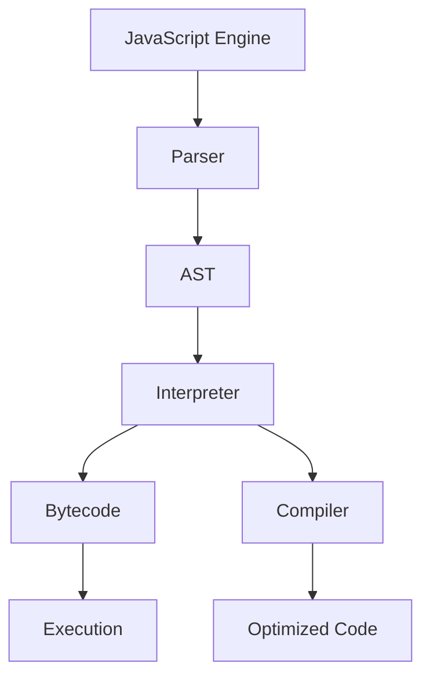
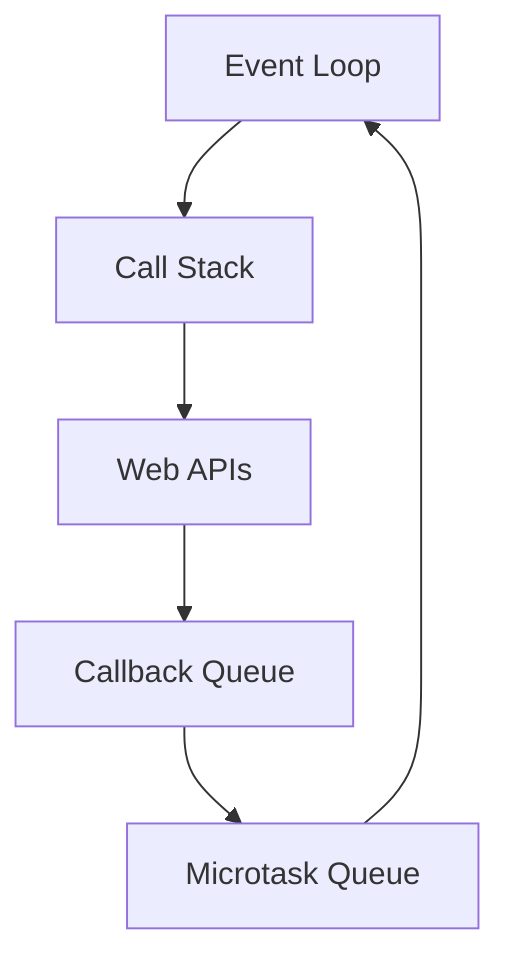
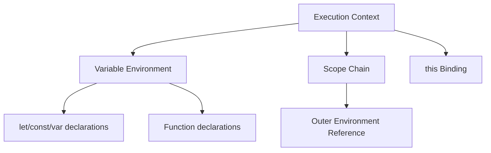
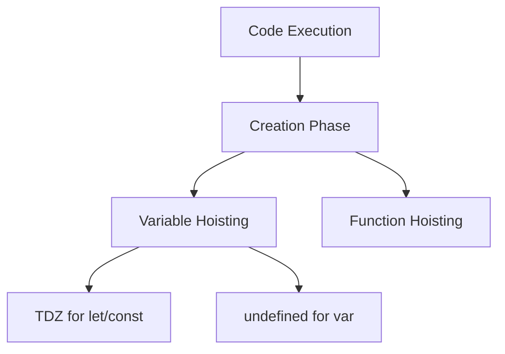
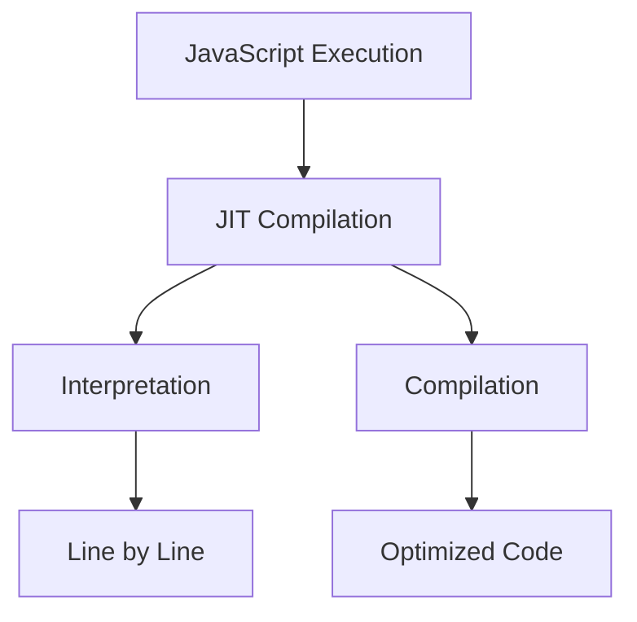

# Core JavaScript Concepts

## How does JavaScript Engine work?



```javascript
// Example of how JavaScript processes code
console.log('First'); // 1. Added to call stack
setTimeout(() => {
    // 2. Moved to Web APIs
    console.log('Second'); // 4. Added back to call stack via callback queue
}, 0);
console.log('Third'); // 3. Added to call stack
```

## What is Event Loop and how does it work?



```javascript
console.log('Script start'); // 1

setTimeout(() => {
    console.log('Timeout'); // 4
}, 0);

Promise.resolve()
    .then(() => console.log('Promise 1')) // 2
    .then(() => console.log('Promise 2')); // 3

console.log('Script end'); // 1
```

## What is Execution Context?



```javascript
let globalVar = 'global';

function outer() {
    let outerVar = 'outer';

    function inner() {
        let innerVar = 'inner';
        console.log(globalVar, outerVar, innerVar); // Can access all variables
    }

    inner();
}

outer();
```

## What is Hoisting and TDZ?



```javascript
// Function hoisting
sayHello(); // Works!
function sayHello() {
    console.log('Hello!');
}

// Variable hoisting with var
console.log(x); // undefined
var x = 5;

// TDZ with let/const
console.log(y); // ReferenceError
let y = 5;
```

## What is the difference between Compilation and Interpretation?



```javascript
// Example of how V8 optimizes code
function add(x, y) {
    return x + y;
}

// First call - interpreted
console.log(add(1, 2));

// After multiple calls with numbers, V8 might compile it
for (let i = 0; i < 100000; i++) {
    add(i, i + 1);
}

// Now optimized for numbers
console.log(add(3, 4));

// De-optimized when used with strings
console.log(add('Hello', ' World'));
```
