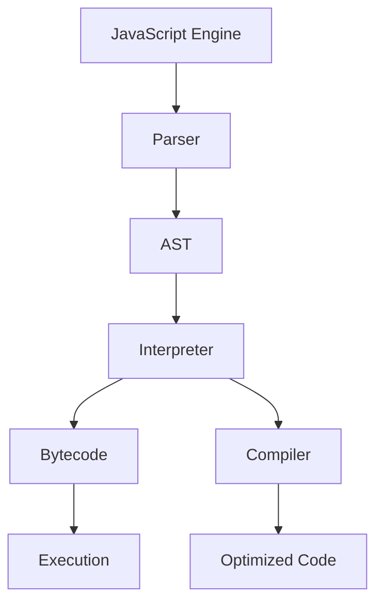
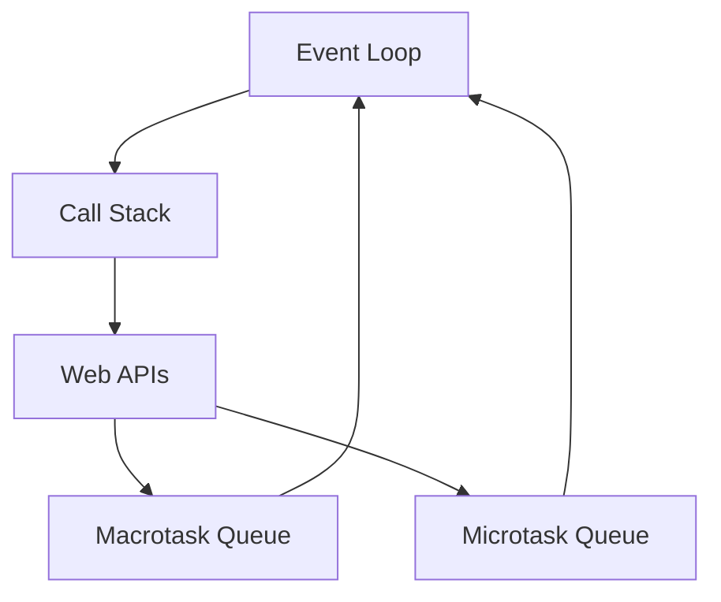
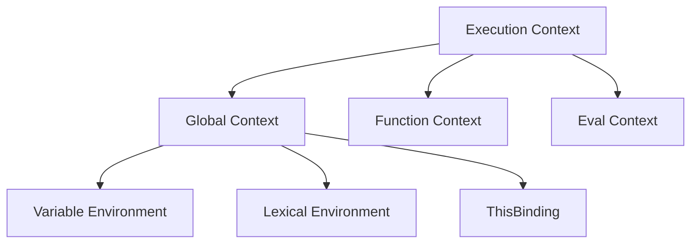

# JavaScript Core Concepts

JavaScript is a multi-paradigm, dynamic language that powers the web. Understanding its core concepts is essential for writing efficient and maintainable code.

## How JavaScript Engine Works

The JavaScript engine is responsible for executing JavaScript code. Different browsers use different engines (V8 for Chrome, SpiderMonkey for Firefox). Here's how they work:



### Execution Process

```javascript
// 1. Parsing Phase
function example() {
    const x = 42; // Tokenized and parsed into AST
    return x * 2; // Syntax checking happens here
}

// 2. Compilation Phase
function hotFunction(x) {
    return x + 1; // Gets optimized after multiple calls
}

// 3. Execution Phase
for (let i = 0; i < 100000; i++) {
    hotFunction(i); // JIT compilation kicks in
}
```

### Memory Management

```javascript
// Stack Memory Example
function foo() {
    const a = 1; // Stored in stack
    const b = 'text'; // String content in heap, reference in stack
    return a + b;
}

// Heap Memory Example
const obj = {
    // Object stored in heap
    name: 'John', // Properties stored with the object
    age: 30,
};
```

## Event Loop and Task Queues

The Event Loop handles the execution of multiple chunks of code over time, coordinating events, callbacks, and rendering.



### Task Types and Execution Order

```javascript
// Macrotasks (Task Queue)
setTimeout(() => console.log('timeout'), 0);
setInterval(() => console.log('interval'), 1000);

// Microtasks (Job Queue)
Promise.resolve().then(() => console.log('promise'));
queueMicrotask(() => console.log('microtask'));

console.log('sync');

// Output order:
// 1. 'sync'
// 2. 'promise'
// 3. 'microtask'
// 4. 'timeout'
```

## Execution Context and Scope

JavaScript code runs in different execution contexts. Understanding these contexts is crucial for writing correct code.



### Context Types and Components

```javascript
// Global Execution Context
const globalVar = 'I am global';

// Function Execution Context
function example() {
    const localVar = 'I am local';
    console.log(globalVar); // Access through scope chain

    function inner() {
        const innerVar = 'I am inner';
        console.log(localVar); // Closure access
    }
}

// Each context has:
// 1. Variable Environment (var, function declarations)
// 2. Lexical Environment (let, const)
// 3. ThisBinding
```

### Scope Chain and Closures

```javascript
function createCounter() {
    let count = 0; // Enclosed variable

    return {
        increment() {
            return ++count; // Access through closure
        },
        decrement() {
            return --count;
        },
        getCount() {
            return count;
        },
    };
}

const counter = createCounter();
console.log(counter.increment()); // 1
console.log(counter.increment()); // 2
console.log(counter.getCount()); // 2
```

## Variable Declarations and Hoisting

JavaScript handles different variable declarations in unique ways.

```javascript
// Variable Hoisting
console.log(varVariable); // undefined
console.log(letVariable); // ReferenceError
console.log(constVariable); // ReferenceError

var varVariable = 'var';
let letVariable = 'let';
const constVariable = 'const';

// Function Hoisting
hoistedFunction(); // Works!
notHoistedFunction(); // TypeError

function hoistedFunction() {
    console.log('I am hoisted!');
}

var notHoistedFunction = function () {
    console.log('I am not hoisted!');
};
```

### Temporal Dead Zone (TDZ)

```javascript
{
    // TDZ starts here
    console.log(blockScoped); // ReferenceError

    let blockScoped = 'I am block scoped'; // TDZ ends here
}

function tdz() {
    console.log(value); // ReferenceError
    const value = 42;
}
```

## Error Handling and Debugging

JavaScript provides robust error handling mechanisms.

```javascript
// Try-Catch with Error Types
try {
    throw new TypeError('Type error occurred');
} catch (error) {
    if (error instanceof TypeError) {
        console.error('Type error:', error.message);
    } else {
        console.error('Other error:', error);
    }
} finally {
    console.log('Cleanup code');
}

// Custom Error Types
class ValidationError extends Error {
    constructor(message) {
        super(message);
        this.name = 'ValidationError';
        this.code = 'VAL_ERR';
    }
}

// Async Error Handling
async function fetchData() {
    try {
        const response = await fetch('https://api.example.com/data');
        if (!response.ok) {
            throw new Error(`HTTP error! status: ${response.status}`);
        }
        return await response.json();
    } catch (error) {
        console.error('Fetch error:', error);
        throw error; // Re-throw for upper level handling
    }
}
```

Best practices for core JavaScript concepts:

-   Understand execution context and scope chain
-   Use appropriate variable declarations (const, let, var)
-   Handle errors properly with try-catch
-   Implement proper async/await error handling
-   Be aware of hoisting behavior
-   Use closures carefully to avoid memory leaks
-   Understand event loop and task queues
-   Implement proper error boundaries
-   Use appropriate error types
-   Follow strict mode conventions
