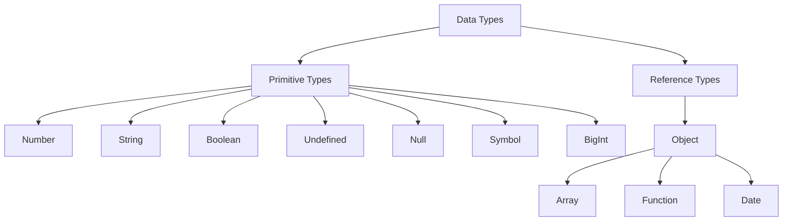

# JavaScript Variables and Types

## Understanding JavaScript Types

JavaScript is a dynamically typed language, which means variables can hold different types of values at different times. Understanding the type system is crucial for writing reliable code and avoiding common pitfalls.

### Data Types Overview

JavaScript has two main categories of data types:

1. **Primitive Types**: Stored directly in the stack memory

    - Immutable values
    - Passed by value
    - Fixed size in memory
    - Includes: Number, String, Boolean, Undefined, Null, Symbol, BigInt

2. **Reference Types**: Stored in heap memory with references in stack
    - Mutable values
    - Passed by reference
    - Dynamic size in memory
    - Includes: Object, Array, Function, Date, RegExp



## Type Checking Mechanisms

### typeof vs instanceof

The `typeof` operator and `instanceof` operator serve different purposes and have different behaviors:

#### typeof Operator

```javascript
// typeof returns a string indicating the type
typeof 42; // 'number'
typeof 'hello'; // 'string'
typeof true; // 'boolean'
typeof undefined; // 'undefined'
typeof null; // 'object' (This is a known language bug)
typeof {}; // 'object'
typeof []; // 'object'
typeof function () {}; // 'function'
typeof Symbol(); // 'symbol'
typeof 42n; // 'bigint'
```

Key points about `typeof`:

-   Returns a string representing the primitive type
-   Cannot distinguish between different object types
-   Has the famous `null` bug (returns 'object')
-   Best used for primitive type checks
-   Cannot detect custom types

#### instanceof Operator

```javascript
// instanceof checks the prototype chain
[] instanceof Array; // true
[] instanceof Object; // true
(() => {}) instanceof Function; // true

class Animal {}
class Dog extends Animal {}
const dog = new Dog();
dog instanceof Dog; // true
dog instanceof Animal; // true
dog instanceof Object; // true
```

Key points about `instanceof`:

-   Checks the prototype chain
-   Works well with custom types and inheritance
-   Cannot be used for primitive types
-   Can be unreliable across different window contexts
-   Best used for checking inheritance relationships

### Object.prototype.toString Method

The most reliable way to check types:

```javascript
const toString = Object.prototype.toString;

toString.call([]); // '[object Array]'
toString.call({}); // '[object Object]'
toString.call(''); // '[object String]'
toString.call(42); // '[object Number]'
toString.call(true); // '[object Boolean]'
toString.call(undefined); // '[object Undefined]'
toString.call(null); // '[object Null]'
toString.call(new Date()); // '[object Date]'
toString.call(/regex/); // '[object RegExp]'
```

Key points about `toString`:

-   Most reliable type checking method
-   Works across different window contexts
-   Can identify built-in types accurately
-   Returns consistent format: '[object Type]'
-   Cannot be fooled by property changes

## Type Conversion Rules

JavaScript's type conversion system follows specific rules when performing operations between different types.

### Implicit Type Conversion (Type Coercion)

1. **String Conversion Rules**:

```javascript
// When + operator involves a string
'1' + 2; // '12' (number converts to string)
'1' + true; // '1true' (boolean converts to string)
'1' + [1, 2]; // '11,2' (array converts to string)
'1' + {}; // '1[object Object]' (object converts to string)
```

2. **Number Conversion Rules**:

```javascript
// In mathematical operations except +
'3' - 2; // 1 (string converts to number)
'3' * '2'; // 6 (strings convert to numbers)
1 - true; // 0 (true converts to 1)
1 - null; // 1 (null converts to 0)
1 - undefined; // NaN (undefined converts to NaN)
```

3. **Boolean Conversion Rules**:

```javascript
// In logical operations
if ('') {
} // falsy
if (0) {
} // falsy
if (null) {
} // falsy
if (undefined) {
} // falsy
if (NaN) {
} // falsy
if ('0') {
} // truthy
if ([]) {
} // truthy
if ({}) {
} // truthy
```

### Explicit Type Conversion

Best practices for explicit conversion:

```javascript
// To String
String(123); // "123"
(123).toString(); // "123"
123 + ''; // "123"

// To Number
Number('123'); // 123
parseInt('123', 10); // 123
parseFloat('123.45'); // 123.45
+'123'; // 123

// To Boolean
Boolean(123); // true
!!123; // true

// To Array
Array.from('123'); // ['1', '2', '3']
[...'123']; // ['1', '2', '3']

// To Object
Object(123); // Number {123}
```

## Memory Management

Understanding how JavaScript manages memory is crucial for writing efficient code.

### Stack vs Heap Memory

```javascript
// Stack Memory (Primitive Types)
let a = 42; // Stored directly in stack
let b = 'hello'; // Stored directly in stack
let c = true; // Stored directly in stack

// Heap Memory (Reference Types)
let obj = { x: 10 }; // Reference in stack, object in heap
let arr = [1, 2, 3]; // Reference in stack, array in heap
let func = () => {}; // Reference in stack, function in heap
```

Key points about memory:

-   Primitive types use stack memory (fixed size, fast access)
-   Reference types use heap memory (dynamic size, slower access)
-   Stack memory is automatically cleaned up
-   Heap memory is managed by garbage collector
-   Variables in stack hold references to heap objects

Best practices for working with types:

-   Use strict equality (`===`) to avoid unexpected type coercion
-   Be explicit about type conversions
-   Understand memory implications of different types
-   Use appropriate type checking methods for different scenarios
-   Be aware of type coercion rules in operations
-   Document type expectations in functions and APIs
-   Consider using TypeScript for static type checking
-   Handle edge cases in type conversions
-   Be careful with reference vs value comparisons
-   Understand prototype chain implications
