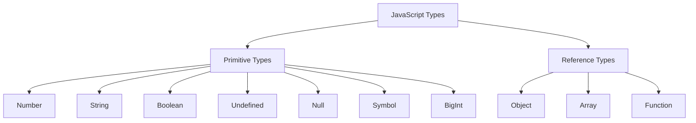
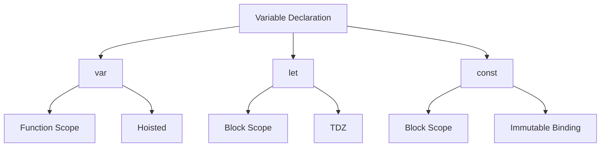

# Variables and Types

## What are the different data types in JavaScript?



```javascript
// Primitive types
const number = 42;
const string = 'Hello';
const boolean = true;
const nullValue = null;
const undefinedValue = undefined;
const symbol = Symbol('description');
const bigInt = 9007199254740991n;

// Reference types
const object = { key: 'value' };
const array = [1, 2, 3];
const func = () => {};

// Type checking
console.log(typeof number); // 'number'
console.log(typeof object); // 'object'
console.log(Array.isArray(array)); // true
```

## What is the difference between var, let, and const?



```javascript
// Scope differences
function scopeTest() {
    var functionScoped = 'I am function scoped';
    let blockScoped = 'I am block scoped';

    if (true) {
        var functionScoped2 = 'I am also function scoped';
        let blockScoped2 = 'I am also block scoped';
        const constantVar = 'I cannot be reassigned';
    }

    console.log(functionScoped2); // Works
    console.log(blockScoped2); // ReferenceError
}

// Const behavior
const obj = { count: 0 };
obj.count++; // Works
obj = {}; // TypeError
```

## What is type coercion and when does it happen?

```javascript
// Implicit coercion
console.log(1 + '2'); // '12' (number to string)
console.log('3' - 1); // 2 (string to number)
console.log(true + 1); // 2 (boolean to number)
console.log([1] + [2]); // '12' (arrays to string)
console.log([] + {}); // '[object Object]'

// Explicit coercion
console.log(Number('123')); // 123
console.log(String(123)); // '123'
console.log(Boolean(1)); // true
console.log(Array.from('123')); // ['1', '2', '3']
```

## What is the difference between == and ===?

```javascript
// Loose equality (==) with type coercion
console.log(1 == '1'); // true
console.log(null == undefined); // true
console.log(0 == false); // true
console.log([1, 2] == '1,2'); // true

// Strict equality (===) without type coercion
console.log(1 === '1'); // false
console.log(null === undefined); // false
console.log(0 === false); // false
console.log([1, 2] === '1,2'); // false

// Best practices
const value = 0;
if (value === undefined || value === null) {
    console.log('Value is not defined');
}
```
