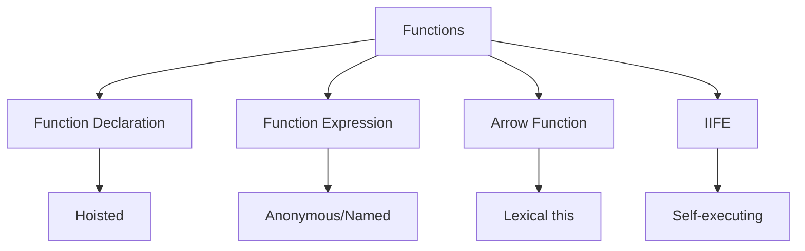

# Functions and Scope in JavaScript

Functions are fundamental building blocks in JavaScript. They are first-class objects that can be passed around, returned from other functions, and assigned to variables.

## Function Types and Declarations

JavaScript provides multiple ways to define functions, each with its own characteristics and use cases.



### Function Declarations vs Expressions

Each type of function declaration has its own characteristics and best use cases:

```javascript
// Function Declaration (hoisted)
function multiply(a, b) {
    return a * b;
}

// Function Expression (not hoisted)
const add = function (a, b) {
    return a + b;
};

// Named Function Expression (useful for recursion and debugging)
const factorial = function fact(n) {
    return n <= 1 ? 1 : n * fact(n - 1);
};

// Arrow Function (lexical this binding)
const divide = (a, b) => a / b;

// IIFE (Immediately Invoked Function Expression)
const counter = (() => {
    let count = 0;
    return {
        increment: () => ++count,
        getCount: () => count,
    };
})();

// Generator Function
function* numberGenerator() {
    yield 1;
    yield 2;
    yield 3;
}
```

Key differences between function types:

1. **Function Declarations**:

    - Are hoisted to the top of their scope
    - Can be called before declaration in code
    - Must have a name
    - Create their own `this` binding

2. **Function Expressions**:

    - Are not hoisted
    - Can be anonymous or named
    - Often used for callbacks and higher-order functions
    - Create their own `this` binding

3. **Arrow Functions**:
    - Have lexical `this` binding
    - Cannot be used as constructors
    - No `arguments` object
    - Ideal for short callbacks

## Understanding Scope

Scope determines the accessibility of variables and functions in JavaScript. It's a fundamental concept that affects how variables are looked up and accessed.

### Scope Types

1. **Global Scope**:

    - Variables declared outside any function or block
    - Accessible throughout the entire program
    - Can cause naming conflicts and memory issues
    - Created at program start, destroyed when program ends

2. **Function Scope**:

    - Variables declared inside a function
    - Only accessible within that function
    - Created when function is called, destroyed when function returns
    - Each function call creates a new scope

3. **Block Scope** (ES6+):
    - Variables declared with `let` and `const`
    - Limited to the block they're declared in
    - Provides better encapsulation
    - Helps prevent variable hoisting issues

```javascript
// Scope Examples
const globalVar = 'I am global';

function outerFunction() {
    const outerVar = 'I am from outer';

    function innerFunction() {
        const innerVar = 'I am from inner';
        console.log(innerVar); // Accessible
        console.log(outerVar); // Accessible through scope chain
        console.log(globalVar); // Accessible through scope chain
    }

    console.log(innerVar); // ReferenceError: innerVar is not defined
}
```

## Scope Chain

The scope chain is how JavaScript looks up variable values. When a variable is referenced, JavaScript:

1. First looks in the current scope
2. If not found, looks in the outer scope
3. Continues up the chain until it reaches global scope
4. Throws ReferenceError if not found

```javascript
let global = 'global';

function outer() {
    let outerVar = 'outer';

    function inner() {
        let innerVar = 'inner';

        // Scope chain demonstration
        console.log(innerVar); // Looks in inner scope
        console.log(outerVar); // Looks in outer scope
        console.log(global); // Looks in global scope
    }

    inner();
}
```

Key points about scope chain:

-   Forms a one-way linked list of scopes
-   Created when code is executed
-   Determined by where functions are defined (lexical scoping)
-   Affects variable lookup performance
-   Important for closure behavior

## Closures

A closure is the combination of a function and its lexical environment. It allows a function to access variables from its outer scope even after the outer function has returned.

### How Closures Work

```javascript
function createCounter() {
    let count = 0; // This variable is "closed over"

    return {
        increment() {
            return ++count; // Accessing variable from outer scope
        },
        decrement() {
            return --count;
        },
        getCount() {
            return count;
        },
    };
}

const counter = createCounter();
console.log(counter.increment()); // 1
console.log(counter.increment()); // 2
console.log(counter.getCount()); // 2
```

Key aspects of closures:

-   Preserve data privacy
-   Maintain state between function calls
-   Enable data encapsulation
-   Can cause memory leaks if not managed properly
-   Essential for module patterns

## This Binding

The `this` keyword in JavaScript is determined by how a function is called, not where it's defined (except for arrow functions).

### Binding Rules

1. **Default Binding**:

    - When function is called without context
    - `this` refers to global object (non-strict) or undefined (strict)

2. **Implicit Binding**:

    - When function is called as an object method
    - `this` refers to the object containing the method

3. **Explicit Binding**:

    - Using `call()`, `apply()`, or `bind()`
    - Directly specifies what `this` should reference

4. **Constructor Binding**:
    - When function is used with `new` keyword
    - `this` refers to the newly created object

```javascript
// Default Binding
function showThis() {
    console.log(this);
}
showThis(); // window or undefined (strict mode)

// Implicit Binding
const obj = {
    name: 'Object',
    show() {
        console.log(this.name);
    },
};
obj.show(); // 'Object'

// Explicit Binding
function greet() {
    console.log(`Hello, ${this.name}!`);
}
const person = { name: 'John' };
greet.call(person); // "Hello, John!"

// Constructor Binding
function User(name) {
    this.name = name;
}
const user = new User('John'); // this refers to new object
```

### Arrow Functions and This

Arrow functions have lexical `this` binding:

-   Inherit `this` from enclosing scope
-   Cannot be bound to different `this` value
-   Ideal for callbacks and methods that need parent scope

```javascript
class Timer {
    constructor() {
        this.seconds = 0;

        // Arrow function preserves this
        setInterval(() => {
            this.seconds++;
        }, 1000);
    }
}
```

Best practices for functions and scope:

-   Understand scope chain implications
-   Use closures judiciously
-   Be careful with `this` binding
-   Prefer `const` and `let` over `var`
-   Use arrow functions appropriately
-   Avoid global scope pollution
-   Clean up closures when no longer needed
-   Document `this` binding expectations
-   Consider using strict mode
-   Understand lexical vs dynamic scoping

## Function Parameters and Arguments

JavaScript provides flexible ways to handle function parameters, including default values, rest parameters, and destructuring.

### Parameter Features

```javascript
// Default parameters
function greet(name = 'Guest', greeting = 'Hello') {
    return `${greeting}, ${name}!`;
}

console.log(greet()); // "Hello, Guest!"
console.log(greet('John')); // "Hello, John!"
console.log(greet('John', 'Hi')); // "Hi, John!"

// Rest parameters
function sum(...numbers) {
    return numbers.reduce((total, num) => total + num, 0);
}

console.log(sum(1, 2, 3)); // 6
console.log(sum(1, 2, 3, 4, 5)); // 15

// Parameter destructuring
function printUserInfo({ name, age, email = 'N/A' }) {
    console.log(`Name: ${name}, Age: ${age}, Email: ${email}`);
}

printUserInfo({ name: 'John', age: 30 });
// Output: "Name: John, Age: 30, Email: N/A"

// Arguments object (not available in arrow functions)
function logArguments() {
    console.log(Array.from(arguments));
    console.log([...arguments]); // Modern spread syntax
}

logArguments(1, 'hello', true); // [1, "hello", true]
```

Key parameter features:

-   Default parameters are evaluated at call time
-   Rest parameters must be the last parameter
-   Destructuring allows for flexible parameter handling
-   `arguments` object is array-like but not an array

## Higher-Order Functions

Higher-order functions are functions that take other functions as arguments or return functions as their results.

### Function Composition and Transformation

```javascript
// Function that takes a function as argument
function operateOnArray(arr, operation) {
    return arr.map(operation);
}

// Function that returns a function (currying)
function multiply(factor) {
    return function (number) {
        return number * factor;
    };
}

const numbers = [1, 2, 3, 4];
const double = multiply(2);

console.log(operateOnArray(numbers, double)); // [2, 4, 6, 8]

// Function composition
const compose =
    (...fns) =>
    x =>
        fns.reduceRight((y, f) => f(y), x);

const pipe =
    (...fns) =>
    x =>
        fns.reduce((y, f) => f(y), x);

const addOne = x => x + 1;
const multiplyByTwo = x => x * 2;
const addThenMultiply = compose(multiplyByTwo, addOne);

console.log(addThenMultiply(3)); // 8 ((3 + 1) * 2)
```

Common higher-order function patterns:

-   Map, filter, and reduce operations
-   Function composition
-   Partial application and currying
-   Event handling and callbacks

### Function Properties and Methods

Functions in JavaScript are objects and have their own properties and methods:

```javascript
function example(a, b, c) {
    return a + b + c;
}

// Function properties
console.log(example.length); // 3 (number of parameters)
console.log(example.name); // "example"

// Function methods
const boundFn = example.bind(null, 1); // Partial application
console.log(boundFn.length); // 2 (remaining parameters)

// Function toString
console.log(example.toString()); // Shows function source code

// Custom properties
example.description = 'Adds three numbers';
console.log(example.description); // "Adds three numbers"
```

### Advanced Function Patterns

```javascript
// Memoization
function memoize(fn) {
    const cache = new Map();

    return function (...args) {
        const key = JSON.stringify(args);
        if (cache.has(key)) {
            return cache.get(key);
        }
        const result = fn.apply(this, args);
        cache.set(key, result);
        return result;
    };
}

// Debouncing
function debounce(fn, delay) {
    let timeoutId;

    return function (...args) {
        clearTimeout(timeoutId);
        timeoutId = setTimeout(() => {
            fn.apply(this, args);
        }, delay);
    };
}

// Throttling
function throttle(fn, limit) {
    let inThrottle;

    return function (...args) {
        if (!inThrottle) {
            fn.apply(this, args);
            inThrottle = true;
            setTimeout(() => (inThrottle = false), limit);
        }
    };
}

// Partial Application
function partial(fn, ...presetArgs) {
    return function (...laterArgs) {
        return fn(...presetArgs, ...laterArgs);
    };
}

// Usage examples
const expensiveOperation = memoize(n => {
    console.log('Computing...');
    return n * 2;
});

const handleResize = debounce(() => {
    console.log('Resized!');
}, 250);

const handleScroll = throttle(() => {
    console.log('Scrolled!');
}, 1000);

const add = (a, b, c) => a + b + c;
const add5 = partial(add, 5);
console.log(add5(10, 20)); // 35 (5 + 10 + 20)
```

These advanced patterns are commonly used for:

-   Performance optimization (memoization)
-   Event handling (debouncing, throttling)
-   Function reusability (partial application)
-   Code organization and maintainability

## Function Declarations

JavaScript provides multiple ways to define functions, each with its own characteristics.

```javascript
// 1. Function Declaration
function multiply(a, b) {
    return a * b;
}

// 2. Function Expression
const add = function (a, b) {
    return a + b;
};

// 3. Arrow Function
const subtract = (a, b) => a - b;

// 4. Method Definition
const math = {
    divide(a, b) {
        return a / b;
    },
};

// 5. Constructor Function
function Calculator() {
    this.sum = function (a, b) {
        return a + b;
    };
}
```

### Function Hoisting

```javascript
// Function declarations are hoisted
console.log(multiply(2, 3)); // Works: 6

function multiply(a, b) {
    return a * b;
}

// Function expressions are not hoisted
console.log(add(2, 3)); // Error: add is not a function

const add = function (a, b) {
    return a + b;
};
```

## Arrow Functions

Arrow functions have special characteristics and use cases.

```javascript
// 1. Concise Syntax
const square = x => x * x;
const sum = (a, b) => a + b;
const getObject = () => ({ value: 42 });

// 2. Lexical this Binding
class Counter {
    constructor() {
        this.count = 0;
        this.interval = null;
    }

    start() {
        // Arrow function preserves 'this'
        this.interval = setInterval(() => {
            this.count++;
            console.log(this.count);
        }, 1000);
    }

    stop() {
        clearInterval(this.interval);
    }
}

// 3. Cannot be used as constructors
const ArrowCtor = () => {};
// const instance = new ArrowCtor(); // TypeError

// 4. No arguments object
const regularFunc = function () {
    console.log(arguments);
};

const arrowFunc = () => {
    // console.log(arguments); // ReferenceError
};
```

## Scope and Closure

### Lexical Scope

```javascript
const globalVar = 'I am global';

function outerFunction() {
    const outerVar = 'I am from outer';

    function innerFunction() {
        const innerVar = 'I am from inner';
        console.log(innerVar); // Access own scope
        console.log(outerVar); // Access outer scope
        console.log(globalVar); // Access global scope
    }

    return innerFunction;
}
```

### Closure Examples

```javascript
// 1. Data Privacy
function createCounter() {
    let count = 0; // Private variable

    return {
        increment() {
            return ++count;
        },
        decrement() {
            return --count;
        },
        getCount() {
            return count;
        },
    };
}

// 2. Function Factory
function multiply(x) {
    return function (y) {
        return x * y;
    };
}

const multiplyByTwo = multiply(2);
console.log(multiplyByTwo(4)); // 8

// 3. Module Pattern
const calculator = (function () {
    let result = 0;

    return {
        add(x) {
            result += x;
            return this;
        },
        subtract(x) {
            result -= x;
            return this;
        },
        getResult() {
            return result;
        },
    };
})();
```

## This Binding

### Binding Rules

```javascript
// 1. Default Binding
function showThis() {
    console.log(this);
}
showThis(); // window (non-strict) or undefined (strict)

// 2. Implicit Binding
const obj = {
    name: 'Object',
    show() {
        console.log(this.name);
    },
};
obj.show(); // 'Object'

// 3. Explicit Binding
function greet() {
    console.log(`Hello, ${this.name}!`);
}
const person = { name: 'John' };
greet.call(person); // Hello, John!
greet.apply(person); // Hello, John!
const boundGreet = greet.bind(person);

// 4. Constructor Binding
function User(name) {
    this.name = name;
    this.greet = function () {
        console.log(`Hi, I'm ${this.name}`);
    };
}
const user = new User('John');
```

### Common Pitfalls and Solutions

```javascript
// 1. Losing this Context
class Button {
    constructor(text) {
        this.text = text;
        this.element = document.createElement('button');

        // Wrong way - loses this
        this.element.addEventListener('click', function () {
            console.log(this.text); // undefined
        });

        // Solution 1: Arrow function
        this.element.addEventListener('click', () => {
            console.log(this.text);
        });

        // Solution 2: Bind
        this.handleClick = this.handleClick.bind(this);
        this.element.addEventListener('click', this.handleClick);
    }

    handleClick() {
        console.log(this.text);
    }
}
```

Best practices for functions and scope:

-   Use arrow functions for callbacks and methods that don't need their own `this`
-   Understand closure memory implications
-   Use proper binding methods for `this`
-   Prefer const for function expressions
-   Use method shorthand in objects
-   Avoid modifying the outer scope from closures
-   Be careful with `this` in callbacks
-   Use proper error handling in async functions
-   Consider function composition
-   Implement proper memory management
