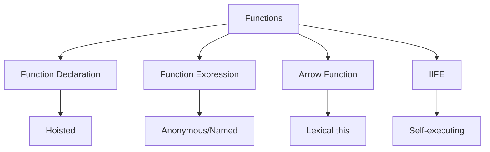
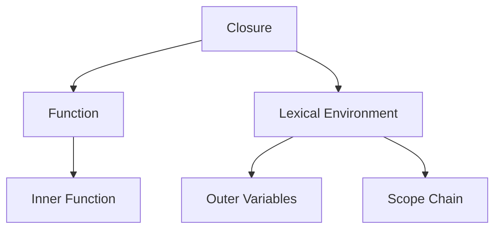
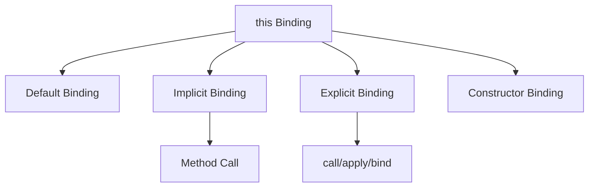

# Functions and Scope

## What are the different types of functions in JavaScript?



```javascript
// Function Declaration (hoisted)
function multiply(a, b) {
    return a * b;
}

// Function Expression
const add = function (a, b) {
    return a + b;
};

// Arrow Function
const divide = (a, b) => a / b;

// IIFE (Immediately Invoked Function Expression)
const counter = (() => {
    let count = 0;
    return {
        increment: () => ++count,
        getCount: () => count,
    };
})();
```

## How do closures work in JavaScript?



```javascript
// Closure example
function createCounter(initial = 0) {
    let count = initial; // This variable is "closed over"

    return {
        increment: () => ++count,
        decrement: () => --count,
        getCount: () => count,
    };
}

const counter1 = createCounter(1);
const counter2 = createCounter(10);

console.log(counter1.getCount()); // 1
console.log(counter2.getCount()); // 10
counter1.increment();
console.log(counter1.getCount()); // 2
```

## How does 'this' binding work?



```javascript
// Different this bindings
const person = {
    name: 'John',
    // Regular method - 'this' refers to person
    sayHi() {
        console.log(`Hi, I'm ${this.name}`);
    },
    // Arrow function - 'this' is lexically scoped
    greet: () => {
        console.log(`Hi, I'm ${this.name}`); // 'this' refers to outer scope
    },
    // Methods with callbacks
    delayedGreet() {
        setTimeout(function () {
            console.log(`Hi, I'm ${this.name}`); // 'this' is lost
        }, 1000);

        setTimeout(() => {
            console.log(`Hi, I'm ${this.name}`); // 'this' is preserved
        }, 1000);
    },
};

// Explicit binding
const greet = person.sayHi;
greet.call(person); // Sets 'this' to person
greet.apply(person); // Same as call but takes array of arguments
const boundGreet = greet.bind(person); // Creates new function with bound 'this'
```

## What is the difference between arrow functions and regular functions?

```javascript
// 1. 'this' binding
const obj = {
    value: 42,
    regularMethod: function () {
        console.log(this.value); // 42
    },
    arrowMethod: () => {
        console.log(this.value); // undefined
    },
};

// 2. Arguments object
function regular() {
    console.log(arguments); // Arguments object available
}

const arrow = () => {
    console.log(arguments); // ReferenceError
};

// 3. Constructor
function RegularConstructor() {
    this.value = 42;
}
const regular = new RegularConstructor(); // Works

const ArrowConstructor = () => {
    this.value = 42;
};
const arrow = new ArrowConstructor(); // TypeError

// 4. Method shorthand
const obj = {
    regularMethod() {
        // Recommended for methods
        return this;
    },
    arrowMethod: () => {
        // Avoid for methods
        return this;
    },
};
```
