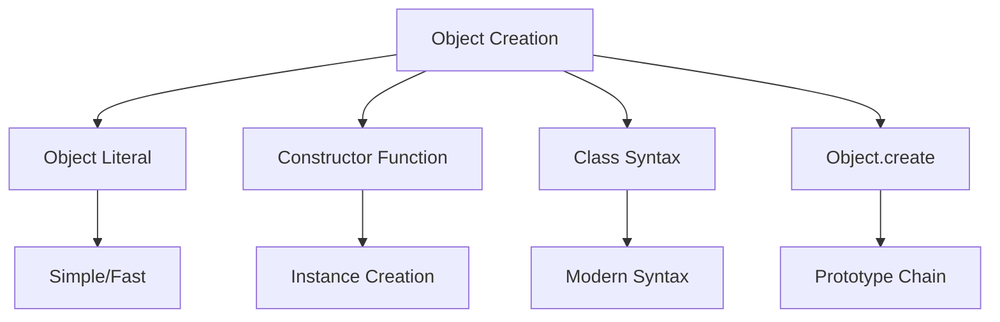

# Objects and Prototypes in JavaScript

JavaScript is prototype-based: every object has a prototype object, which acts as a template object that it inherits methods and properties from.

## Object Creation

JavaScript provides multiple ways to create objects, each with its own use cases and characteristics.



### Object Creation Methods

```javascript
// 1. Object Literal
const obj1 = {
    name: 'Object 1',
    greet() {
        return `Hello from ${this.name}`;
    },
};

// 2. Constructor Function
function Person(name) {
    this.name = name;
    this.greet = function () {
        return `Hello, I'm ${this.name}`;
    };
}
const obj2 = new Person('John');

// 3. Object.create()
const proto = {
    greet() {
        return `Hello, I'm ${this.name}`;
    },
};
const obj3 = Object.create(proto);
obj3.name = 'Object 3';

// 4. Class Syntax (ES6+)
class Animal {
    constructor(name) {
        this.name = name;
    }

    speak() {
        return `${this.name} makes a sound`;
    }
}
const obj4 = new Animal('Dog');
```

## Understanding Prototypes

JavaScript uses prototypal inheritance, where objects inherit directly from other objects. This is fundamentally different from class-based inheritance in languages like Java or C++.

### Prototype Chain

The prototype chain is the mechanism that enables inheritance in JavaScript:

1. When accessing a property on an object, JavaScript first looks for the property on the object itself
2. If not found, it looks on the object's prototype
3. If still not found, it continues up the prototype chain
4. This continues until reaching `Object.prototype` or `null`

```javascript
// Basic prototype chain demonstration
const animal = {
    makeSound() {
        return 'Some sound';
    },
};

const dog = Object.create(animal);
dog.bark = function () {
    return 'Woof!';
};

console.log(dog.makeSound()); // Inherited from animal
console.log(dog.bark()); // Own method
console.log(dog.toString()); // Inherited from Object.prototype
```

### The `new` Operator

When using `new`, JavaScript performs several steps:

```javascript
// What happens when you use 'new'
function User(name) {
    this.name = name;
}

User.prototype.sayHello = function () {
    return `Hello, I'm ${this.name}`;
};

// This is what 'new User("John")' does under the hood:
function createInstance(Constructor, ...args) {
    // 1. Create a new object with the constructor's prototype
    const instance = Object.create(Constructor.prototype);

    // 2. Call constructor with 'this' bound to the new object
    const result = Constructor.apply(instance, args);

    // 3. Return the object (unless constructor returns an object)
    return typeof result === 'object' && result !== null ? result : instance;
}

const user = createInstance(User, 'John');
```

## Inheritance Patterns

JavaScript offers multiple ways to implement inheritance, each with its own advantages and trade-offs.

### 1. Prototypal Inheritance

```javascript
// Basic prototypal inheritance
const parent = {
    value: 42,
    getValue() {
        return this.value;
    },
};

const child = Object.create(parent);
child.value = 100;

console.log(child.getValue()); // 100 (own value)
console.log(parent.getValue()); // 42 (unchanged)
```

Advantages:

-   Simple and direct
-   Memory efficient
-   Dynamic

Disadvantages:

-   No private properties
-   Can be confusing for developers from class-based languages

### 2. Constructor Inheritance

```javascript
function Animal(name) {
    this.name = name;
}

Animal.prototype.makeSound = function () {
    return 'Some sound';
};

function Dog(name, breed) {
    // Call parent constructor
    Animal.call(this, name);
    this.breed = breed;
}

// Set up inheritance
Dog.prototype = Object.create(Animal.prototype);
Dog.prototype.constructor = Dog;

Dog.prototype.bark = function () {
    return 'Woof!';
};
```

Advantages:

-   Familiar to developers from class-based languages
-   Supports private variables (through closures)
-   Clear constructor chain

Disadvantages:

-   More verbose
-   Easy to forget setting constructor property
-   Multiple steps to set up inheritance

### 3. Class Inheritance (ES6+)

```javascript
class Animal {
    constructor(name) {
        this.name = name;
    }

    makeSound() {
        return 'Some sound';
    }
}

class Dog extends Animal {
    constructor(name, breed) {
        super(name);
        this.breed = breed;
    }

    bark() {
        return 'Woof!';
    }
}
```

Advantages:

-   Clean syntax
-   Built-in constructor handling
-   Proper method inheritance
-   Support for `super`

Disadvantages:

-   May hide prototypal nature
-   No true privacy (yet)
-   Slightly slower than prototypal inheritance

### 4. Mixin Pattern

```javascript
const speakerMixin = {
    speak(phrase) {
        console.log(`${this.name} says: ${phrase}`);
    },
};

const walkerMixin = {
    walk(steps) {
        console.log(`${this.name} walked ${steps} steps`);
    },
};

// Using Object.assign for mixins
class Pet {
    constructor(name) {
        this.name = name;
    }
}

Object.assign(Pet.prototype, speakerMixin, walkerMixin);

const pet = new Pet('Fluffy');
pet.speak('Hello!');
pet.walk(10);
```

## Property Descriptors

JavaScript provides detailed control over object properties through descriptors.

```javascript
const person = {};

// Define property with full descriptor
Object.defineProperty(person, 'name', {
    value: 'John',
    writable: true,
    enumerable: true,
    configurable: true,
});

// Define multiple properties
Object.defineProperties(person, {
    age: {
        value: 30,
        writable: false,
    },
    _password: {
        value: '123456',
        enumerable: false,
    },
});

// Get property descriptor
console.log(Object.getOwnPropertyDescriptor(person, 'name'));
```

## Prototype Chain Lookup

Understanding how JavaScript looks up properties:

```javascript
function lookupExample() {
    function Parent() {}
    Parent.prototype.parentMethod = function () {};

    function Child() {}
    Child.prototype = Object.create(Parent.prototype);
    Child.prototype.childMethod = function () {};

    const instance = new Child();

    // Lookup chain:
    console.log(instance.hasOwnProperty('childMethod')); // false
    console.log(Child.prototype.hasOwnProperty('childMethod')); // true
    console.log(Parent.prototype.hasOwnProperty('parentMethod')); // true

    // instanceof checks the prototype chain
    console.log(instance instanceof Child); // true
    console.log(instance instanceof Parent); // true
    console.log(instance instanceof Object); // true
}
```

Best practices for prototypes and inheritance:

-   Understand the prototype chain
-   Use appropriate inheritance pattern for your needs
-   Be careful with property shadowing
-   Consider composition over inheritance
-   Use modern class syntax when appropriate
-   Document inheritance relationships
-   Be mindful of performance implications
-   Handle constructor property correctly
-   Use proper property descriptors
-   Implement proper method sharing
