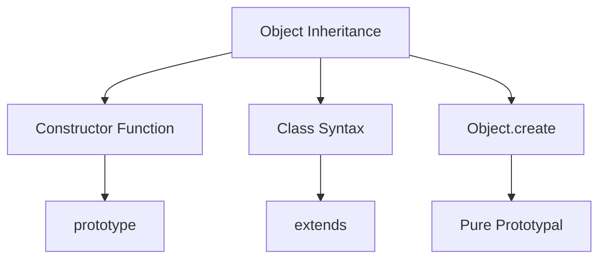

# Objects and Prototypes

## How does prototypal inheritance work in JavaScript?



```javascript
// Classical prototypal inheritance
function Animal(name) {
    this.name = name;
}

Animal.prototype.speak = function () {
    return `${this.name} makes a sound`;
};

function Dog(name, breed) {
    Animal.call(this, name); // Call parent constructor
    this.breed = breed;
}

// Set up inheritance
Dog.prototype = Object.create(Animal.prototype);
Dog.prototype.constructor = Dog;

// Add method specific to Dog
Dog.prototype.bark = function () {
    return `${this.name} barks!`;
};

const dog = new Dog('Rex', 'German Shepherd');
console.log(dog.speak()); // "Rex makes a sound"
console.log(dog.bark()); // "Rex barks!"
```

## How do modern class features work?

```javascript
// ES6+ Class implementation
class Animal {
    #privateField = 'private'; // Private field

    constructor(name) {
        this.name = name;
    }

    // Public method
    speak() {
        return `${this.name} makes a sound`;
    }

    // Private method
    #privateMethod() {
        return this.#privateField;
    }

    // Static method
    static isAnimal(obj) {
        return obj instanceof Animal;
    }

    // Getter
    get type() {
        return 'Animal';
    }
}

class Dog extends Animal {
    constructor(name, breed) {
        super(name);
        this.breed = breed;
    }

    speak() {
        return `${super.speak()} and barks`;
    }
}
```

## What are property descriptors and their uses?

```javascript
// Property descriptors and their behavior
const person = {
    firstName: 'John',
};

// Define a property with custom descriptor
Object.defineProperty(person, 'lastName', {
    value: 'Doe',
    writable: false, // Cannot be changed
    enumerable: true, // Shows up in iterations
    configurable: false, // Cannot be deleted or reconfigured
});

// Define getter/setter
Object.defineProperty(person, 'fullName', {
    get() {
        return `${this.firstName} ${this.lastName}`;
    },
    set(value) {
        [this.firstName, this.lastName] = value.split(' ');
    },
});

// Seal and freeze
const frozen = Object.freeze({ x: 1 }); // Completely immutable
const sealed = Object.seal({ y: 2 }); // Can modify properties but not add/delete
```

## What are different ways to create objects?

```javascript
// 1. Object literal
const obj1 = {
    name: 'Object 1',
    greet() {
        return `Hello from ${this.name}`;
    },
};

// 2. Constructor function
function Person(name) {
    this.name = name;
}
const obj2 = new Person('Object 2');

// 3. Object.create
const proto = {
    greet() {
        return `Hello from ${this.name}`;
    },
};
const obj3 = Object.create(proto);
obj3.name = 'Object 3';

// 4. Class
class Product {
    constructor(name) {
        this.name = name;
    }
}
const obj4 = new Product('Object 4');

// 5. Factory function
function createObject(name) {
    return {
        name,
        greet() {
            return `Hello from ${this.name}`;
        },
    };
}
const obj5 = createObject('Object 5');
```

## How does object composition work?

```javascript
// Object composition patterns
const withLogger = state => ({
    log(message) {
        console.log(`${state.name}: ${message}`);
    },
});

const withTimer = state => ({
    startTimer() {
        state.startTime = Date.now();
    },
    stopTimer() {
        return Date.now() - state.startTime;
    },
});

// Compose object with multiple behaviors
function createGameEntity(name) {
    const state = {
        name,
        startTime: 0,
    };

    return Object.assign({}, withLogger(state), withTimer(state), {
        getState: () => ({ ...state }),
    });
}

const game = createGameEntity('Adventure');
game.log('Started'); // "Adventure: Started"
game.startTimer();
// ... some time later
console.log(game.stopTimer()); // Time elapsed in ms
```
