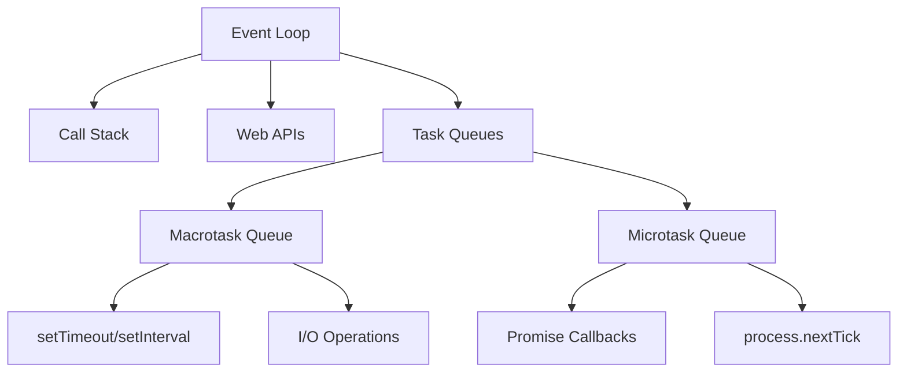

# Asynchronous Programming in JavaScript

## Understanding the Event Loop

The Event Loop is fundamental to JavaScript's asynchronous programming model. It's responsible for executing code, collecting and processing events, and executing queued tasks.

### Event Loop Architecture



### Execution Order

1. Execute synchronous code in the call stack
2. Check microtask queue and execute all microtasks
3. Execute one macrotask from the macrotask queue
4. Return to step 2

```javascript
console.log('Script start'); // 1: Synchronous

setTimeout(() => {
    console.log('Timeout 1'); // 4: Macrotask
}, 0);

Promise.resolve()
    .then(() => {
        console.log('Promise 1'); // 2: Microtask
    })
    .then(() => {
        console.log('Promise 2'); // 3: Microtask
    });

console.log('Script end'); // 1: Synchronous

// Output:
// Script start
// Script end
// Promise 1
// Promise 2
// Timeout 1
```

## Task Types

### Macrotasks (Tasks)

-   setTimeout/setInterval
-   requestAnimationFrame
-   I/O operations
-   UI rendering
-   script execution
-   event listeners

### Microtasks

-   Promise callbacks (.then/.catch/.finally)
-   process.nextTick (Node.js)
-   queueMicrotask()
-   MutationObserver

```javascript
// Demonstrating task queue priorities
console.log('Start'); // 1

setTimeout(() => {
    console.log('Timeout 1'); // 5
    Promise.resolve().then(() => {
        console.log('Promise inside Timeout'); // 6
    });
}, 0);

Promise.resolve().then(() => {
    console.log('Promise 1'); // 3
    setTimeout(() => {
        console.log('Timeout 2'); // 7
    }, 0);
});

queueMicrotask(() => {
    console.log('Microtask'); // 4
});

console.log('End'); // 2
```

## Promise Implementation

Understanding how Promises work internally:

```javascript
class MyPromise {
    static PENDING = 'pending';
    static FULFILLED = 'fulfilled';
    static REJECTED = 'rejected';

    constructor(executor) {
        this.state = MyPromise.PENDING;
        this.value = undefined;
        this.handlers = [];

        try {
            executor(this._resolve.bind(this), this._reject.bind(this));
        } catch (err) {
            this._reject(err);
        }
    }

    _resolve(value) {
        if (this.state !== MyPromise.PENDING) return;

        // Handle promise resolution
        if (value instanceof MyPromise) {
            value.then(this._resolve.bind(this), this._reject.bind(this));
            return;
        }

        this.state = MyPromise.FULFILLED;
        this.value = value;
        this._executeHandlers();
    }

    _reject(error) {
        if (this.state !== MyPromise.PENDING) return;

        this.state = MyPromise.REJECTED;
        this.value = error;
        this._executeHandlers();
    }

    _executeHandlers() {
        if (this.state === MyPromise.PENDING) return;

        queueMicrotask(() => {
            this.handlers.forEach(handler => {
                if (this.state === MyPromise.FULFILLED) {
                    handler.onFulfilled(this.value);
                } else {
                    handler.onRejected(this.value);
                }
            });
            this.handlers = [];
        });
    }

    then(onFulfilled, onRejected) {
        return new MyPromise((resolve, reject) => {
            this.handlers.push({
                onFulfilled: result => {
                    try {
                        resolve(onFulfilled ? onFulfilled(result) : result);
                    } catch (err) {
                        reject(err);
                    }
                },
                onRejected: error => {
                    try {
                        if (onRejected) {
                            resolve(onRejected(error));
                        } else {
                            reject(error);
                        }
                    } catch (err) {
                        reject(err);
                    }
                },
            });

            this._executeHandlers();
        });
    }
}
```

## Async/Await Implementation

Understanding how async/await works under the hood:

```javascript
// Async/await is syntactic sugar over generators and promises
function asyncToGenerator(generatorFunc) {
    return function (...args) {
        const generator = generatorFunc.apply(this, args);

        return new Promise((resolve, reject) => {
            function step(key, arg) {
                let generatorResult;

                try {
                    generatorResult = generator[key](arg);
                } catch (error) {
                    return reject(error);
                }

                const { value, done } = generatorResult;

                if (done) {
                    return resolve(value);
                }

                return Promise.resolve(value).then(
                    val => step('next', val),
                    err => step('throw', err),
                );
            }

            step('next');
        });
    };
}

// Example usage
function* fetchUserData() {
    try {
        const user = yield fetch('/api/user');
        const profile = yield fetch(`/api/profile/${user.id}`);
        return profile;
    } catch (error) {
        console.error('Error:', error);
        throw error;
    }
}

const fetchUserDataAsync = asyncToGenerator(fetchUserData);
```

## Evolution of Asynchronous Programming

### 1. Callbacks (Early Days)

```javascript
// Callback Hell Example
getData(function (a) {
    getMoreData(a, function (b) {
        getMoreData(b, function (c) {
            getMoreData(c, function (d) {
                getMoreData(d, function (e) {
                    // Do something with e
                });
            });
        });
    });
});
```

### 2. Promises (ES6)

```javascript
// Promise Chain
getData()
    .then(a => getMoreData(a))
    .then(b => getMoreData(b))
    .then(c => getMoreData(c))
    .then(d => getMoreData(d))
    .then(e => {
        // Do something with e
    })
    .catch(error => {
        // Handle any error that occurred
    });
```

### 3. Async/Await (ES2017)

```javascript
async function getAllData() {
    try {
        const a = await getData();
        const b = await getMoreData(a);
        const c = await getMoreData(b);
        const d = await getMoreData(c);
        const e = await getMoreData(d);
        // Do something with e
    } catch (error) {
        // Handle any error that occurred
    }
}
```

Best practices for asynchronous programming:

-   Understand the event loop and task queues
-   Use async/await for better readability
-   Implement proper error handling
-   Consider Promise.all for parallel operations
-   Be aware of microtask and macrotask differences
-   Handle Promise rejection appropriately
-   Avoid callback hell
-   Use proper error boundaries
-   Consider cancellation patterns
-   Implement loading states
