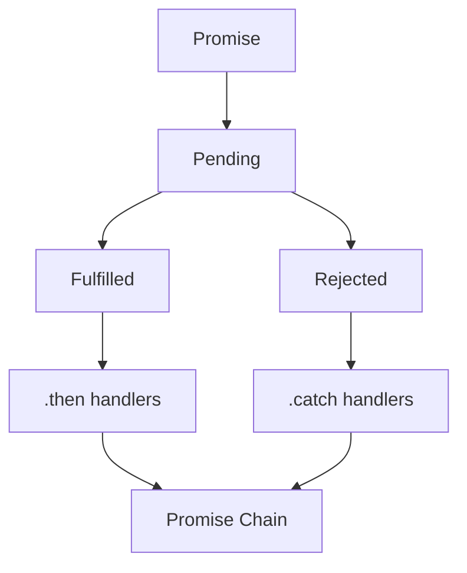
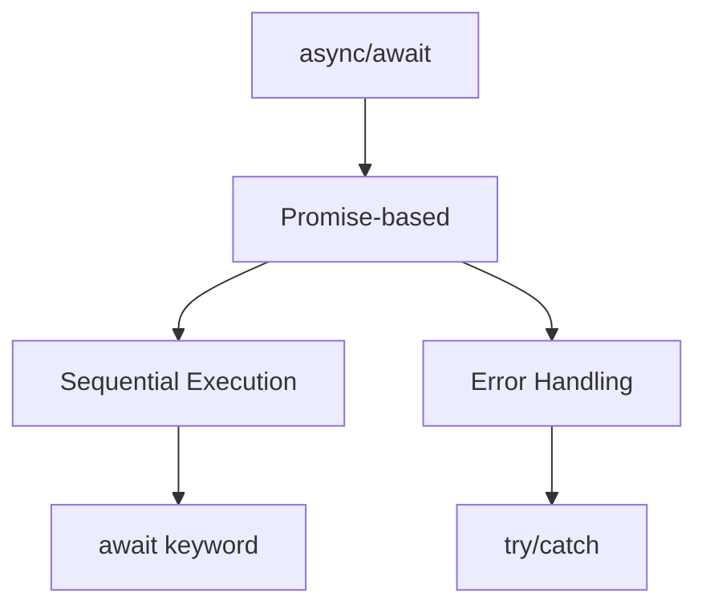
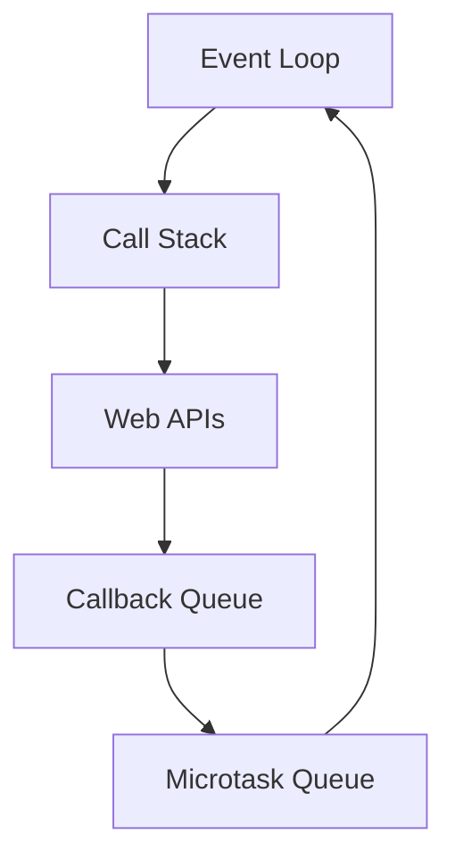

# Asynchronous Programming

## How do Promises work in JavaScript?



```javascript
// Promise implementation patterns
function fetchData(shouldSucceed = true) {
    return new Promise((resolve, reject) => {
        setTimeout(() => {
            if (shouldSucceed) {
                resolve({ data: 'Success' });
            } else {
                reject(new Error('Failed'));
            }
        }, 1000);
    });
}

// Promise chaining
fetchData()
    .then(result => {
        console.log(result);
        return fetchData(); // Return another promise
    })
    .then(result2 => {
        console.log(result2);
    })
    .catch(error => {
        console.error('Error:', error);
    })
    .finally(() => {
        console.log('Cleanup');
    });

// Promise combinators
Promise.all([fetchData(), fetchData()]) // All must succeed
    .then(([result1, result2]) => {
        console.log(result1, result2);
    });

Promise.race([fetchData(), fetchData()]) // First to complete
    .then(result => {
        console.log('First:', result);
    });

Promise.allSettled([fetchData(), fetchData(false)]) // Wait for all
    .then(results => {
        results.forEach(result => {
            if (result.status === 'fulfilled') {
                console.log('Success:', result.value);
            } else {
                console.log('Error:', result.reason);
            }
        });
    });
```

## How does async/await work?



```javascript
// Basic async/await usage
async function fetchUserData(userId) {
    try {
        const user = await fetchData(`/users/${userId}`);
        const posts = await fetchData(`/posts?userId=${userId}`);
        return { user, posts };
    } catch (error) {
        console.error('Error fetching user data:', error);
        throw error;
    }
}

// Parallel execution with async/await
async function fetchMultipleUsers(userIds) {
    try {
        const userPromises = userIds.map(id => fetchData(`/users/${id}`));
        const users = await Promise.all(userPromises);
        return users;
    } catch (error) {
        console.error('Error fetching users:', error);
        throw error;
    }
}

// Async iteration
async function processItems(items) {
    for await (const item of items) {
        await processItem(item);
    }
}
```

## How does the Event Loop handle async operations?



```javascript
console.log('Start'); // 1. Synchronous

setTimeout(() => {
    console.log('Timeout 1'); // 4. Macrotask
}, 0);

Promise.resolve()
    .then(() => {
        console.log('Promise 1'); // 2. Microtask
    })
    .then(() => {
        console.log('Promise 2'); // 3. Microtask
    });

console.log('End'); // 1. Synchronous

// Output:
// Start
// End
// Promise 1
// Promise 2
// Timeout 1
```

## How to handle errors in async code?

```javascript
// Error handling patterns
async function robustFetch(url, retries = 3) {
    for (let i = 0; i < retries; i++) {
        try {
            const response = await fetch(url);
            if (!response.ok) {
                throw new Error(`HTTP error! status: ${response.status}`);
            }
            return await response.json();
        } catch (error) {
            if (i === retries - 1) throw error;
            console.log(`Attempt ${i + 1} failed, retrying...`);
            await new Promise(resolve =>
                setTimeout(resolve, 1000 * Math.pow(2, i)),
            );
        }
    }
}

// Error boundaries in async operations
class AsyncOperation {
    static async execute(operation, fallback = null) {
        try {
            const result = await operation();
            return result;
        } catch (error) {
            console.error('Operation failed:', error);
            return fallback;
        } finally {
            // Cleanup code
        }
    }
}

// Usage
const result = await AsyncOperation.execute(() => fetchData('/api/data'), {
    error: 'Failed to fetch data',
});
```
