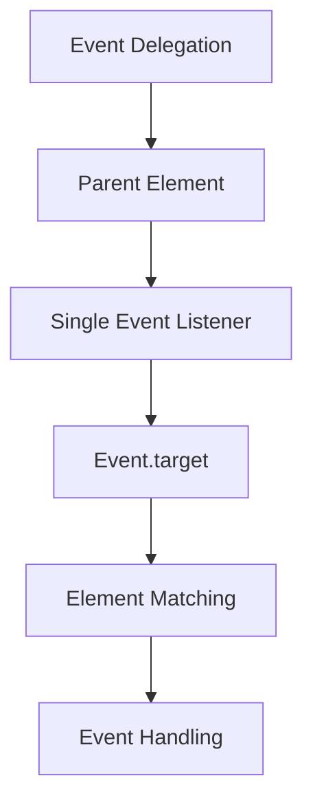
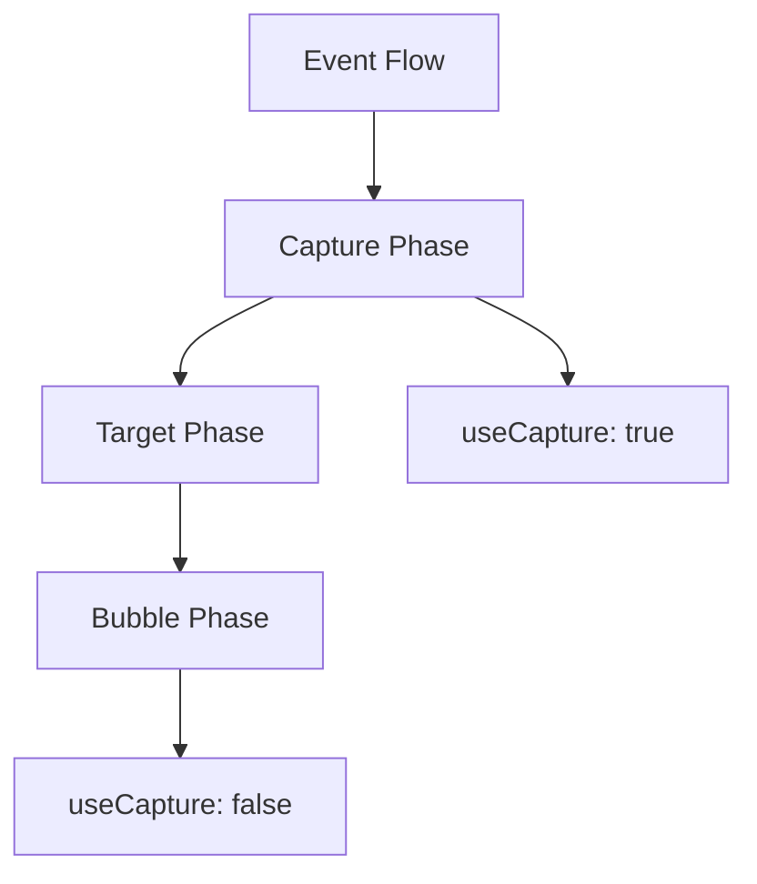

# DOM and Events

## How does Event Delegation work?



```javascript
// Event delegation pattern
class TodoList {
    constructor(elementId) {
        this.list = document.getElementById(elementId);
        this.setupEventHandlers();
    }

    setupEventHandlers() {
        this.list.addEventListener('click', event => {
            const target = event.target;

            if (target.matches('.delete-btn')) {
                this.handleDelete(target.closest('li'));
            } else if (target.matches('.edit-btn')) {
                this.handleEdit(target.closest('li'));
            } else if (target.matches('.toggle-btn')) {
                this.handleToggle(target.closest('li'));
            }
        });
    }

    handleDelete(item) {
        item.remove();
    }

    handleEdit(item) {
        const text = item.querySelector('.text');
        const newText = prompt('Edit item:', text.textContent);
        if (newText) text.textContent = newText;
    }

    handleToggle(item) {
        item.classList.toggle('completed');
    }
}
```

## How do Event Phases work?



```javascript
// Event phases demonstration
class EventPhases {
    static setupEventListeners() {
        const container = document.querySelector('.container');
        const button = container.querySelector('button');

        // Capture phase listeners
        document.addEventListener(
            'click',
            e => console.log('Document (Capture)'),
            true,
        );
        container.addEventListener(
            'click',
            e => console.log('Container (Capture)'),
            true,
        );
        button.addEventListener(
            'click',
            e => console.log('Button (Capture)'),
            true,
        );

        // Bubble phase listeners
        document.addEventListener('click', e =>
            console.log('Document (Bubble)'),
        );
        container.addEventListener('click', e =>
            console.log('Container (Bubble)'),
        );
        button.addEventListener('click', e => console.log('Button (Bubble)'));
    }

    static stopPropagation() {
        const button = document.querySelector('button');
        button.addEventListener('click', e => {
            e.stopPropagation(); // Stops event bubbling
            console.log('Button clicked (propagation stopped)');
        });
    }
}
```

## How to optimize DOM manipulation?

```javascript
// Efficient DOM manipulation patterns
class DOMOptimizer {
    static batchUpdates(elements, updateFn) {
        // Use DocumentFragment for batch updates
        const fragment = document.createDocumentFragment();
        elements.forEach(element => {
            const updated = updateFn(element);
            fragment.appendChild(updated);
        });
        return fragment;
    }

    static lazyLoad(elements, options = {}) {
        const observer = new IntersectionObserver(entries => {
            entries.forEach(entry => {
                if (entry.isIntersecting) {
                    const element = entry.target;
                    if (element.dataset.src) {
                        element.src = element.dataset.src;
                        observer.unobserve(element);
                    }
                }
            });
        }, options);

        elements.forEach(element => observer.observe(element));
    }

    static virtualScroll(container, items, rowHeight) {
        let lastScrollTop = 0;

        container.addEventListener('scroll', () => {
            const scrollTop = container.scrollTop;
            const visibleHeight = container.clientHeight;

            const startIndex = Math.floor(scrollTop / rowHeight);
            const endIndex = Math.ceil((scrollTop + visibleHeight) / rowHeight);

            // Only render visible items
            this.renderItems(items.slice(startIndex, endIndex), startIndex);
            lastScrollTop = scrollTop;
        });
    }
}
```

## How to work with Custom Events?

```javascript
// Custom events implementation
class CustomEventManager {
    static createEvent(name, detail) {
        return new CustomEvent(name, {
            bubbles: true,
            cancelable: true,
            detail,
        });
    }

    static dispatch(element, eventName, detail) {
        const event = this.createEvent(eventName, detail);
        return element.dispatchEvent(event);
    }

    static listen(element, eventName, handler, options = {}) {
        element.addEventListener(
            eventName,
            e => {
                handler(e.detail, e);
            },
            options,
        );

        return () => element.removeEventListener(eventName, handler);
    }
}

// Usage example
class UserActions {
    constructor(element) {
        this.element = element;
        this.setupEvents();
    }

    setupEvents() {
        CustomEventManager.listen(
            this.element,
            'user:action',
            (detail, event) => {
                console.log('User action:', detail);
                if (detail.type === 'dangerous' && !confirm('Are you sure?')) {
                    event.preventDefault();
                }
            },
        );
    }

    performAction(actionType, data) {
        CustomEventManager.dispatch(this.element, 'user:action', {
            type: actionType,
            data,
            timestamp: new Date(),
        });
    }
}
```
