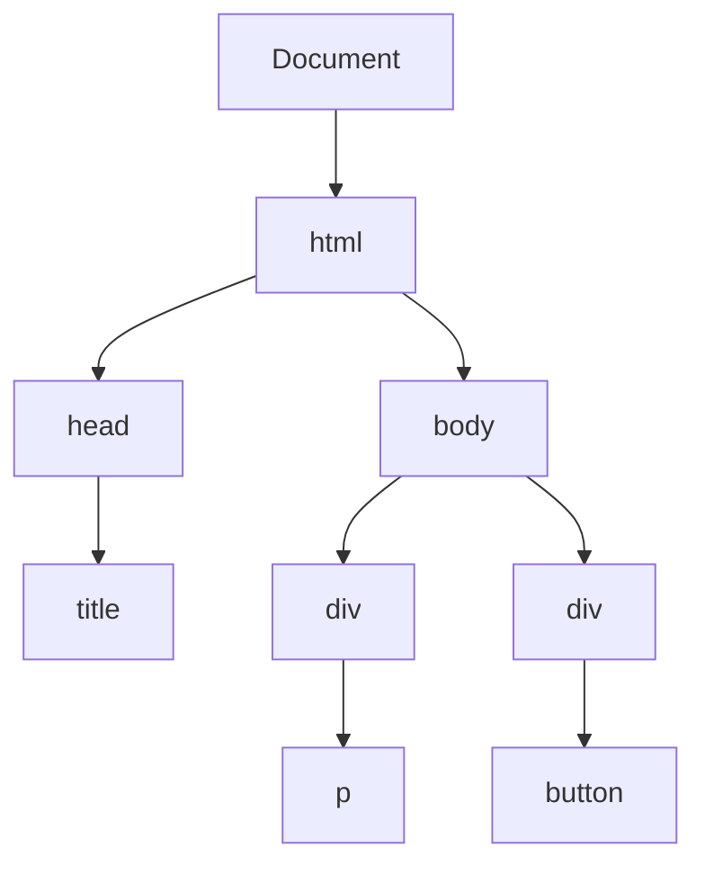
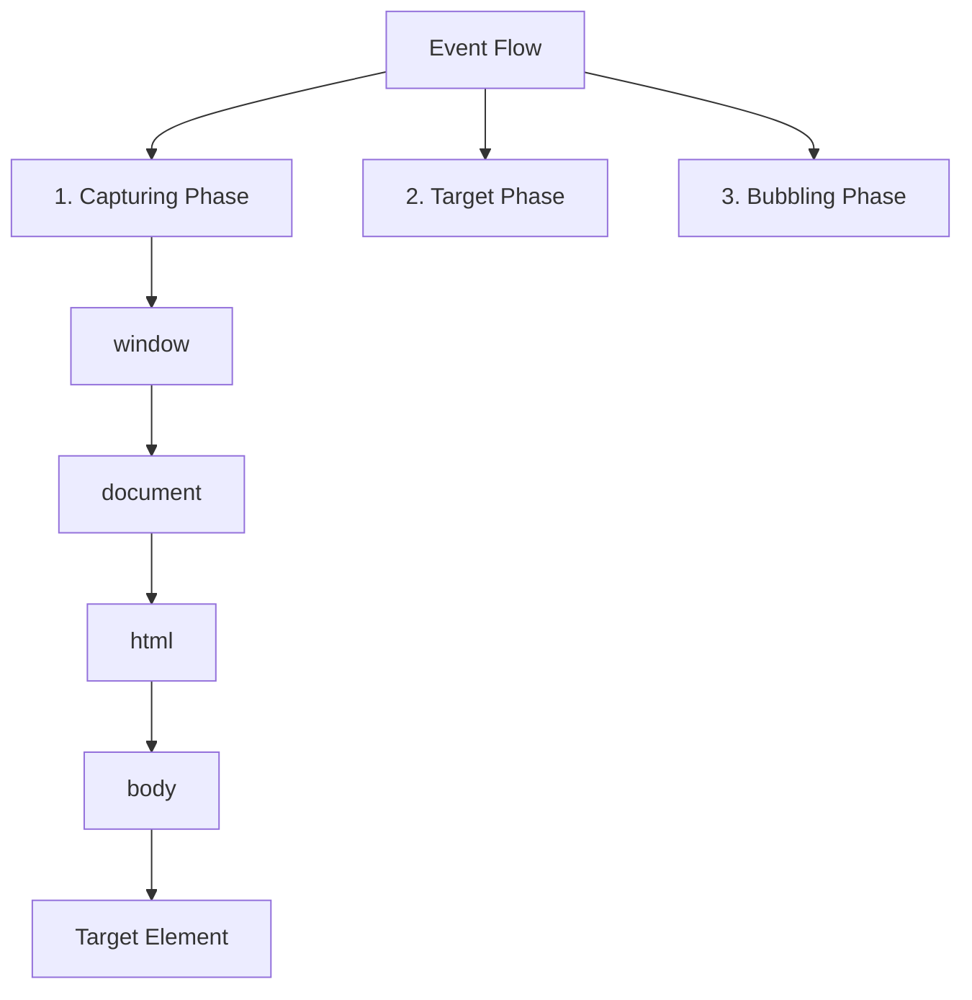

# DOM and Events in JavaScript

## DOM Structure and Navigation

The DOM represents HTML as a tree structure of objects.



### DOM Node Selection

```javascript
// Basic Selection Methods
const byId = document.getElementById('myId');
const byClass = document.getElementsByClassName('myClass');
const byTag = document.getElementsByTagName('div');

// Modern Query Selectors
const oneElement = document.querySelector('.myClass');
const allElements = document.querySelectorAll('.myClass');

// Traversing the DOM
const parent = element.parentNode;
const children = element.children;
const next = element.nextElementSibling;
const previous = element.previousElementSibling;

// Checking Relationships
const isChild = parent.contains(child);
const isDescendant = element.closest('.ancestor');
```

## DOM Manipulation

### Creating and Modifying Elements

```javascript
// Creating Elements
const div = document.createElement('div');
const text = document.createTextNode('Hello');
const fragment = document.createDocumentFragment();

// Modifying Elements
element.textContent = 'New text';
element.innerHTML = '<span>HTML content</span>';
element.setAttribute('class', 'new-class');
element.classList.add('active');
element.style.backgroundColor = 'red';

// DOM Insertion
parent.appendChild(child);
parent.insertBefore(newNode, referenceNode);
parent.replaceChild(newNode, oldNode);
element.remove();

// Modern Insertion Methods
element.append(child1, child2);
element.prepend(child);
element.before(sibling);
element.after(sibling);
```

## Event Flow

Events in the DOM flow through three phases: capturing, target, and bubbling.



### Event Phases Example

```javascript
// Event flow demonstration
document.addEventListener(
    'click',
    () => {
        console.log('Document Capture');
    },
    true,
); // Capture phase

document.addEventListener('click', () => {
    console.log('Document Bubble');
}); // Bubble phase

element.addEventListener(
    'click',
    () => {
        console.log('Element Capture');
    },
    true,
); // Capture phase

element.addEventListener('click', () => {
    console.log('Element Bubble');
}); // Bubble phase

// Output when element is clicked:
// 1. Document Capture
// 2. Element Capture
// 3. Element Bubble
// 4. Document Bubble
```

## Event Handling

### Event Delegation

```javascript
class EventDelegate {
    constructor(element, options = {}) {
        this.element = element;
        this.options = {
            capture: false,
            passive: true,
            ...options,
        };
        this.handlers = new Map();
    }

    on(eventType, selector, handler) {
        if (!this.handlers.has(eventType)) {
            this.handlers.set(eventType, new Map());
            this.addEventHandler(eventType);
        }
        this.handlers.get(eventType).set(selector, handler);
    }

    off(eventType, selector) {
        const typeHandlers = this.handlers.get(eventType);
        if (typeHandlers) {
            typeHandlers.delete(selector);
        }
    }

    addEventHandler(eventType) {
        this.element.addEventListener(
            eventType,
            event => {
                const typeHandlers = this.handlers.get(eventType);
                if (!typeHandlers) return;

                for (const [selector, handler] of typeHandlers) {
                    const target = event.target.closest(selector);
                    if (target && this.element.contains(target)) {
                        handler.call(target, event, target);
                    }
                }
            },
            this.options,
        );
    }
}
```

### Custom Events

```javascript
class EventEmitter {
    constructor() {
        this.events = new Map();
    }

    on(eventName, handler) {
        if (!this.events.has(eventName)) {
            this.events.set(eventName, new Set());
        }
        this.events.get(eventName).add(handler);
        return () => this.off(eventName, handler);
    }

    off(eventName, handler) {
        const handlers = this.events.get(eventName);
        if (handlers) {
            handlers.delete(handler);
        }
    }

    emit(eventName, data) {
        const handlers = this.events.get(eventName);
        if (handlers) {
            handlers.forEach(handler => handler(data));
        }
    }

    once(eventName, handler) {
        const wrapper = data => {
            handler(data);
            this.off(eventName, wrapper);
        };
        return this.on(eventName, wrapper);
    }
}

// DOM Custom Events
class DOMEvents {
    static dispatch(element, eventName, detail = {}) {
        const event = new CustomEvent(eventName, {
            bubbles: true,
            cancelable: true,
            detail,
        });
        return element.dispatchEvent(event);
    }

    static on(element, eventName, handler, options = {}) {
        element.addEventListener(eventName, handler, options);
        return () => element.removeEventListener(eventName, handler, options);
    }
}
```

## Performance Optimization

### Virtual List Implementation

```javascript
class VirtualList {
    constructor(container, options) {
        this.container = container;
        this.options = {
            itemHeight: 30,
            bufferSize: 5,
            ...options,
        };

        this.visibleCount = Math.ceil(
            container.clientHeight / this.options.itemHeight,
        );
        this.totalCount = 0;
        this.startIndex = 0;
        this.items = [];

        this.setupContainer();
        this.bindEvents();
    }

    setupContainer() {
        this.container.style.position = 'relative';
        this.container.style.overflow = 'auto';
        this.content = document.createElement('div');
        this.content.style.position = 'absolute';
        this.content.style.width = '100%';
        this.container.appendChild(this.content);
    }

    bindEvents() {
        this.container.addEventListener('scroll', this.onScroll.bind(this));
        window.addEventListener('resize', this.onResize.bind(this));
    }

    onScroll() {
        const scrollTop = this.container.scrollTop;
        this.startIndex = Math.floor(scrollTop / this.options.itemHeight);
        this.render();
    }

    onResize() {
        this.visibleCount = Math.ceil(
            this.container.clientHeight / this.options.itemHeight,
        );
        this.render();
    }

    setItems(items) {
        this.items = items;
        this.totalCount = items.length;
        this.content.style.height = `${this.totalCount * this.options.itemHeight}px`;
        this.render();
    }

    render() {
        const { itemHeight, bufferSize } = this.options;
        const start = Math.max(0, this.startIndex - bufferSize);
        const end = Math.min(
            this.totalCount,
            this.startIndex + this.visibleCount + bufferSize,
        );

        const items = this.items.slice(start, end).map((item, index) => {
            const top = (start + index) * itemHeight;
            return `
                <div style="position: absolute; top: ${top}px; width: 100%; height: ${itemHeight}px;">
                    ${item}
                </div>
            `;
        });

        this.content.innerHTML = items.join('');
    }
}
```

### DOM Batching

```javascript
class DOMBatcher {
    constructor() {
        this.reads = new Map();
        this.writes = new Map();
        this.scheduled = false;
    }

    read(key, operation) {
        this.reads.set(key, operation);
        this.schedule();
    }

    write(key, operation) {
        this.writes.set(key, operation);
        this.schedule();
    }

    schedule() {
        if (this.scheduled) return;
        this.scheduled = true;
        requestAnimationFrame(() => this.run());
    }

    run() {
        // Process all reads
        for (const [key, operation] of this.reads) {
            operation();
        }
        this.reads.clear();

        // Process all writes
        for (const [key, operation] of this.writes) {
            operation();
        }
        this.writes.clear();

        this.scheduled = false;
    }
}
```

Best practices for DOM and Events:

-   Use event delegation for dynamic content
-   Batch DOM operations for better performance
-   Implement virtual scrolling for large lists
-   Use custom events for decoupled communication
-   Handle event cleanup properly
-   Consider performance implications of event listeners
-   Use appropriate event options (capture, passive)
-   Implement proper error boundaries
-   Optimize DOM queries and updates
-   Follow event naming conventions
