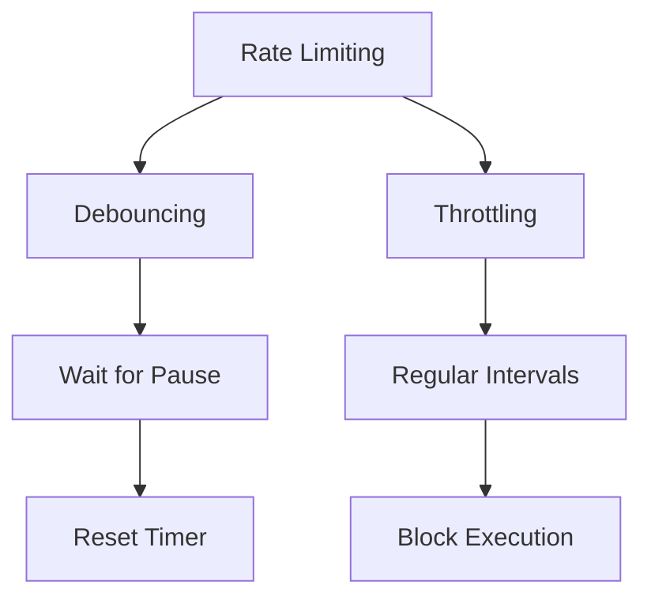
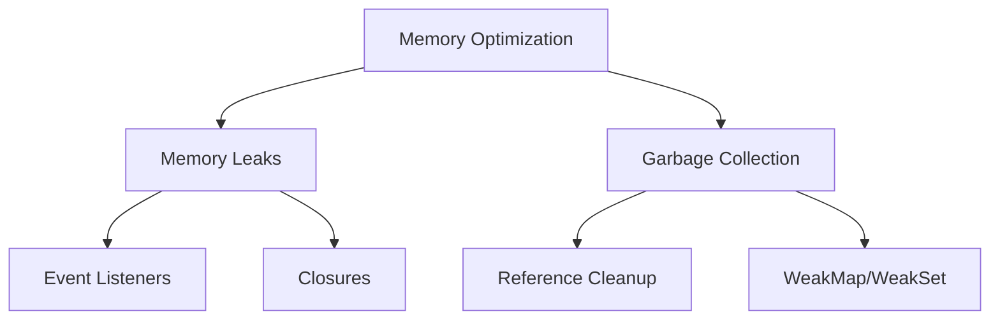

# Performance Optimization

## How to implement Debouncing and Throttling?



```javascript
// Advanced debouncing with options
function debounce(func, wait, options = {}) {
    let timeoutId;
    let lastArgs;
    let lastThis;
    let result;
    let lastCallTime = 0;
    const { leading = false, maxWait = null } = options;

    const invoke = () => {
        const args = lastArgs;
        const thisArg = lastThis;

        lastArgs = lastThis = undefined;
        result = func.apply(thisArg, args);
        return result;
    };

    const shouldInvoke = time => {
        if (!timeoutId) return true;
        if (maxWait && time - lastCallTime >= maxWait) return true;
        return false;
    };

    return function (...args) {
        const time = Date.now();

        if (shouldInvoke(time)) {
            if (leading) {
                result = invoke();
            }
        }

        lastArgs = args;
        lastThis = this;
        lastCallTime = time;

        clearTimeout(timeoutId);
        timeoutId = setTimeout(invoke, wait);

        return result;
    };
}

// Advanced throttling with trailing option
function throttle(func, limit, options = {}) {
    let inThrottle;
    let lastResult;
    let lastArgs;
    let lastThis;
    const { trailing = true } = options;

    return function (...args) {
        if (!inThrottle) {
            lastResult = func.apply(this, args);
            inThrottle = true;

            setTimeout(() => {
                inThrottle = false;
                if (trailing && lastArgs) {
                    lastResult = func.apply(lastThis, lastArgs);
                    lastArgs = lastThis = undefined;
                }
            }, limit);
        } else if (trailing) {
            lastArgs = args;
            lastThis = this;
        }

        return lastResult;
    };
}

// Usage examples
class SearchComponent {
    constructor() {
        this.searchInput = document.querySelector('#search');
        this.setupHandlers();
    }

    setupHandlers() {
        const debouncedSearch = debounce(this.performSearch.bind(this), 300, {
            leading: true,
            maxWait: 1000,
        });

        const throttledScroll = throttle(this.handleScroll.bind(this), 100, {
            trailing: true,
        });

        this.searchInput.addEventListener('input', debouncedSearch);
        window.addEventListener('scroll', throttledScroll);
    }
}
```

## How to optimize memory usage?



```javascript
// Memory management patterns
class MemoryManager {
    constructor() {
        this.cache = new WeakMap();
        this.eventHandlers = new Map();
        this.observers = new Set();
    }

    // Cache with automatic cleanup
    cacheData(element, data) {
        this.cache.set(element, {
            data,
            timestamp: Date.now(),
        });
    }

    // Event handler cleanup
    addEventHandler(element, event, handler) {
        if (!this.eventHandlers.has(element)) {
            this.eventHandlers.set(element, new Map());
        }

        const elementHandlers = this.eventHandlers.get(element);
        elementHandlers.set(event, handler);
        element.addEventListener(event, handler);
    }

    removeEventHandlers(element) {
        if (this.eventHandlers.has(element)) {
            const elementHandlers = this.eventHandlers.get(element);
            elementHandlers.forEach((handler, event) => {
                element.removeEventListener(event, handler);
            });
            this.eventHandlers.delete(element);
        }
    }

    // Observer cleanup
    observe(target) {
        const observer = new MutationObserver(mutations => {
            // Handle mutations
        });

        observer.observe(target, { childList: true, subtree: true });
        this.observers.add(observer);

        return () => {
            observer.disconnect();
            this.observers.delete(observer);
        };
    }

    cleanup() {
        this.eventHandlers.forEach((_, element) => {
            this.removeEventHandlers(element);
        });

        this.observers.forEach(observer => {
            observer.disconnect();
        });
        this.observers.clear();
    }
}
```

## How to optimize rendering performance?

```javascript
// Rendering optimization patterns
class RenderOptimizer {
    static requestIdleCallback(callback) {
        if ('requestIdleCallback' in window) {
            return window.requestIdleCallback(callback);
        }
        return setTimeout(callback, 1);
    }

    static batchDOMReads() {
        const measurements = new Map();
        const elements = document.querySelectorAll('.target');

        // Batch all DOM reads
        elements.forEach(element => {
            measurements.set(element, {
                height: element.offsetHeight,
                width: element.offsetWidth,
                top: element.offsetTop,
            });
        });

        // Then batch all DOM writes
        measurements.forEach((metrics, element) => {
            this.updateElement(element, metrics);
        });
    }

    static useRAF(callback) {
        let ticking = false;

        return (...args) => {
            if (!ticking) {
                requestAnimationFrame(() => {
                    callback(...args);
                    ticking = false;
                });
                ticking = true;
            }
        };
    }

    static createVirtualList(container, items, rowHeight) {
        const totalHeight = items.length * rowHeight;
        const visibleItems = Math.ceil(container.clientHeight / rowHeight);

        container.style.height = `${totalHeight}px`;
        const content = document.createElement('div');

        const render = this.useRAF(scrollTop => {
            const startIndex = Math.floor(scrollTop / rowHeight);
            const endIndex = Math.min(
                startIndex + visibleItems + 1,
                items.length,
            );

            content.style.transform = `translateY(${startIndex * rowHeight}px)`;
            content.innerHTML = items
                .slice(startIndex, endIndex)
                .map(
                    item => `<div style="height: ${rowHeight}px">${item}</div>`,
                )
                .join('');
        });

        container.addEventListener('scroll', e => {
            render(e.target.scrollTop);
        });

        container.appendChild(content);
        render(0);
    }
}
```
