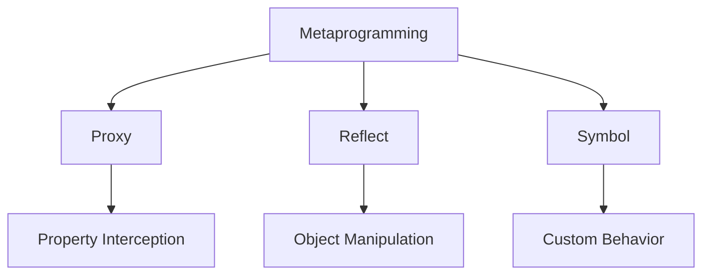

# Advanced JavaScript Concepts

Advanced JavaScript concepts involve sophisticated programming patterns and language features that enable powerful application architectures.

## Metaprogramming

Metaprogramming allows programs to analyze and modify their own structure and behavior.



### Proxy and Reflect

```javascript
// Property Access Interception
const handler = {
    get(target, property) {
        console.log(`Accessing property: ${property}`);
        return Reflect.get(target, property);
    },
    set(target, property, value) {
        console.log(`Setting property: ${property} = ${value}`);
        return Reflect.set(target, property, value);
    },
};

const target = { name: 'John' };
const proxy = new Proxy(target, handler);

// Custom Property Validation
const validator = {
    set(target, property, value) {
        if (property === 'age') {
            if (!Number.isInteger(value)) {
                throw new TypeError('Age must be an integer');
            }
            if (value < 0 || value > 150) {
                throw new RangeError('Age must be between 0 and 150');
            }
        }
        return Reflect.set(target, property, value);
    },
};

const person = new Proxy({}, validator);
```

## Advanced Design Patterns

### Singleton Pattern with Private Fields

```javascript
class Singleton {
    static #instance;
    #data;

    constructor() {
        if (Singleton.#instance) {
            return Singleton.#instance;
        }
        this.#data = new Map();
        Singleton.#instance = this;
    }

    static getInstance() {
        return new Singleton();
    }

    set(key, value) {
        this.#data.set(key, value);
    }

    get(key) {
        return this.#data.get(key);
    }
}

// Factory Pattern with Abstract Factory
class UIFactory {
    createButton() {
        throw new Error('Method not implemented');
    }

    createInput() {
        throw new Error('Method not implemented');
    }
}

class MaterialUIFactory extends UIFactory {
    createButton() {
        return new MaterialButton();
    }

    createInput() {
        return new MaterialInput();
    }
}

class BootstrapUIFactory extends UIFactory {
    createButton() {
        return new BootstrapButton();
    }

    createInput() {
        return new BootstrapInput();
    }
}
```

## Advanced Memory Management

### Memory Leak Detection and Prevention

```javascript
class MemoryLeakDetector {
    constructor() {
        this.weakMap = new WeakMap();
        this.refs = new Set();
    }

    track(object, metadata = {}) {
        this.weakMap.set(object, {
            timestamp: Date.now(),
            ...metadata,
        });
        this.refs.add(object);
    }

    untrack(object) {
        this.weakMap.delete(object);
        this.refs.delete(object);
    }

    getStats() {
        return {
            trackedObjects: this.refs.size,
            oldestReference: Math.min(
                ...Array.from(this.refs).map(
                    ref => this.weakMap.get(ref).timestamp,
                ),
            ),
        };
    }
}

// Circular Reference Handler
class CircularReferenceHandler {
    static stringify(obj) {
        const seen = new WeakSet();
        return JSON.stringify(obj, (key, value) => {
            if (typeof value === 'object' && value !== null) {
                if (seen.has(value)) {
                    return '[Circular]';
                }
                seen.add(value);
            }
            return value;
        });
    }

    static deepClone(obj) {
        const seen = new WeakMap();
        return (function clone(item) {
            if (typeof item !== 'object' || item === null) {
                return item;
            }
            if (seen.has(item)) {
                return seen.get(item);
            }
            const result = Array.isArray(item) ? [] : {};
            seen.set(item, result);
            return Object.fromEntries(
                Object.entries(item).map(([key, value]) => [key, clone(value)]),
            );
        })(obj);
    }
}
```

## Advanced Asynchronous Patterns

### Custom Promise Implementation

```javascript
class MyPromise {
    constructor(executor) {
        this.state = 'pending';
        this.value = undefined;
        this.callbacks = [];

        const resolve = value => {
            if (this.state === 'pending') {
                this.state = 'fulfilled';
                this.value = value;
                this.callbacks.forEach(callback => callback());
            }
        };

        const reject = reason => {
            if (this.state === 'pending') {
                this.state = 'rejected';
                this.value = reason;
                this.callbacks.forEach(callback => callback());
            }
        };

        try {
            executor(resolve, reject);
        } catch (error) {
            reject(error);
        }
    }

    then(onFulfilled, onRejected) {
        return new MyPromise((resolve, reject) => {
            const callback = () => {
                try {
                    const result =
                        this.state === 'fulfilled'
                            ? onFulfilled?.(this.value)
                            : onRejected?.(this.value);
                    resolve(result);
                } catch (error) {
                    reject(error);
                }
            };

            if (this.state === 'pending') {
                this.callbacks.push(callback);
            } else {
                callback();
            }
        });
    }
}
```

## Advanced Language Features

### Generator Composition

```javascript
function* range(start, end) {
    for (let i = start; i <= end; i++) {
        yield i;
    }
}

function* filter(iterator, predicate) {
    for (const value of iterator) {
        if (predicate(value)) {
            yield value;
        }
    }
}

// Usage
const numbers = range(1, 10);
const evenNumbers = filter(numbers, n => n % 2 === 0);

// Advanced Iterator
const advancedIterator = {
    *[Symbol.iterator]() {
        yield* range(1, 3);
        yield* ['a', 'b', 'c'];
        yield* new Set([1, 2, 3]);
    },
};
```

## Design Patterns

### Decorator Pattern

```javascript
// Class Decorator
function readonly(target) {
    target.prototype.readonly = true;
    return target;
}

// Method Decorator
function log(target, name, descriptor) {
    const original = descriptor.value;
    descriptor.value = function (...args) {
        console.log(`Calling ${name} with:`, args);
        return original.apply(this, args);
    };
    return descriptor;
}

// Property Decorator
function validate(target, name, descriptor) {
    const setter = descriptor.set;
    descriptor.set = function (value) {
        if (value < 0) {
            throw new Error('Value cannot be negative');
        }
        setter.call(this, value);
    };
    return descriptor;
}

// Usage Example
@readonly
class Example {
    @validate
    set age(value) {
        this._age = value;
    }

    @log
    greet(name) {
        return `Hello, ${name}!`;
    }
}
```

### Observer Pattern

```javascript
class Subject {
    constructor() {
        this.observers = new Set();
    }

    addObserver(observer) {
        this.observers.add(observer);
    }

    removeObserver(observer) {
        this.observers.delete(observer);
    }

    notify(data) {
        this.observers.forEach(observer => observer.update(data));
    }
}

class Observer {
    update(data) {
        console.log('Received update:', data);
    }
}

// Usage
const subject = new Subject();
const observer1 = new Observer();
const observer2 = new Observer();

subject.addObserver(observer1);
subject.addObserver(observer2);
subject.notify('Hello Observers!');
```

### Publish-Subscribe Pattern

```javascript
class EventBus {
    constructor() {
        this.topics = new Map();
    }

    subscribe(topic, callback) {
        if (!this.topics.has(topic)) {
            this.topics.set(topic, new Set());
        }
        this.topics.get(topic).add(callback);

        return () => {
            this.topics.get(topic).delete(callback);
            if (this.topics.get(topic).size === 0) {
                this.topics.delete(topic);
            }
        };
    }

    publish(topic, data) {
        if (this.topics.has(topic)) {
            this.topics.get(topic).forEach(callback => {
                try {
                    callback(data);
                } catch (error) {
                    console.error('Error in subscriber:', error);
                }
            });
        }
    }

    clear(topic) {
        if (topic) {
            this.topics.delete(topic);
        } else {
            this.topics.clear();
        }
    }
}

// Usage
const eventBus = new EventBus();
const unsubscribe = eventBus.subscribe('userLogin', data => {
    console.log('User logged in:', data);
});

eventBus.publish('userLogin', { id: 1, name: 'John' });
unsubscribe(); // Remove subscription
```

### Proxy Pattern

```javascript
// Property Validation Proxy
const userValidator = {
    set(target, property, value) {
        switch (property) {
            case 'age':
                if (!Number.isInteger(value)) {
                    throw new TypeError('Age must be an integer');
                }
                if (value < 0 || value > 150) {
                    throw new RangeError('Age must be between 0 and 150');
                }
                break;
            case 'email':
                if (!value.includes('@')) {
                    throw new Error('Invalid email format');
                }
                break;
        }
        return Reflect.set(target, property, value);
    },
};

const user = new Proxy({}, userValidator);

// Access Control Proxy
function createAccessControlProxy(target, allowedRoles) {
    return new Proxy(target, {
        get(target, property) {
            const currentUser = getCurrentUser(); // Implementation needed
            if (!allowedRoles.includes(currentUser.role)) {
                throw new Error('Access denied');
            }
            return Reflect.get(target, property);
        },
    });
}

// Cache Proxy
function createCacheProxy(target) {
    const cache = new Map();

    return new Proxy(target, {
        get(target, property) {
            if (!cache.has(property)) {
                cache.set(property, Reflect.get(target, property));
            }
            return cache.get(property);
        },
    });
}
```

### Singleton Pattern

```javascript
class Singleton {
    static #instance;
    #data;

    constructor() {
        if (Singleton.#instance) {
            return Singleton.#instance;
        }
        this.#data = new Map();
        Singleton.#instance = this;
    }

    static getInstance() {
        return new Singleton();
    }

    set(key, value) {
        this.#data.set(key, value);
    }

    get(key) {
        return this.#data.get(key);
    }
}

// Usage
const instance1 = Singleton.getInstance();
const instance2 = Singleton.getInstance();
console.log(instance1 === instance2); // true
```

Best practices for advanced JavaScript:

-   Use metaprogramming judiciously
-   Implement design patterns appropriately
-   Handle memory management carefully
-   Understand advanced async patterns
-   Leverage modern language features
-   Document complex implementations
-   Write comprehensive tests
-   Consider performance implications
-   Maintain code readability
-   Follow established conventions
