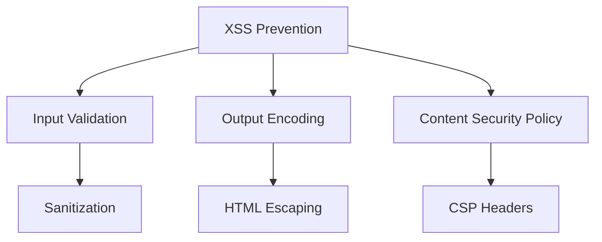

# Security Best Practices

## How to prevent XSS attacks?



```javascript
// Input sanitization and validation
class SecurityUtils {
    static escapeHTML(unsafe) {
        return unsafe
            .replace(/&/g, '&amp;')
            .replace(/</g, '&lt;')
            .replace(/>/g, '&gt;')
            .replace(/"/g, '&quot;')
            .replace(/'/g, '&#039;');
    }

    static sanitizeInput(input, allowedTags = []) {
        const div = document.createElement('div');
        div.textContent = input;

        if (allowedTags.length) {
            // Use DOMPurify with configuration
            return DOMPurify.sanitize(input, {
                ALLOWED_TAGS: allowedTags,
                ALLOWED_ATTR: ['href', 'title', 'target'],
            });
        }

        return div.innerHTML;
    }

    static validateJSON(jsonString) {
        try {
            const data = JSON.parse(jsonString);
            return { isValid: true, data };
        } catch {
            return { isValid: false, data: null };
        }
    }
}

// Safe DOM manipulation
class SafeDOM {
    static setInnerHTML(element, content) {
        // Use DOMPurify for complex HTML
        element.innerHTML = DOMPurify.sanitize(content);
    }

    static setTextContent(element, content) {
        element.textContent = content; // Automatically escapes HTML
    }

    static createSafeLink(url, text) {
        const link = document.createElement('a');
        link.textContent = text;

        try {
            const safeUrl = new URL(url);
            if (['http:', 'https:'].includes(safeUrl.protocol)) {
                link.href = safeUrl.href;
                link.rel = 'noopener noreferrer';
                link.target = '_blank';
            }
        } catch {
            console.error('Invalid URL:', url);
        }

        return link;
    }
}
```

## How to implement secure authentication?

```javascript
// Secure authentication patterns
class AuthService {
    constructor() {
        this.tokenKey = 'auth_token';
        this.refreshTokenKey = 'refresh_token';
    }

    async login(credentials) {
        try {
            const response = await fetch('/api/login', {
                method: 'POST',
                headers: {
                    'Content-Type': 'application/json',
                },
                body: JSON.stringify(credentials),
                credentials: 'include', // For cookies
            });

            if (!response.ok) throw new Error('Authentication failed');

            const data = await response.json();
            this.setTokens(data);

            return data;
        } catch (error) {
            console.error('Login error:', error);
            throw error;
        }
    }

    setTokens({ accessToken, refreshToken, expiresIn }) {
        // Store tokens securely
        if (this.supportsSecureStorage()) {
            sessionStorage.setItem(this.tokenKey, accessToken);
            localStorage.setItem(this.refreshTokenKey, refreshToken);
        } else {
            // Fallback to cookies with httpOnly flag
            document.cookie = `${this.tokenKey}=${accessToken}; Secure; SameSite=Strict`;
        }

        // Set token expiration
        const expiresAt = Date.now() + expiresIn * 1000;
        sessionStorage.setItem('token_expires_at', expiresAt.toString());
    }

    supportsSecureStorage() {
        try {
            return window.isSecureContext && 'localStorage' in window;
        } catch {
            return false;
        }
    }

    async refreshAccessToken() {
        const refreshToken = localStorage.getItem(this.refreshTokenKey);
        if (!refreshToken) throw new Error('No refresh token');

        const response = await fetch('/api/refresh', {
            method: 'POST',
            headers: {
                'Content-Type': 'application/json',
            },
            body: JSON.stringify({ refreshToken }),
        });

        if (!response.ok) {
            this.logout();
            throw new Error('Token refresh failed');
        }

        const data = await response.json();
        this.setTokens(data);
        return data.accessToken;
    }
}
```

## How to implement secure data handling?

```javascript
// Secure data handling patterns
class SecureDataHandler {
    constructor() {
        this.encryptionKey = null;
    }

    async initializeEncryption() {
        // Use Web Crypto API for encryption
        const key = await window.crypto.subtle.generateKey(
            {
                name: 'AES-GCM',
                length: 256,
            },
            true,
            ['encrypt', 'decrypt'],
        );
        this.encryptionKey = key;
    }

    async encryptData(data) {
        const iv = window.crypto.getRandomValues(new Uint8Array(12));
        const encodedData = new TextEncoder().encode(JSON.stringify(data));

        const encryptedData = await window.crypto.subtle.encrypt(
            {
                name: 'AES-GCM',
                iv,
            },
            this.encryptionKey,
            encodedData,
        );

        return {
            data: Array.from(new Uint8Array(encryptedData)),
            iv: Array.from(iv),
        };
    }

    async decryptData(encryptedData, iv) {
        try {
            const decrypted = await window.crypto.subtle.decrypt(
                {
                    name: 'AES-GCM',
                    iv: new Uint8Array(iv),
                },
                this.encryptionKey,
                new Uint8Array(encryptedData),
            );

            return JSON.parse(new TextDecoder().decode(decrypted));
        } catch (error) {
            console.error('Decryption failed:', error);
            throw new Error('Data integrity compromised');
        }
    }

    // Secure data transmission
    async sendSecureData(url, data) {
        const encrypted = await this.encryptData(data);

        return fetch(url, {
            method: 'POST',
            headers: {
                'Content-Type': 'application/json',
                'X-Request-ID': crypto.randomUUID(),
            },
            body: JSON.stringify(encrypted),
            credentials: 'include',
        });
    }
}
```
