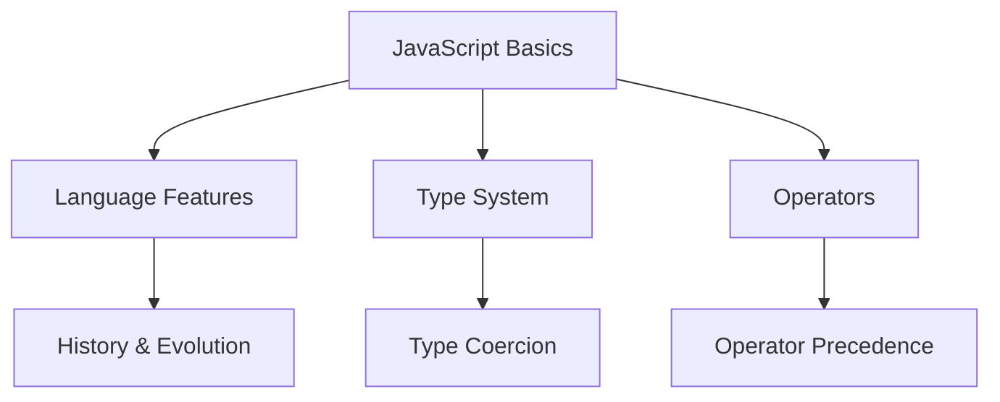

# Additional JavaScript Concepts

## Language Fundamentals



## What is the difference between Java and JavaScript?

Despite similar names, they are very different:

-   JavaScript is a scripting language for web browsers
-   Java is a full OOP language for general applications
-   JavaScript is interpreted, Java is compiled
-   JavaScript has dynamic typing, Java has static typing
-   JavaScript runs in browsers, Java runs in JVM

## What happens in JavaScript type coercion?

```javascript
// Examples of type coercion
console.log(3 + 2 + '7'); // Outputs "57"
console.log('3' + 2 + 7); // Outputs "327"
console.log('3' - 2); // Outputs 1
console.log(true + 1); // Outputs 2
```

## What is the difference between null and undefined?

```javascript
// undefined examples
let variable;
console.log(variable); // undefined
console.log(typeof undefined); // "undefined"

// null examples
let nullVar = null;
console.log(nullVar); // null
console.log(typeof null); // "object" (this is a known JavaScript quirk)

// Comparison
console.log(null == undefined); // true
console.log(null === undefined); // false
```

## What is negative infinity?

```javascript
// Ways to get negative infinity
console.log(Number.NEGATIVE_INFINITY); // -Infinity
console.log(-1 / 0); // -Infinity
console.log(-Number.MAX_VALUE * 2); // -Infinity

// Properties
console.log(isFinite(Number.NEGATIVE_INFINITY)); // false
```

## How to handle browser-specific JavaScript code?

```javascript
// Browser detection and feature detection
function getBrowserInfo() {
    const userAgent = navigator.userAgent;
    const browserInfo = {
        isChrome: /Chrome/.test(userAgent),
        isFirefox: /Firefox/.test(userAgent),
        isSafari: /Safari/.test(userAgent) && !/Chrome/.test(userAgent),
        isEdge: /Edge/.test(userAgent),
    };
    return browserInfo;
}

// Feature detection example
function supportsLocalStorage() {
    try {
        return 'localStorage' in window && window['localStorage'] !== null;
    } catch (e) {
        return false;
    }
}
```

## What is ViewState vs SessionState?

```javascript
// Client-side state management examples
// ViewState equivalent (component level state)
class Component {
    constructor() {
        this.viewState = {
            data: null,
            isLoading: false,
            error: null,
        };
    }

    updateViewState(newState) {
        this.viewState = { ...this.viewState, ...newState };
        this.render();
    }
}

// SessionState equivalent (session level state)
class SessionManager {
    static setSessionData(key, value) {
        sessionStorage.setItem(key, JSON.stringify(value));
    }

    static getSessionData(key) {
        const data = sessionStorage.getItem(key);
        return data ? JSON.parse(data) : null;
    }
}
```

## How to detect the operating system?

```javascript
function detectOS() {
    const userAgent = window.navigator.userAgent;
    const platform = window.navigator.platform;
    const macosPlatforms = ['Macintosh', 'MacIntel', 'MacPPC', 'Mac68K'];
    const windowsPlatforms = ['Win32', 'Win64', 'Windows', 'WinCE'];
    const iosPlatforms = ['iPhone', 'iPad', 'iPod'];

    if (macosPlatforms.indexOf(platform) !== -1) {
        return 'Mac OS';
    } else if (iosPlatforms.indexOf(platform) !== -1) {
        return 'iOS';
    } else if (windowsPlatforms.indexOf(platform) !== -1) {
        return 'Windows';
    } else if (/Android/.test(userAgent)) {
        return 'Android';
    } else if (/Linux/.test(platform)) {
        return 'Linux';
    }

    return 'Unknown';
}
```

## What are the different popup boxes in JavaScript?

```javascript
// Alert box
function showAlert() {
    alert('This is an alert box');
}

// Confirm box
function showConfirm() {
    const result = confirm('Are you sure?');
    return result; // returns true or false
}

// Prompt box
function showPrompt() {
    const name = prompt('Please enter your name:', 'John Doe');
    if (name) {
        return `Hello, ${name}!`;
    }
    return 'You cancelled the prompt';
}
```
