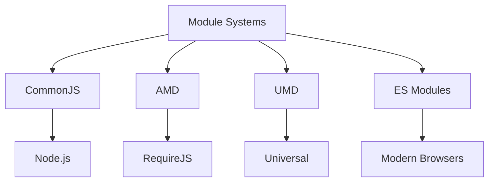

# JavaScript Modules

## Understanding Module Systems

JavaScript has evolved through different module systems. Understanding their differences and how they work is crucial for modern web development.

### Module System Evolution



## ES Modules vs CommonJS

### Key Differences

1. **Loading Mechanism**:

    - ES Modules: Static analysis, loads during parsing phase
    - CommonJS: Dynamic, loads during execution

2. **Import/Export Syntax**:

    - ES Modules: Declaration-like, hoisted
    - CommonJS: Dynamic objects

3. **Module Resolution**:
    - ES Modules: Spec-defined algorithm
    - CommonJS: Implementation-dependent

```javascript
// ES Modules
import { something } from './module.js';
export const value = 42;

// CommonJS
const something = require('./module');
module.exports = { value: 42 };
```

### Module Loading Process

```javascript
// How ES Modules load
// 1. Construction - Find and download all modules
import main from './main.js';
import { helper } from './helper.js';

// 2. Instantiation - Create module objects and link exports
export const value = 42;
import { value } from './other.js';

// 3. Evaluation - Execute module code
console.log(value); // Safe to use after evaluation
```

## Module Features

### Static Analysis

ES Modules enable static analysis because:

-   Imports must be at top level
-   Import/export statements are hoisted
-   Module structure is determined before execution

```javascript
// This works
import { something } from './module.js';
console.log(something);

// This doesn't work
if (condition) {
    import { something } from './module.js'; // Error: import must be at top level
}
```

### Circular Dependencies

ES Modules handle circular dependencies better than CommonJS:

```javascript
// moduleA.js
import { b } from './moduleB.js';
export const a = 1;
console.log(b); // undefined during initialization, but linked

// moduleB.js
import { a } from './moduleA.js';
export const b = 2;
console.log(a); // 1 (already initialized)
```

### Dynamic Imports

Modern JavaScript supports dynamic module loading:

```javascript
// Basic dynamic import
async function loadModule() {
    try {
        const module = await import('./feature.js');
        module.doSomething();
    } catch (error) {
        console.error('Module loading failed:', error);
    }
}

// Conditional loading
if (condition) {
    import('./feature.js')
        .then(module => module.doSomething())
        .catch(err => console.error(err));
}

// Dynamic import with destructuring
const { default: DefaultExport, named } = await import('./module.js');
```

## Module Best Practices

### Export Patterns

```javascript
// Named exports - preferred for multiple exports
export const value1 = 42;
export const value2 = 'hello';
export function helper() {}

// Default export - use for main module functionality
export default class MainClass {
    // ...
}

// Re-exports
export { something as somethingElse } from './other.js';
export * from './utils.js';
```

### Import Patterns

```javascript
// Named imports
import { value1, value2, helper } from './module.js';

// Default import
import MainClass from './module.js';

// Mixed imports
import MainClass, { value1, helper } from './module.js';

// Namespace import
import * as utils from './utils.js';

// Side effects only
import './polyfills.js';
```

### Module Organization

```javascript
// index.js - Barrel file pattern
export { default as Component1 } from './Component1.js';
export { default as Component2 } from './Component2.js';
export * from './utils.js';

// Usage
import { Component1, Component2 } from './components';
```

### Performance Optimization

```javascript
// Code splitting with dynamic imports
const AdminPanel = {
    async render() {
        const { default: AdminUI } = await import('./admin-ui.js');
        return new AdminUI();
    },
};

// Preloading modules
const preloadAdmin = () => {
    const link = document.createElement('link');
    link.rel = 'modulepreload';
    link.href = './admin-ui.js';
    document.head.appendChild(link);
};
```

### Error Handling

```javascript
// Module loading error handling
async function loadFeature() {
    try {
        const module = await import('./feature.js');
        return module.default;
    } catch (error) {
        if (error.code === 'MODULE_NOT_FOUND') {
            console.error('Module not found:', error);
        } else {
            console.error('Module loading failed:', error);
        }
        return null;
    }
}
```

Best practices for modules:

-   Use named exports for multiple exports
-   Use default exports for main functionality
-   Implement proper error handling
-   Consider code splitting
-   Use barrel files for organization
-   Implement proper tree shaking
-   Handle circular dependencies carefully
-   Use dynamic imports appropriately
-   Consider module preloading
-   Document module interfaces
