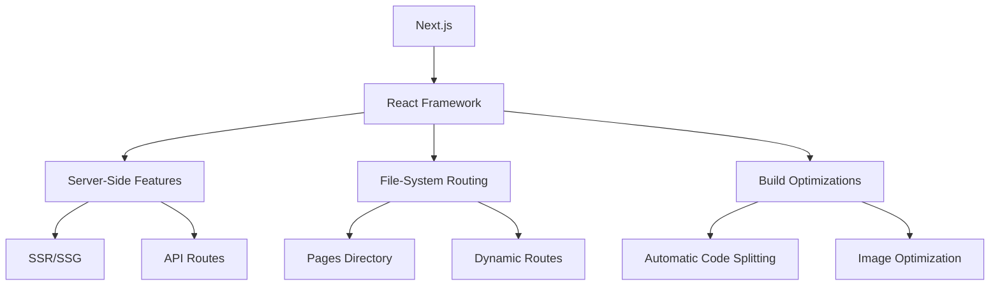
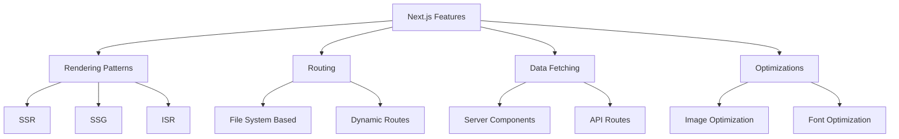
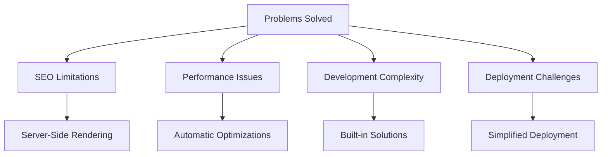
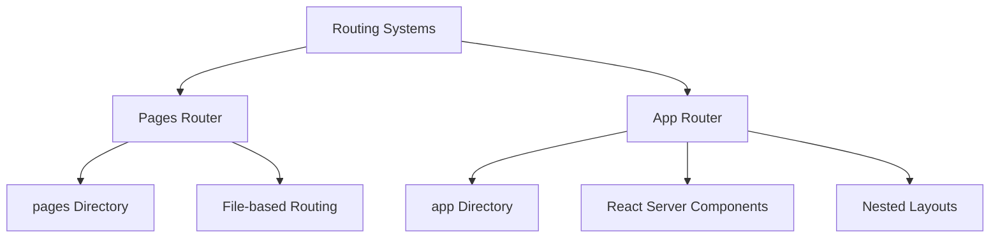

# Core Concepts

## What is Next.js and how does it differ from React?

Next.js is a full-stack React framework that provides additional structure, features, and optimizations for your application.



Key differences from React:

-   Built-in routing vs manual routing setup
-   Server-side rendering out of the box vs client-side only
-   File-system based routing vs component-based routing
-   API routes vs separate backend server
-   Automatic code splitting vs manual configuration
-   Built-in optimizations vs manual setup

```jsx
// Next.js Page Component
// pages/index.js
export default function Home() {
    return <h1>Hello Next.js</h1>;
}

// React Component
// Needs additional routing setup
import { BrowserRouter, Route } from 'react-router-dom';
function App() {
    return (
        <BrowserRouter>
            <Route path="/" element={<h1>Hello React</h1>} />
        </BrowserRouter>
    );
}
```

## What are the key features of Next.js?



```jsx
// Example showcasing multiple Next.js features
// pages/posts/[id].js
import Image from 'next/image';

// 1. Dynamic routing
export default function Post({ post }) {
    return (
        <article>
            {/* 2. Image optimization */}
            <Image src={post.image} width={800} height={400} alt={post.title} />
            <h1>{post.title}</h1>
            <p>{post.content}</p>
        </article>
    );
}

// 3. Static site generation
export async function getStaticProps({ params }) {
    const post = await fetchPost(params.id);
    return { props: { post } };
}

// 4. Dynamic paths
export async function getStaticPaths() {
    const posts = await fetchPosts();
    const paths = posts.map(post => ({
        params: { id: post.id.toString() },
    }));

    return { paths, fallback: 'blocking' };
}
```

## What problems does Next.js solve?



1. **SEO Limitations**

```jsx
// pages/product/[id].js
export async function getServerSideProps({ params }) {
    const product = await fetchProduct(params.id);

    return {
        props: {
            // SEO-friendly metadata
            metadata: {
                title: product.name,
                description: product.description,
                openGraph: {
                    images: [{ url: product.image }],
                },
            },
            product,
        },
    };
}
```

2. **Performance Issues**

```jsx
// Automatic code splitting
import dynamic from 'next/dynamic';

// Heavy component only loaded when needed
const HeavyChart = dynamic(() => import('../components/HeavyChart'), {
    loading: () => <p>Loading chart...</p>,
    ssr: false, // Disable SSR for components that need browser APIs
});
```

## What is the difference between Pages Router and App Router?



```jsx
// Pages Router (pages/blog/[slug].js)
export default function BlogPost({ post }) {
  return <article>{post.content}</article>
}

// App Router (app/blog/[slug]/page.js)
export default async function BlogPost({ params }) {
  const post = await fetchPost(params.slug) // Server Component
  return <article>{post.content}</article>
}

// App Router with layouts (app/blog/layout.js)
export default function BlogLayout({ children }) {
  return (
    <div className="blog-layout">
      <nav>Blog Navigation</nav>
      {children}
    </div>
  )
}
```

## What is the file-system based routing in Next.js?

```mermaid
graph TD
    A[File System Routing] --> B[Pages Directory]
    A --> C[Dynamic Routes]
    A --> D[Nested Routes]
    B --> E[index.js → /]
    B --> F[about.js → /about]
    C --> G[[slug].js]
    C --> H[[...slug].js]
    D --> I[Nested Folders]
```

```jsx
// Example file structure and corresponding routes
// pages/index.js → /
export default function Home() {
  return <h1>Home Page</h1>
}

// pages/blog/[slug].js → /blog/:slug
export default function BlogPost({ params }) {
  return <h1>Blog Post: {params.slug}</h1>
}

// pages/products/[category]/[id].js → /products/:category/:id
export default function Product({ category, id }) {
  return (
    <div>
      <h1>Category: {category}</h1>
      <h2>Product ID: {id}</h2>
    </div>
  )
}

// Catch-all routes
// pages/docs/[...slug].js → /docs/:slug*
export default function Docs({ params }) {
  // params.slug is an array of path segments
  return <div>Documentation: {params.slug.join('/')}</div>
}
```

Each route can be enhanced with special files:

-   `layout.js` - Shared layouts
-   `loading.js` - Loading UI
-   `error.js` - Error boundaries
-   `not-found.js` - 404 pages
