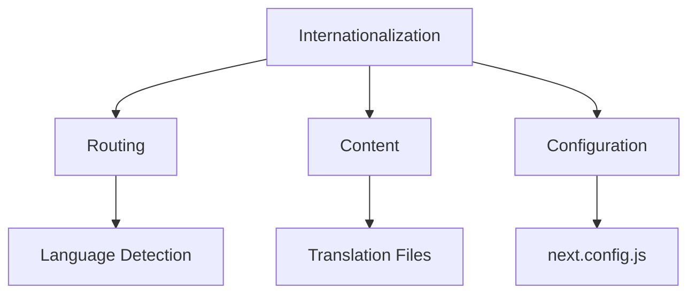
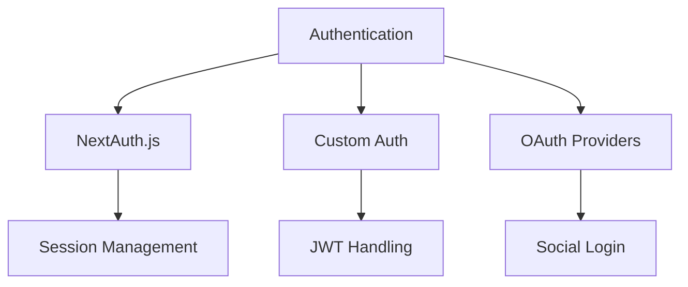

# Advanced Features

## How to implement internationalization?

Next.js provides built-in support for internationalization (i18n).



```jsx
// next.config.js
module.exports = {
    i18n: {
        locales: ['en', 'fr', 'de'],
        defaultLocale: 'en',
        localeDetection: true,
    },
};

// pages/index.js
import { useRouter } from 'next/router';
import { useTranslations } from 'next-intl';

export default function Home() {
    const router = useRouter();
    const t = useTranslations('Home');

    const switchLanguage = locale => {
        router.push(router.pathname, router.asPath, { locale });
    };

    return (
        <div>
            <h1>{t('title')}</h1>
            <select
                onChange={e => switchLanguage(e.target.value)}
                value={router.locale}
            >
                <option value="en">English</option>
                <option value="fr">Français</option>
                <option value="de">Deutsch</option>
            </select>
        </div>
    );
}
```

```json
// messages/en.json
{
    "Home": {
        "title": "Welcome to our site",
        "description": "Explore our content"
    }
}
```

## How to handle SEO in Next.js?

Next.js provides powerful SEO capabilities through metadata and dynamic generation.

```jsx
// app/layout.tsx
import { Metadata } from 'next';

export const metadata: Metadata = {
    title: {
        template: '%s | My Site',
        default: 'My Site',
    },
    description: 'Welcome to my website',
    openGraph: {
        type: 'website',
        locale: 'en_US',
        url: 'https://mysite.com',
        siteName: 'My Site',
    },
};

// Dynamic metadata for blog posts
export async function generateMetadata({ params }) {
    const post = await fetchPost(params.slug);

    return {
        title: post.title,
        description: post.excerpt,
        openGraph: {
            images: [
                {
                    url: post.image,
                    width: 1200,
                    height: 630,
                },
            ],
        },
        twitter: {
            card: 'summary_large_image',
            title: post.title,
            description: post.excerpt,
            images: [post.image],
        },
    };
}
```

## How to implement authentication?

Next.js can be integrated with various authentication solutions.



```jsx
// pages/api/auth/[...nextauth].ts
import NextAuth from 'next-auth';
import { PrismaAdapter } from '@next-auth/prisma-adapter';
import GitHubProvider from 'next-auth/providers/github';
import prisma from '@/lib/prisma';

export default NextAuth({
    adapter: PrismaAdapter(prisma),
    providers: [
        GitHubProvider({
            clientId: process.env.GITHUB_ID,
            clientSecret: process.env.GITHUB_SECRET,
        }),
    ],
    callbacks: {
        async session({ session, user }) {
            session.user.id = user.id;
            return session;
        },
    },
    pages: {
        signIn: '/auth/signin',
        error: '/auth/error',
    },
});

// Protected component
import { useSession } from 'next-auth/react';

function ProtectedComponent() {
    const { data: session, status } = useSession({
        required: true,
        onUnauthenticated() {
            router.push('/auth/signin');
        },
    });

    if (status === 'loading') {
        return <LoadingSpinner />;
    }

    return (
        <div>
            <h1>Welcome, {session.user.name}</h1>
            {/* Protected content */}
        </div>
    );
}
```

## How to integrate state management tools?

Next.js works well with modern state management solutions.

```jsx
// Using Redux Toolkit
import { configureStore } from '@reduxjs/toolkit';
import { Provider } from 'react-redux';

const store = configureStore({
    reducer: {
        // Your reducers
    },
    middleware: getDefaultMiddleware =>
        getDefaultMiddleware().concat(api.middleware),
});

// _app.tsx
function MyApp({ Component, pageProps }) {
    return (
        <Provider store={store}>
            <Component {...pageProps} />
        </Provider>
    );
}

// Using Zustand
import create from 'zustand';

const useStore = create(set => ({
    count: 0,
    increment: () => set(state => ({ count: state.count + 1 })),
    decrement: () => set(state => ({ count: state.count - 1 })),
}));

// Component
function Counter() {
    const { count, increment, decrement } = useStore();

    return (
        <div>
            <button onClick={decrement}>-</button>
            <span>{count}</span>
            <button onClick={increment}>+</button>
        </div>
    );
}
```

## How to implement real-time features?

Next.js can be integrated with WebSocket for real-time functionality.

```jsx
// lib/socket.ts
import { io } from 'socket.io-client';

export const socket = io(process.env.NEXT_PUBLIC_WS_URL, {
    autoConnect: false,
});

// Real-time chat component
function Chat() {
    const [messages, setMessages] = useState([]);
    const [connected, setConnected] = useState(false);

    useEffect(() => {
        socket.connect();

        socket.on('connect', () => setConnected(true));
        socket.on('message', message => {
            setMessages(prev => [...prev, message]);
        });

        return () => socket.disconnect();
    }, []);

    const sendMessage = message => {
        socket.emit('message', {
            text: message,
            timestamp: Date.now(),
        });
    };

    return (
        <div>
            {connected ? (
                <div className="chat-container">
                    {messages.map(msg => (
                        <Message key={msg.id} {...msg} />
                    ))}
                    <MessageInput onSend={sendMessage} />
                </div>
            ) : (
                <div>Connecting...</div>
            )}
        </div>
    );
}
```

## How to handle forms in Next.js?

Next.js provides various ways to handle form submissions.

```jsx
// Using React Hook Form with server actions
'use client';

import { useForm } from 'react-hook-form';
import { zodResolver } from '@hookform/resolvers/zod';
import { z } from 'zod';

const schema = z.object({
    email: z.string().email(),
    password: z.string().min(8),
});

export default function SignupForm() {
    const {
        register,
        handleSubmit,
        formState: { errors },
    } = useForm({
        resolver: zodResolver(schema),
    });

    async function onSubmit(data) {
        try {
            const response = await fetch('/api/auth/signup', {
                method: 'POST',
                headers: { 'Content-Type': 'application/json' },
                body: JSON.stringify(data),
            });

            if (!response.ok) throw new Error('Signup failed');
            router.push('/dashboard');
        } catch (error) {
            console.error('Signup error:', error);
        }
    }

    return (
        <form onSubmit={handleSubmit(onSubmit)}>
            <input {...register('email')} />
            {errors.email && <span>{errors.email.message}</span>}

            <input type="password" {...register('password')} />
            {errors.password && <span>{errors.password.message}</span>}

            <button type="submit">Sign Up</button>
        </form>
    );
}
```

## How to implement PWA features?

Next.js can be configured as a Progressive Web App.

```jsx
// next.config.js
const withPWA = require('next-pwa')({
    dest: 'public',
    register: true,
    skipWaiting: true,
    disable: process.env.NODE_ENV === 'development',
});

module.exports = withPWA({
    // Next.js config
});
```

```json
// public/manifest.json
{
    "name": "My Next.js PWA",
    "short_name": "Next PWA",
    "start_url": "/",
    "display": "standalone",
    "background_color": "#ffffff",
    "theme_color": "#000000",
    "icons": [
        {
            "src": "/icons/icon-192x192.png",
            "sizes": "192x192",
            "type": "image/png"
        },
        {
            "src": "/icons/icon-512x512.png",
            "sizes": "512x512",
            "type": "image/png"
        }
    ]
}
```

## How to handle file uploads?

Next.js provides multiple ways to handle file uploads.

```jsx
function FileUpload() {
    const [uploading, setUploading] = useState(false);
    const [progress, setProgress] = useState(0);

    async function uploadFile(file) {
        const formData = new FormData();
        formData.append('file', file);

        try {
            setUploading(true);
            const response = await fetch('/api/upload', {
                method: 'POST',
                body: formData,
                onUploadProgress: event => {
                    const progress = (event.loaded / event.total) * 100;
                    setProgress(Math.round(progress));
                },
            });

            if (!response.ok) throw new Error('Upload failed');
            const data = await response.json();
            return data.url;
        } finally {
            setUploading(false);
        }
    }

    return (
        <div>
            <input type="file" onChange={e => uploadFile(e.target.files[0])} />
            {uploading && (
                <div className="progress-bar">
                    <div
                        className="progress"
                        style={{ width: `${progress}%` }}
                    />
                </div>
            )}
        </div>
    );
}
```
