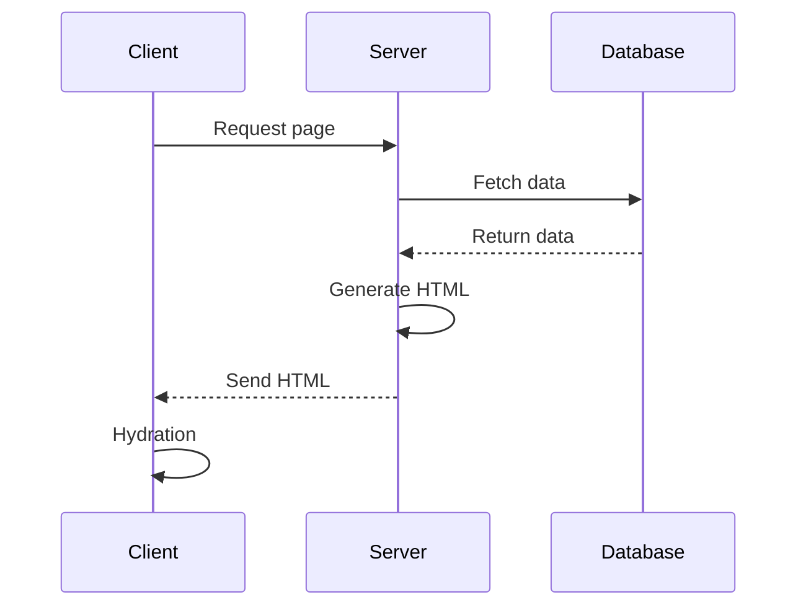
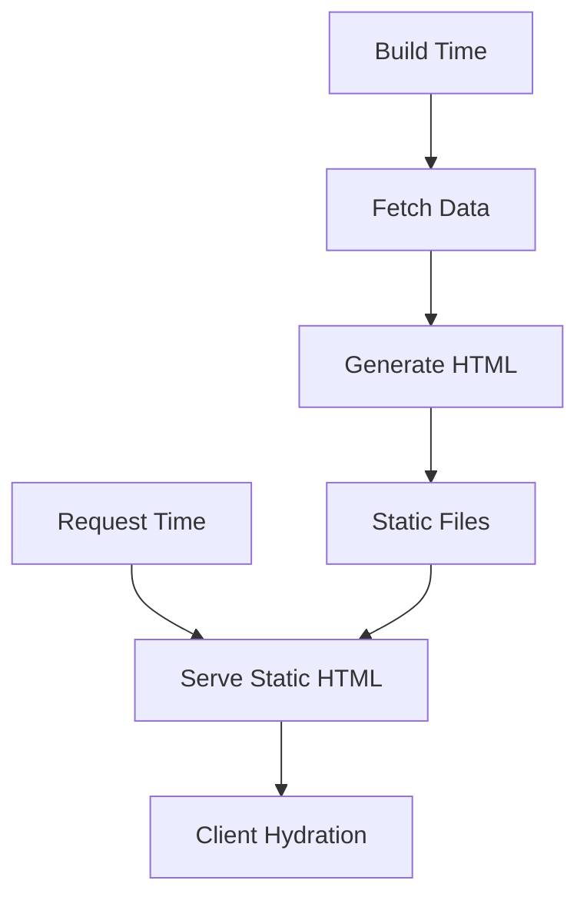
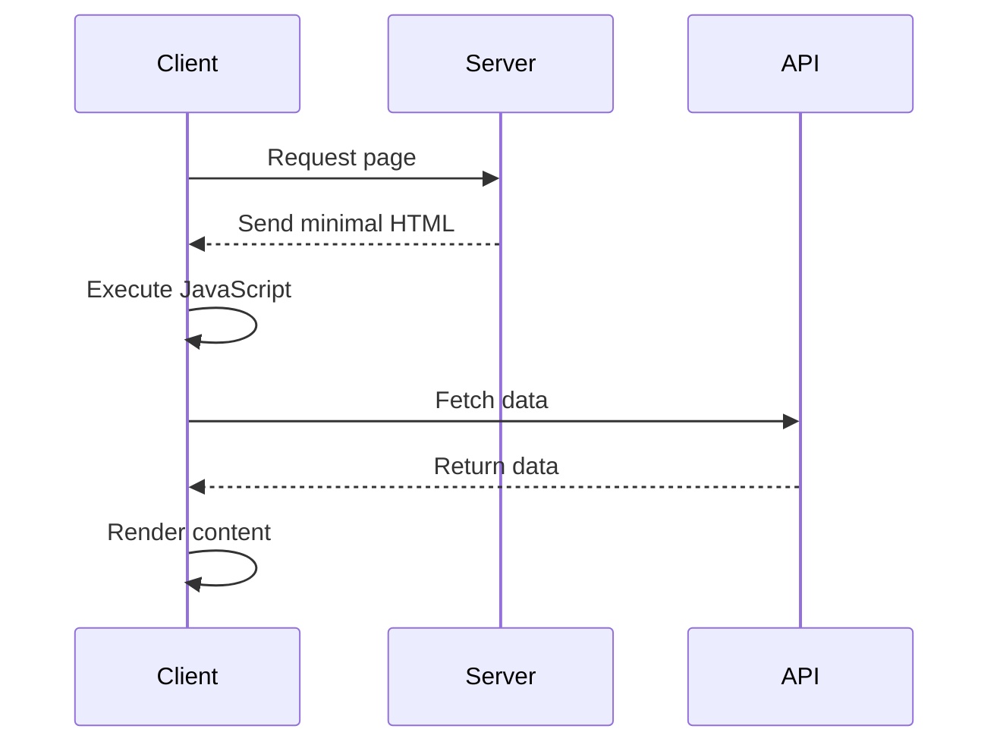
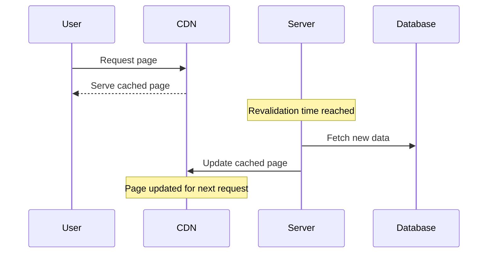
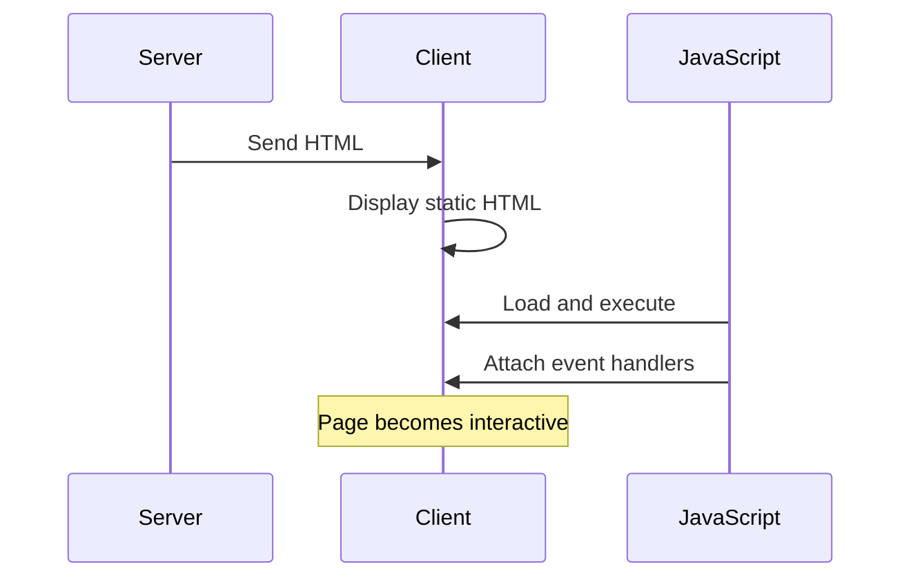
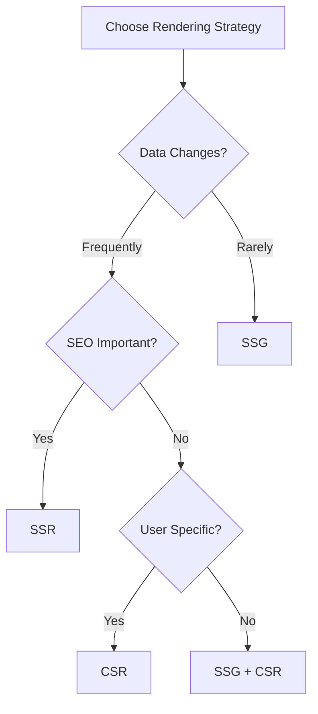

# Rendering Strategies

## What is Server-Side Rendering (SSR) in Next.js?

Server-Side Rendering (SSR) generates HTML on the server for each request.



```jsx
// pages/products/[id].js
export default function Product({ product }) {
    return (
        <div>
            <h1>{product.name}</h1>
            <p>{product.description}</p>
            <span>Price: ${product.price}</span>
        </div>
    );
}

// Server-side rendering with data fetching
export async function getServerSideProps({ params, req, res }) {
    try {
        // Fetch data on every request
        const product = await fetchProduct(params.id);

        // Set cache headers
        res.setHeader(
            'Cache-Control',
            'public, s-maxage=10, stale-while-revalidate=59',
        );

        return {
            props: { product },
        };
    } catch (error) {
        return {
            notFound: true, // Returns 404 page
        };
    }
}
```

## What is Static Site Generation (SSG)?

SSG generates HTML at build time and reuses it for each request.



```jsx
// pages/blog/[slug].js
export default function BlogPost({ post }) {
    return (
        <article>
            <h1>{post.title}</h1>
            <div dangerouslySetInnerHTML={{ __html: post.content }} />
            <div>
                Last updated: {new Date(post.updatedAt).toLocaleDateString()}
            </div>
        </article>
    );
}

// Static Generation with data
export async function getStaticProps({ params }) {
    const post = await fetchBlogPost(params.slug);

    return {
        props: {
            post,
        },
        // Regenerate page after 1 hour
        revalidate: 3600,
    };
}

// Generate static paths at build time
export async function getStaticPaths() {
    const posts = await fetchBlogPosts();

    return {
        paths: posts.map(post => ({
            params: { slug: post.slug },
        })),
        fallback: 'blocking', // Show loading state for new paths
    };
}
```

## What is Client-Side Rendering (CSR)?

CSR renders content in the browser using JavaScript.



```jsx
'use client';

import { useState, useEffect } from 'react';

export default function Dashboard() {
    const [data, setData] = useState(null);
    const [loading, setLoading] = useState(true);

    useEffect(() => {
        async function loadDashboard() {
            try {
                const response = await fetch('/api/dashboard');
                const result = await response.json();
                setData(result);
            } catch (error) {
                console.error('Failed to load dashboard:', error);
            } finally {
                setLoading(false);
            }
        }

        loadDashboard();
    }, []);

    if (loading) return <div>Loading...</div>;
    if (!data) return <div>No data available</div>;

    return (
        <div>
            <h1>Dashboard</h1>
            {/* Render dashboard data */}
        </div>
    );
}
```

## What is Incremental Static Regeneration (ISR)?

ISR enables updating static pages after they're built.



```jsx
// pages/products/[id].js
export default function Product({ product, lastUpdated }) {
    return (
        <div>
            <h1>{product.name}</h1>
            <p>{product.description}</p>
            <small>
                Last updated: {new Date(lastUpdated).toLocaleString()}
            </small>
        </div>
    );
}

export async function getStaticProps({ params }) {
    const product = await fetchProduct(params.id);

    return {
        props: {
            product,
            lastUpdated: Date.now(),
        },
        // Regenerate page every 60 seconds
        revalidate: 60,
    };
}

export async function getStaticPaths() {
    const products = await fetchPopularProducts();

    return {
        // Pre-render popular products
        paths: products.map(product => ({
            params: { id: product.id.toString() },
        })),
        // Generate other pages on-demand
        fallback: true,
    };
}
```

## What is hydration in Next.js?

Hydration is the process of attaching JavaScript functionality to server-rendered HTML.



```jsx
'use client';

// Component that requires hydration
export default function InteractiveCounter() {
    const [count, setCount] = useState(0);

    // This event handler only works after hydration
    const increment = () => setCount(prev => prev + 1);

    return (
        <div>
            <p>Count: {count}</p>
            <button onClick={increment}>Increment</button>
        </div>
    );
}

// Usage in a server component
export default async function Page() {
    const data = await fetchData();

    return (
        <div>
            <h1>Server Rendered Content</h1>
            {/* Interactive component will hydrate */}
            <InteractiveCounter />
        </div>
    );
}
```

## When should you use SSR vs SSG vs CSR?



Selection guide:

-   Use **SSG** for:

    -   Marketing pages
    -   Blog posts
    -   Documentation
    -   Static product pages

-   Use **SSR** for:

    -   Dynamic pricing pages
    -   Social media feeds
    -   Real-time data
    -   Personalized content

-   Use **CSR** for:
    -   Dashboards
    -   User accounts
    -   Interactive tools
    -   Admin panels

```jsx
// Example combining multiple strategies
export default function ProductPage({ product, staticData }) {
    const [realtimeData, setRealtimeData] = useState(null);

    // CSR for real-time data
    useEffect(() => {
        const subscription = subscribeToUpdates(product.id, setRealtimeData);
        return () => subscription.unsubscribe();
    }, [product.id]);

    return (
        <div>
            {/* SSG content */}
            <h1>{product.name}</h1>
            <div>{staticData}</div>

            {/* CSR content */}
            {realtimeData && (
                <div className="real-time-updates">
                    {realtimeData.latestInfo}
                </div>
            )}
        </div>
    );
}

// SSG for base content
export async function getStaticProps({ params }) {
    const product = await fetchProduct(params.id);
    const staticData = await fetchStaticData();

    return {
        props: { product, staticData },
        revalidate: 3600, // ISR: Update every hour
    };
}
```

## How does Next.js handle page rendering?

Next.js can handle page rendering using SSR, SSG, CSR, and ISR. The rendering strategy is determined based on the configuration of the page.

## What are React Server Components?

React Server Components are a new way to render components on the server. They are designed to improve performance and reduce the amount of JavaScript that needs to be sent to the client.
