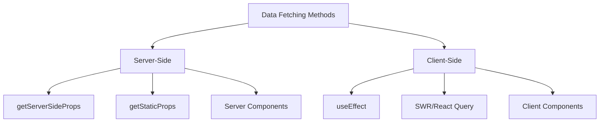
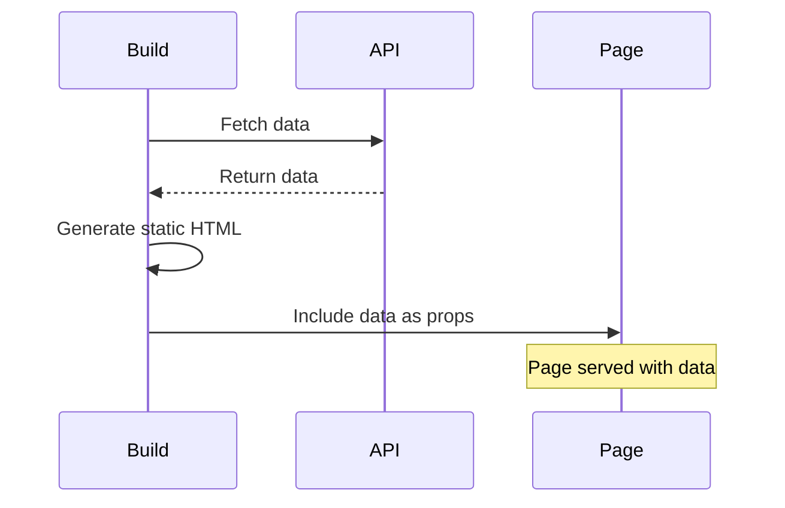
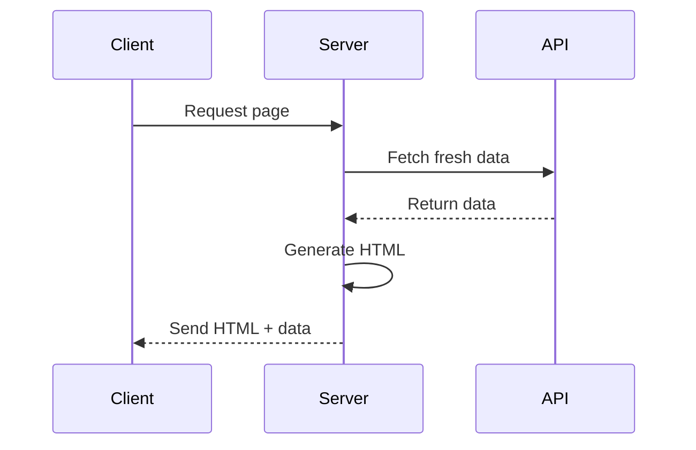
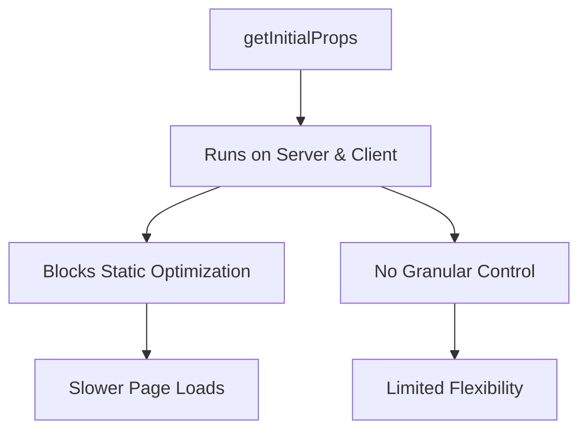
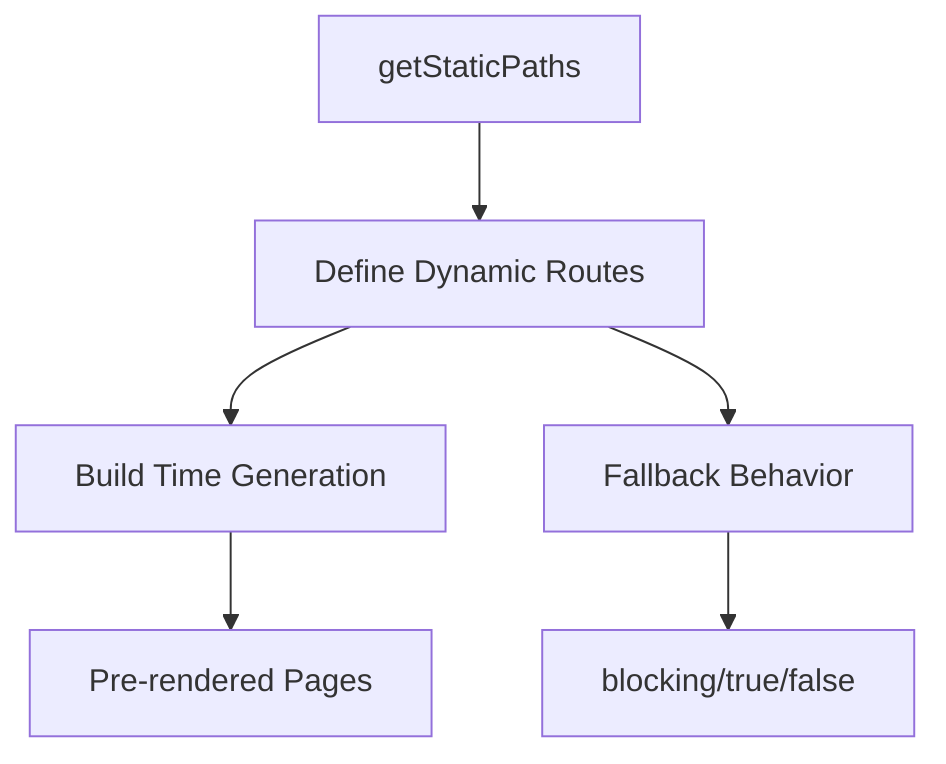
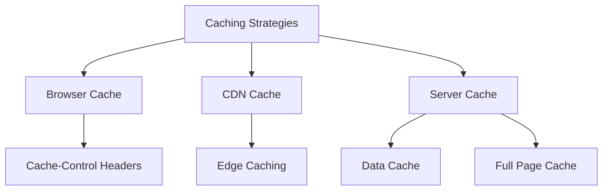

# Data Fetching

## What are the different data fetching methods in Next.js?

Next.js provides multiple ways to fetch data depending on your needs.



```jsx
// Server-side data fetching
export async function getServerSideProps() {
    const res = await fetch('https://api.example.com/data');
    const data = await res.json();

    return {
        props: { data },
    };
}

// Client-side data fetching with SWR
import useSWR from 'swr';

function Profile() {
    const { data, error, isLoading } = useSWR('/api/user', fetcher);

    if (error) return <div>Failed to load</div>;
    if (isLoading) return <div>Loading...</div>;
    return <div>Hello {data.name}!</div>;
}
```

## What is getStaticProps and when should you use it?

getStaticProps fetches data at build time and is ideal for static content.



```jsx
// pages/blog/[slug].js
export async function getStaticProps({ params, preview = false }) {
    try {
        // Fetch blog post data
        const post = await fetchBlogPost(params.slug);

        // Fetch related posts
        const relatedPosts = await fetchRelatedPosts(post.category);

        return {
            props: {
                post,
                relatedPosts,
                preview,
            },
            // Enable ISR
            revalidate: 60 * 60, // Revalidate every hour
        };
    } catch (error) {
        return {
            notFound: true, // Returns 404 page
        };
    }
}

// Component using the data
export default function BlogPost({ post, relatedPosts, preview }) {
    return (
        <article>
            {preview && <PreviewBanner />}
            <h1>{post.title}</h1>
            <div className="content">{post.content}</div>
            <RelatedPosts posts={relatedPosts} />
        </article>
    );
}
```

## What is getServerSideProps and when should you use it?

getServerSideProps runs on every request and is ideal for dynamic content.



```jsx
// pages/dashboard.js
export async function getServerSideProps({ req, res }) {
    try {
        // Get user session
        const session = await getSession(req);

        if (!session) {
            return {
                redirect: {
                    destination: '/login',
                    permanent: false,
                },
            };
        }

        // Fetch user-specific data
        const dashboardData = await fetchDashboardData(session.user.id);

        // Set cache headers
        res.setHeader(
            'Cache-Control',
            'private, no-cache, no-store, must-revalidate',
        );

        return {
            props: {
                user: session.user,
                dashboardData,
            },
        };
    } catch (error) {
        return {
            props: {
                error: error.message,
            },
        };
    }
}
```

## What is getInitialProps and why is it deprecated?

getInitialProps was the original data fetching method but has limitations.



```jsx
// Old approach (deprecated)
function Page({ data }) {
    return <div>{data.title}</div>;
}

Page.getInitialProps = async ctx => {
    const res = await fetch('https://api.example.com/data');
    const data = await res.json();
    return { data };
};

// Modern approach
export async function getStaticProps() {
    const res = await fetch('https://api.example.com/data');
    const data = await res.json();
    return {
        props: { data },
    };
}
```

## What is getStaticPaths and when do you need it?

getStaticPaths defines which dynamic pages should be pre-rendered at build time.



```jsx
// pages/posts/[category]/[slug].js
export async function getStaticPaths() {
    // Fetch list of all categories
    const categories = await fetchCategories();

    // Fetch popular posts for each category
    const paths = await Promise.all(
        categories.map(async category => {
            const posts = await fetchCategoryPosts(category.id);
            return posts.map(post => ({
                params: {
                    category: category.slug,
                    slug: post.slug,
                },
            }));
        }),
    );

    return {
        paths: paths.flat(),
        fallback: 'blocking', // Generate new pages on-demand
    };
}
```

## How to implement client-side data fetching?

Client-side data fetching is useful for frequently updated data.

```jsx
'use client';

import { useState, useEffect } from 'react';
import useSWR from 'swr';

// Using SWR for data fetching
function RealTimeData() {
    const { data, error, mutate } = useSWR('/api/stats', fetcher, {
        refreshInterval: 1000, // Poll every second
    });

    return (
        <div>
            {error && <div>Error loading data</div>}
            {!data && <div>Loading...</div>}
            {data && (
                <>
                    <h2>Real-time Stats</h2>
                    <pre>{JSON.stringify(data, null, 2)}</pre>
                    <button onClick={() => mutate()}>Refresh</button>
                </>
            )}
        </div>
    );
}

// Using useState and useEffect
function TraditionalFetch() {
    const [data, setData] = useState(null);
    const [loading, setLoading] = useState(true);

    useEffect(() => {
        async function fetchData() {
            try {
                const response = await fetch('/api/data');
                const result = await response.json();
                setData(result);
            } catch (error) {
                console.error('Failed to fetch:', error);
            } finally {
                setLoading(false);
            }
        }

        fetchData();
    }, []);

    if (loading) return <div>Loading...</div>;
    if (!data) return <div>No data</div>;

    return <div>{/* Render data */}</div>;
}
```

## How does caching work in Next.js?

Next.js implements multiple caching strategies for optimal performance.



```jsx
// API route with caching
export default async function handler(req, res) {
    // Set caching headers
    res.setHeader(
        'Cache-Control',
        'public, s-maxage=10, stale-while-revalidate=59',
    );

    try {
        const data = await fetchData();
        res.status(200).json(data);
    } catch (error) {
        res.status(500).json({ error: 'Failed to fetch data' });
    }
}

// Page with custom caching
export async function getStaticProps() {
    const data = await fetchData();

    return {
        props: { data },
        revalidate: 60, // Cache for 60 seconds
    };
}
```

## How to handle dynamic data with SSG?

Combine SSG with client-side updates for dynamic content.

```jsx
// pages/products/[id].js
export default function Product({ product, lastUpdated }) {
    const [price, setPrice] = useState(product.price);
    const [inventory, setInventory] = useState(product.inventory);

    // Real-time updates
    useEffect(() => {
        const channel = new WebSocket(
            `ws://api.example.com/products/${product.id}`,
        );

        channel.onmessage = event => {
            const update = JSON.parse(event.data);
            if (update.price) setPrice(update.price);
            if (update.inventory) setInventory(update.inventory);
        };

        return () => channel.close();
    }, [product.id]);

    return (
        <div>
            <h1>{product.name}</h1>
            <p>Current Price: ${price}</p>
            <p>In Stock: {inventory}</p>
            <small>
                Page generated: {new Date(lastUpdated).toLocaleString()}
            </small>
        </div>
    );
}

export async function getStaticProps({ params }) {
    const product = await fetchProduct(params.id);

    return {
        props: {
            product,
            lastUpdated: Date.now(),
        },
        revalidate: 60 * 60, // Revalidate every hour
    };
}
```
