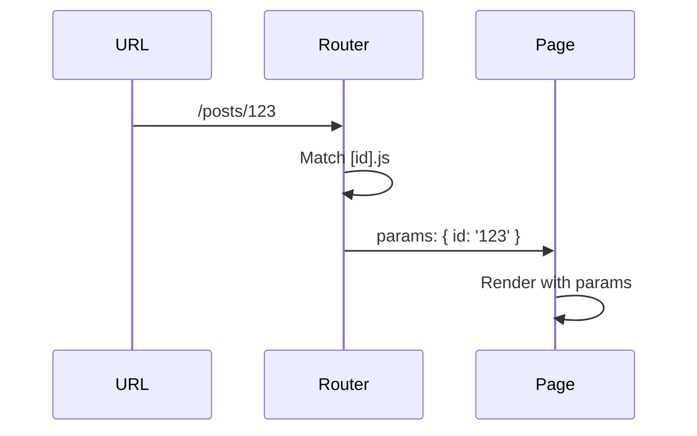
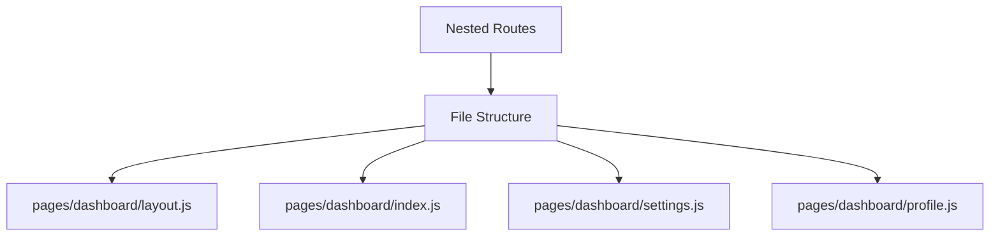
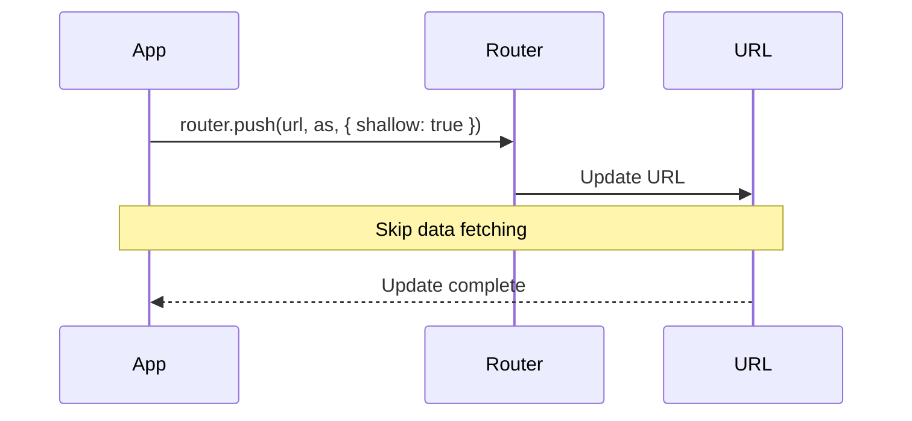
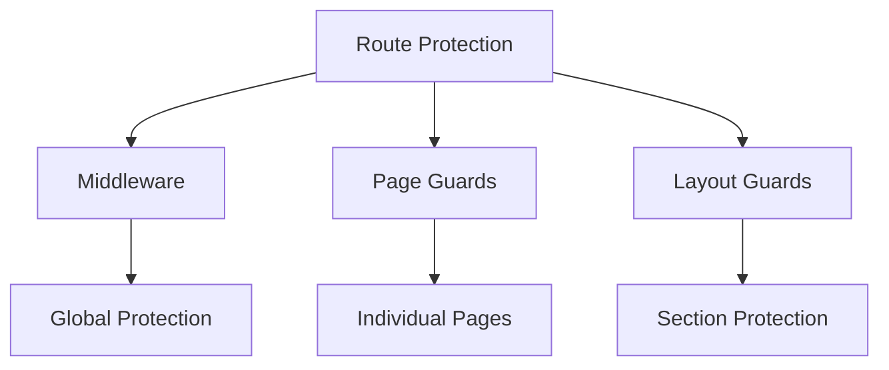
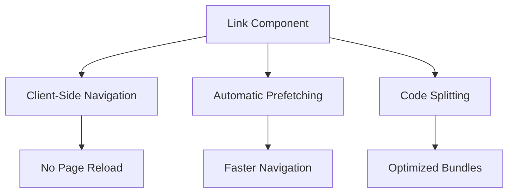

# Routing and Navigation

## How does routing work in Next.js?

Next.js uses a file-system based router built on the concept of pages.

```mermaid
graph TD
    A[Next.js Routing] --> B[File System Based]
    A --> C[Dynamic Routes]
    A --> D[Nested Routes]
    B --> E[pages/index.js → /]
    B --> F[pages/about.js → /about]
    C --> G[pages/posts/[id].js]
    D --> H[pages/blog/[...slug].js]
```

```jsx
// Basic routing structure
// pages/index.js → /
export default function Home() {
    return <h1>Home Page</h1>;
}

// pages/about.js → /about
export default function About() {
    return <h1>About Page</h1>;
}

// pages/posts/[id].js → /posts/1, /posts/2, etc.
export default function Post({ id }) {
    return <h1>Post {id}</h1>;
}
```

## What are dynamic routes and how to implement them?

Dynamic routes allow you to create pages with dynamic segments.



```jsx
// pages/posts/[category]/[slug].js
export default function Post({ params }) {
    const { category, slug } = params;

    return (
        <article>
            <h1>Category: {category}</h1>
            <h2>Post: {slug}</h2>
        </article>
    );
}

// Multiple dynamic segments
// pages/[locale]/products/[id].js
export default function Product({ params }) {
    const { locale, id } = params;

    return (
        <div>
            <p>Locale: {locale}</p>
            <p>Product ID: {id}</p>
        </div>
    );
}

// Optional catch-all routes
// pages/docs/[[...slug]].js
export default function Docs({ params }) {
    const { slug = [] } = params; // slug is an array or undefined

    return (
        <div>
            <h1>Documentation</h1>
            <p>Current Path: {slug.join('/')}</p>
        </div>
    );
}
```

## What is catch-all routing?

Catch-all routes can capture an arbitrary number of URL segments.

```mermaid
graph TD
    A[Catch-all Routes] --> B[[...slug].js]
    A --> C[[[...slug]].js]
    B --> D[Required Parameters]
    C --> E[Optional Parameters]
    D --> F[/docs/a/b/c]
    E --> G[/docs or /docs/a/b]
```

```jsx
// pages/docs/[...slug].js - Required catch-all
export default function Docs({ params }) {
    const { slug } = params;

    return (
        <div>
            <h1>Documentation</h1>
            <nav>
                {slug.map((segment, index) => (
                    <span key={index}>/ {segment}</span>
                ))}
            </nav>
            <section>{/* Render content based on slug */}</section>
        </div>
    );
}

// Generate paths for catch-all routes
export async function getStaticPaths() {
    const paths = [
        { params: { slug: ['getting-started'] } },
        { params: { slug: ['advanced', 'routing'] } },
        { params: { slug: ['api', 'auth', 'jwt'] } },
    ];

    return {
        paths,
        fallback: 'blocking',
    };
}
```

## How to handle nested routing?

Nested routing allows you to create complex page hierarchies.



```jsx
// app/dashboard/layout.js
export default function DashboardLayout({ children }) {
    return (
        <div className="dashboard-layout">
            <nav>
                <Link href="/dashboard">Overview</Link>
                <Link href="/dashboard/settings">Settings</Link>
                <Link href="/dashboard/profile">Profile</Link>
            </nav>
            <main>{children}</main>
        </div>
    );
}

// app/dashboard/page.js
export default function DashboardPage() {
    return <h1>Dashboard Overview</h1>;
}

// app/dashboard/settings/page.js
export default function SettingsPage() {
    return <h1>Dashboard Settings</h1>;
}
```

## What is shallow routing?

Shallow routing allows you to change the URL without running data fetching methods.



```jsx
'use client';

import { useRouter } from 'next/navigation';

export default function FilterableList({ items }) {
    const router = useRouter();
    const [filter, setFilter] = useState('');

    // Update URL without full page reload
    const handleFilterChange = newFilter => {
        setFilter(newFilter);
        router.push(`?filter=${newFilter}`, undefined, { shallow: true });
    };

    return (
        <div>
            <input
                value={filter}
                onChange={e => handleFilterChange(e.target.value)}
                placeholder="Filter items..."
            />
            <ul>
                {items
                    .filter(item => item.includes(filter))
                    .map(item => (
                        <li key={item}>{item}</li>
                    ))}
            </ul>
        </div>
    );
}
```

## How to implement route protection?

Route protection ensures that certain pages are only accessible to authenticated users.



```jsx
// middleware.ts
import { NextResponse } from 'next/server';
import type { NextRequest } from 'next/server';

export function middleware(request: NextRequest) {
    const { pathname } = request.nextUrl;
    const isAuthenticated = request.cookies.get('auth-token');

    // Protect dashboard routes
    if (pathname.startsWith('/dashboard') && !isAuthenticated) {
        return NextResponse.redirect(new URL('/login', request.url));
    }

    return NextResponse.next();
}

// Protected page component
export default function ProtectedPage() {
    const { user, loading } = useAuth();

    if (loading) {
        return <LoadingSpinner />;
    }

    if (!user) {
        return <AccessDenied />;
    }

    return (
        <div>
            <h1>Protected Content</h1>
            <p>Welcome, {user.name}!</p>
        </div>
    );
}
```

## What is the Link component and how does it work?

The Link component enables client-side navigation between pages.



```jsx
import Link from 'next/link';

export default function Navigation() {
    return (
        <nav>
            <Link
                href="/dashboard"
                className="nav-link"
                prefetch={false} // Disable prefetching
            >
                Dashboard
            </Link>

            {/* Dynamic route with query parameters */}
            <Link
                href={{
                    pathname: '/posts/[id]',
                    query: { id: '123', preview: 'true' },
                }}
            >
                View Post
            </Link>

            {/* With scroll restoration */}
            <Link href="/long-page" scroll={false}>
                Long Page
            </Link>
        </nav>
    );
}
```

## How to handle 404 pages?

Next.js allows you to customize the 404 page and handle not-found routes.

```jsx
// app/not-found.js
export default function NotFound() {
    return (
        <div className="error-page">
            <h1>404 - Page Not Found</h1>
            <p>Sorry, the page you are looking for does not exist.</p>
            <Link href="/">Return Home</Link>
        </div>
    );
}

// Custom 404 handling in pages
export default function ProductPage({ params }) {
    const { data, error } = useSWR(`/api/products/${params.id}`);

    if (error?.status === 404) {
        notFound(); // Triggers the not-found page
    }

    return <div>{/* Product details */}</div>;
}
```
