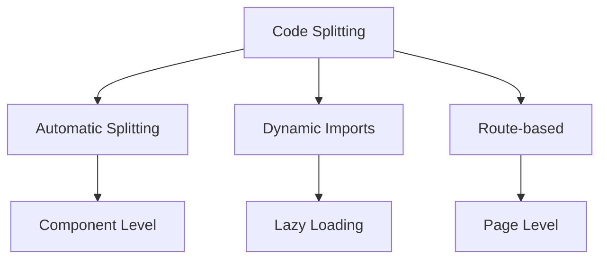
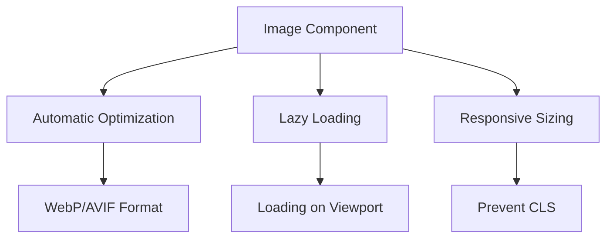
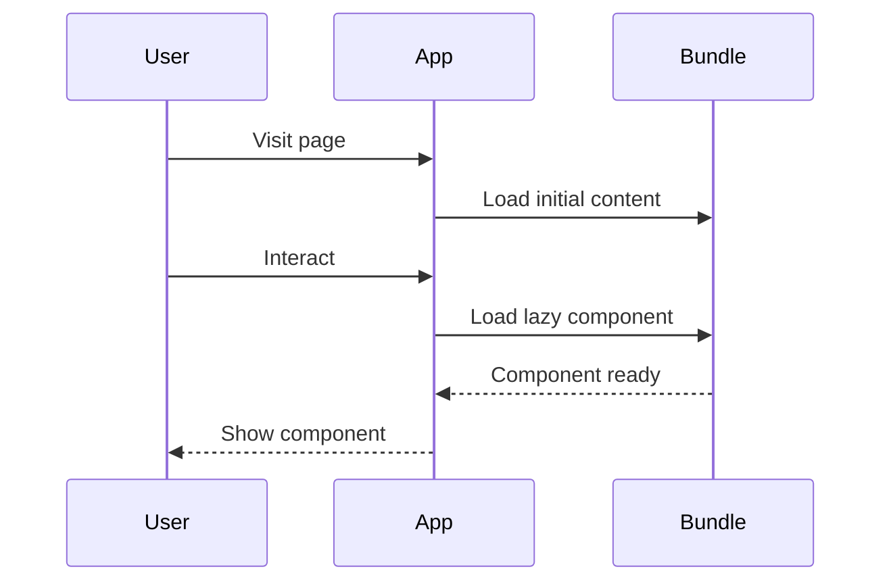
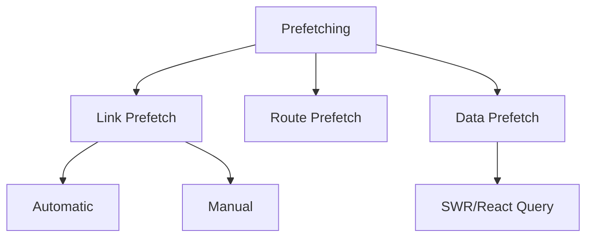
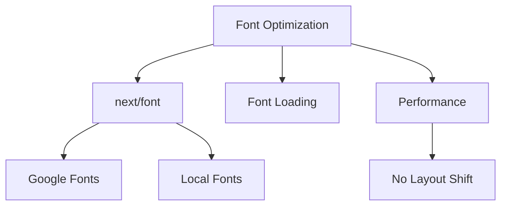
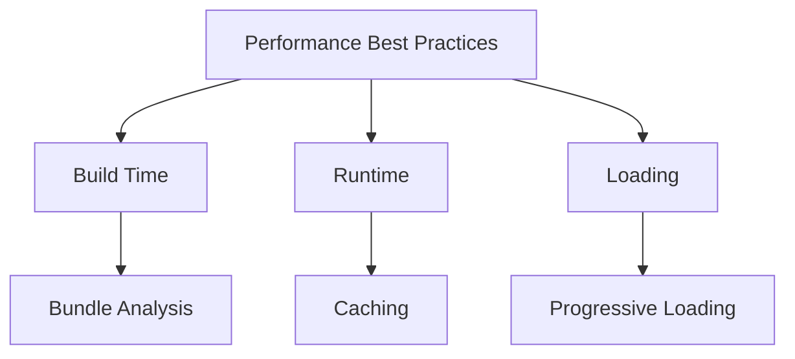
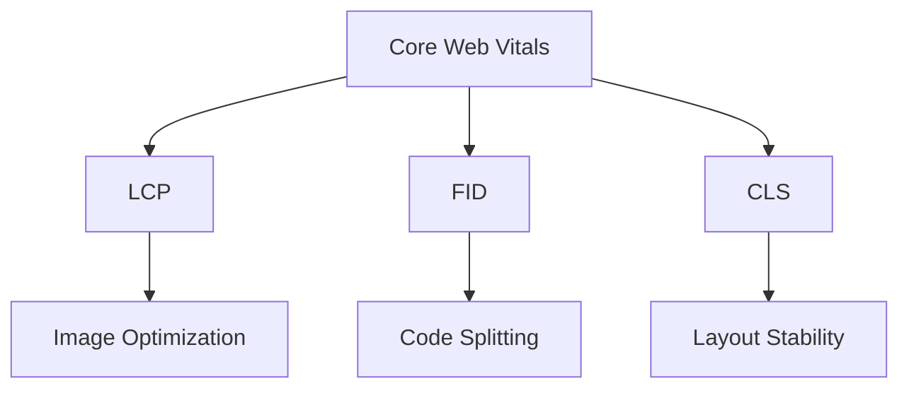

# Performance Optimization

## How does code splitting work in Next.js?

Next.js automatically splits your code to ensure optimal loading performance.



```jsx
// Dynamic import with loading state
const DynamicChart = dynamic(() => import('../components/Chart'), {
    loading: () => <div>Loading chart...</div>,
    ssr: false, // Disable server-side rendering
});

// Route-based code splitting
function AnalyticsDashboard() {
    return (
        <div>
            <h1>Analytics</h1>
            <Suspense fallback={<LoadingSpinner />}>
                <DynamicChart />
            </Suspense>
        </div>
    );
}
```

## What is the Image component and its benefits?

The Next.js Image component automatically optimizes images for better performance.



```jsx
import Image from 'next/image';

function ProductGallery({ products }) {
    return (
        <div className="gallery">
            {products.map(product => (
                <div key={product.id} className="product-card">
                    <Image
                        src={product.image}
                        alt={product.name}
                        width={300}
                        height={200}
                        placeholder="blur"
                        blurDataURL={product.thumbnail}
                        priority={product.featured}
                        sizes="(max-width: 768px) 100vw,
                               (max-width: 1200px) 50vw,
                               33vw"
                    />
                    <h3>{product.name}</h3>
                </div>
            ))}
        </div>
    );
}
```

## How to implement lazy loading?

Lazy loading helps reduce the initial bundle size by loading components on demand.



```jsx
// Component level lazy loading
const LazyComponent = dynamic(() => import('./HeavyComponent'), {
    loading: () => <LoadingSpinner />,
    ssr: true,
});

// Route level lazy loading
const AdminDashboard = dynamic(() => import('../components/AdminDashboard'), {
    loading: () => <AdminSkeleton />,
    ssr: false,
});

// Lazy loading with preload
const PreloadableComponent = dynamic(
    () => import('../components/PreloadableComponent'),
    { loading: () => <Loading /> },
);

// Preload on hover
function NavLink({ children, href }) {
    const handleMouseEnter = () => {
        PreloadableComponent.preload();
    };

    return (
        <Link href={href} onMouseEnter={handleMouseEnter}>
            {children}
        </Link>
    );
}
```

## What is prefetching and how does it improve performance?

Prefetching loads pages in advance to provide instant navigation.



```jsx
// Automatic prefetching with Link
function Navigation() {
    return (
        <nav>
            <Link
                href="/dashboard"
                prefetch={true} // Default behavior
            >
                Dashboard
            </Link>
        </nav>
    );
}

// Manual route prefetching
function PreloadableSection() {
    const router = useRouter();

    useEffect(() => {
        // Prefetch multiple routes
        router.prefetch('/dashboard');
        router.prefetch('/settings');
    }, [router]);

    return <div>{/* Content */}</div>;
}

// Data prefetching with SWR
function Profile() {
    const { data } = useSWR('/api/user', fetcher, {
        revalidateOnFocus: false,
        revalidateOnReconnect: false,
    });

    // Prefetch related data
    useSWR('/api/user/preferences', fetcher, {
        revalidateIfStale: false,
    });

    return <div>{/* Profile content */}</div>;
}
```

## How to optimize fonts in Next.js?

Next.js provides built-in font optimization to improve loading performance.



```jsx
import { Inter, Roboto_Mono } from 'next/font/google';

// Configure fonts
const inter = Inter({
    subsets: ['latin'],
    display: 'swap',
    preload: true,
});

const robotoMono = Roboto_Mono({
    subsets: ['latin'],
    display: 'swap',
    variable: '--font-roboto-mono',
});

// Use in layout
export default function RootLayout({ children }) {
    return (
        <html lang="en" className={`${inter.className} ${robotoMono.variable}`}>
            <body>
                <h1 className={inter.className}>Main Title</h1>
                <code className="font-roboto-mono">Code Block</code>
                {children}
            </body>
        </html>
    );
}
```

## What are the best practices for performance optimization?



```jsx
// Bundle analysis
// next.config.js
const withBundleAnalyzer = require('@next/bundle-analyzer')({
    enabled: process.env.ANALYZE === 'true',
});

module.exports = withBundleAnalyzer({
    // Configuration
});

// Component optimization
function OptimizedList({ items }) {
    // Memoize expensive calculations
    const sortedItems = useMemo(
        () => [...items].sort((a, b) => b.value - a.value),
        [items],
    );

    // Virtualize long lists
    return (
        <VirtualList
            height={400}
            itemCount={sortedItems.length}
            itemSize={50}
            width="100%"
        >
            {({ index, style }) => (
                <div style={style}>{sortedItems[index].name}</div>
            )}
        </VirtualList>
    );
}
```

## How to analyze and improve Core Web Vitals?



```jsx
// Optimize Largest Contentful Paint (LCP)
function HeroSection() {
    return (
        <div>
            <Image
                src="/hero.jpg"
                alt="Hero"
                priority // Load immediately
                quality={85}
                placeholder="blur"
                width={1200}
                height={600}
            />
        </div>
    );
}

// Minimize Cumulative Layout Shift (CLS)
function ProductCard({ product }) {
    return (
        <div style={{ aspectRatio: '16/9' }}>
            <Image
                src={product.image}
                alt={product.name}
                fill
                sizes="(max-width: 768px) 100vw,
                       (max-width: 1200px) 50vw,
                       33vw"
                className="object-cover"
            />
        </div>
    );
}
```

## How to implement dynamic imports?

```jsx
// Dynamic import with custom loading
const DynamicEditor = dynamic(() => import('../components/Editor'), {
    loading: () => (
        <div className="editor-skeleton">
            <div className="toolbar-skeleton" />
            <div className="content-skeleton" />
        </div>
    ),
    ssr: false, // Disable SSR for browser-specific features
});

// Dynamic import with error boundary
function AdminPanel() {
    return (
        <ErrorBoundary fallback={<ErrorMessage />}>
            <Suspense fallback={<Loading />}>
                <DynamicEditor />
            </Suspense>
        </ErrorBoundary>
    );
}

// Dynamic route imports
export default function Dashboard() {
    const [showAnalytics, setShowAnalytics] = useState(false);

    return (
        <div>
            <button onClick={() => setShowAnalytics(true)}>
                Show Analytics
            </button>

            {showAnalytics && (
                <Suspense fallback={<Loading />}>
                    <DynamicChart />
                </Suspense>
            )}
        </div>
    );
}
```
