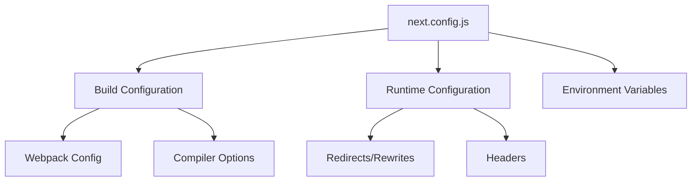
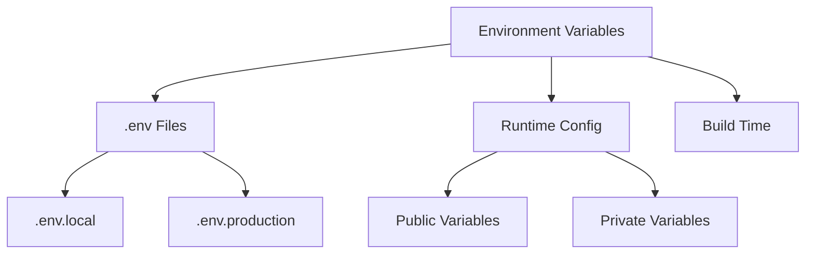
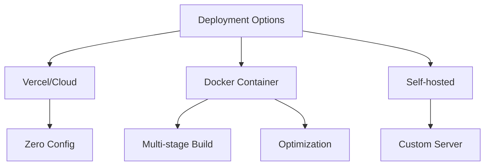
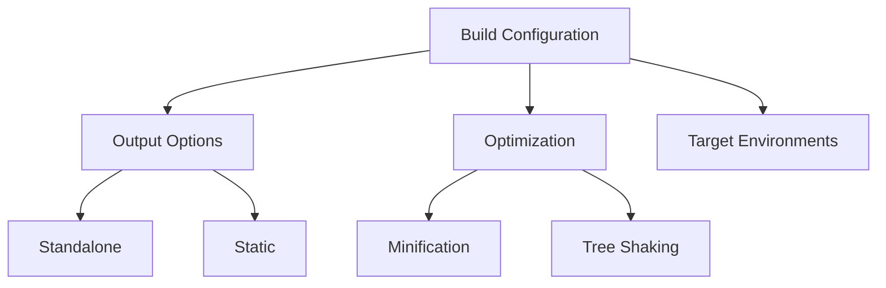

# Configuration and Deployment

## What is next.config.js and its common configurations?

next.config.js is the configuration file for Next.js projects.



```jsx
// next.config.js
/** @type {import('next').NextConfig} */
const nextConfig = {
    // Compiler options
    swcMinify: true,

    // Image optimization
    images: {
        domains: ['example.com'],
        formats: ['image/avif', 'image/webp'],
        deviceSizes: [640, 750, 828, 1080, 1200],
    },

    // Environment variables
    env: {
        API_URL: process.env.API_URL,
    },

    // Custom webpack config
    webpack: (config, { buildId, dev, isServer }) => {
        // Custom webpack configurations
        config.module.rules.push({
            test: /\.svg$/,
            use: ['@svgr/webpack'],
        });
        return config;
    },

    // Redirects
    async redirects() {
        return [
            {
                source: '/old-blog/:slug',
                destination: '/blog/:slug',
                permanent: true,
            },
        ];
    },

    // Headers
    async headers() {
        return [
            {
                source: '/:path*',
                headers: [
                    {
                        key: 'X-Frame-Options',
                        value: 'DENY',
                    },
                ],
            },
        ];
    },
};

module.exports = nextConfig;
```

## How to handle environment variables?

Next.js provides built-in support for environment variables.



```jsx
// .env.local
DATABASE_URL = 'postgresql://...';
NEXT_PUBLIC_API_URL = 'https://api.example.com';
JWT_SECRET = 'your-secret-key';

// Usage in pages/api
export default async function handler(req, res) {
    const db = await connectDB(process.env.DATABASE_URL);
    // Handle request
}

// Usage in components
function ApiComponent() {
    const [data, setData] = useState(null);

    useEffect(() => {
        // NEXT_PUBLIC_ prefix makes it available in the browser
        fetch(process.env.NEXT_PUBLIC_API_URL)
            .then(res => res.json())
            .then(setData);
    }, []);

    return <div>{/* Render data */}</div>;
}
```

## How to deploy a Next.js application?

Next.js applications can be deployed in various ways, including containerization with Docker.



```dockerfile
# Multi-stage Dockerfile
FROM node:18-alpine AS deps
WORKDIR /app
COPY package.json yarn.lock ./
RUN yarn install --frozen-lockfile

FROM node:18-alpine AS builder
WORKDIR /app
COPY --from=deps /app/node_modules ./node_modules
COPY . .
RUN yarn build

FROM node:18-alpine AS runner
WORKDIR /app
ENV NODE_ENV production

# Copy necessary files
COPY --from=builder /app/next.config.js ./
COPY --from=builder /app/public ./public
COPY --from=builder /app/.next/standalone ./
COPY --from=builder /app/.next/static ./.next/static

ENV PORT 3000
EXPOSE 3000

USER node
CMD ["node", "server.js"]
```

```jsx
// Custom server setup (server.js)
const next = require('next');
const express = require('express');

const dev = process.env.NODE_ENV !== 'production';
const app = next({ dev });
const handle = app.getRequestHandler();

app.prepare().then(() => {
    const server = express();

    // Custom routes
    server.get('/custom-route', (req, res) => {
        return app.render(req, res, '/custom-page', req.query);
    });

    // Default handler
    server.all('*', (req, res) => {
        return handle(req, res);
    });

    server.listen(3000);
});
```

## How to configure build output?

Next.js provides various options to optimize and configure the build output.



```jsx
// next.config.js
module.exports = {
    output: 'standalone',
    experimental: {
        outputFileTracingRoot: undefined,
        outputFileTracingExcludes: {
            '*': [
                'node_modules/@swc/core-linux-x64-gnu',
                'node_modules/@swc/core-linux-x64-musl',
            ],
        },
    },
    // Optimize build output
    compiler: {
        removeConsole: process.env.NODE_ENV === 'production',
    },
    // Minification options
    swcMinify: true,
};
```

## How to handle CI/CD for Next.js applications?

```yaml
# GitHub Actions workflow
name: Next.js CI/CD

on:
    push:
        branches: [main]
    pull_request:
        branches: [main]

jobs:
    build-and-deploy:
        runs-on: ubuntu-latest

        steps:
            - uses: actions/checkout@v2

            - name: Setup Node.js
              uses: actions/setup-node@v2
              with:
                  node-version: '18'
                  cache: 'yarn'

            - name: Install dependencies
              run: yarn install --frozen-lockfile

            - name: Run tests
              run: yarn test

            - name: Build application
              run: yarn build

            - name: Deploy to Vercel
              if: github.ref == 'refs/heads/main'
              run: npx vercel --prod --token ${{ secrets.VERCEL_TOKEN }}
```
