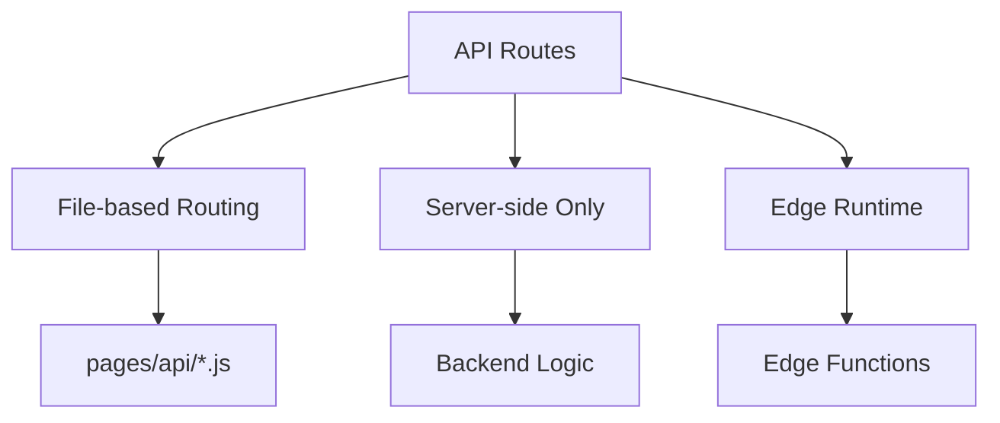
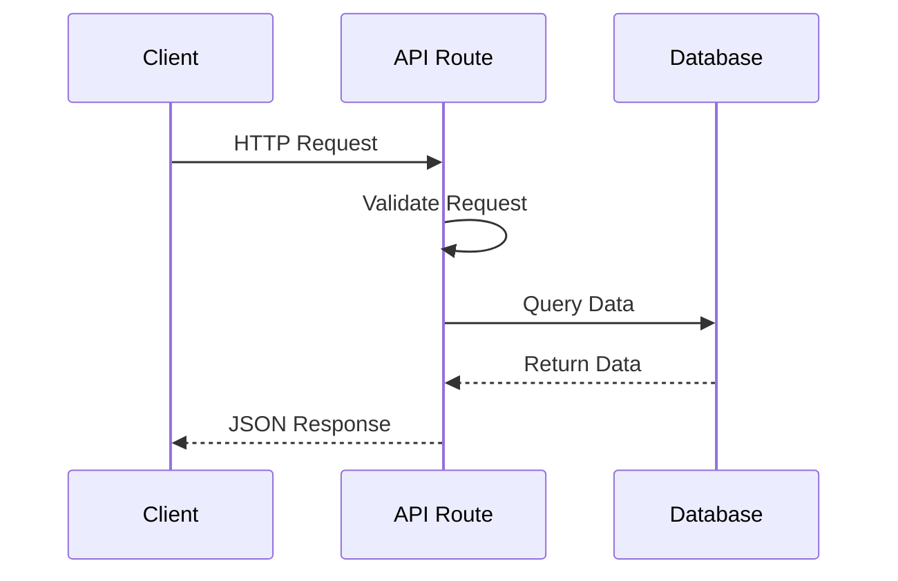
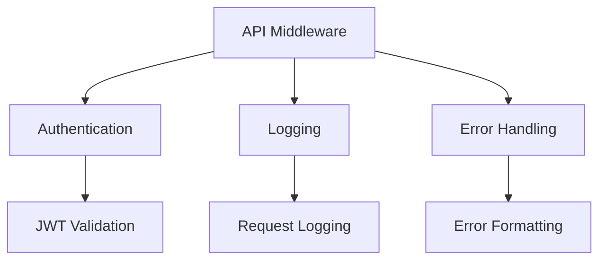

# API Routes

## What are API routes in Next.js?

API routes provide a solution to build your API with Next.js.



```jsx
// pages/api/hello.js
export default function handler(req, res) {
    res.status(200).json({ message: 'Hello from Next.js!' });
}

// Dynamic API route
// pages/api/users/[id].js
export default function handler(req, res) {
    const { id } = req.query;
    const { method } = req;

    switch (method) {
        case 'GET':
            // Get user data
            res.status(200).json({ id, name: 'John Doe' });
            break;
        case 'PUT':
            // Update user data
            res.status(200).json({ id, ...req.body });
            break;
        default:
            res.setHeader('Allow', ['GET', 'PUT']);
            res.status(405).end(`Method ${method} Not Allowed`);
    }
}
```

## How to create and use API routes?

API routes can handle different HTTP methods and middleware.



```jsx
// pages/api/posts/index.js
import { createPost, getPosts } from '@/lib/db';
import { validateToken } from '@/lib/auth';

export default async function handler(req, res) {
    try {
        // Validate authentication
        const user = await validateToken(req);
        if (!user) {
            return res.status(401).json({ error: 'Unauthorized' });
        }

        switch (req.method) {
            case 'POST':
                const post = await createPost({
                    ...req.body,
                    authorId: user.id,
                });
                return res.status(201).json(post);

            case 'GET':
                const posts = await getPosts({
                    where: { authorId: user.id },
                });
                return res.status(200).json(posts);

            default:
                res.setHeader('Allow', ['GET', 'POST']);
                return res.status(405).end(`Method ${req.method} Not Allowed`);
        }
    } catch (error) {
        console.error('API Error:', error);
        return res.status(500).json({ error: 'Internal Server Error' });
    }
}
```

## How to handle API requests and responses?

Proper request handling and response formatting are crucial for API routes.

```jsx
// lib/middleware/withValidation.js
export function withValidation(schema) {
    return async (req, res, next) => {
        try {
            await schema.validate(req.body);
            return next();
        } catch (error) {
            return res.status(400).json({
                error: 'Validation Error',
                details: error.errors,
            });
        }
    };
}

// pages/api/users/create.js
import { userSchema } from '@/lib/validation';
import { withValidation } from '@/lib/middleware';

async function createUser(req, res) {
    try {
        const user = await db.user.create({
            data: req.body,
        });

        // Set cookie after user creation
        res.setHeader(
            'Set-Cookie',
            `token=${user.token}; Path=/; HttpOnly; Secure`,
        );

        return res.status(201).json({
            user: {
                id: user.id,
                email: user.email,
                name: user.name,
            },
        });
    } catch (error) {
        if (error.code === 'P2002') {
            return res.status(409).json({
                error: 'User already exists',
            });
        }
        throw error;
    }
}

export default withValidation(userSchema)(createUser);
```

## How to implement API middleware?

Middleware can handle cross-cutting concerns in your API routes.



```jsx
// middleware/withAuth.js
export function withAuth(handler) {
    return async (req, res) => {
        try {
            const token = req.headers.authorization?.split(' ')[1];
            if (!token) {
                return res.status(401).json({ error: 'No token provided' });
            }

            const user = await verifyToken(token);
            req.user = user;

            return handler(req, res);
        } catch (error) {
            return res.status(401).json({ error: 'Invalid token' });
        }
    };
}

// middleware/withLogging.js
export function withLogging(handler) {
    return async (req, res) => {
        const start = Date.now();

        try {
            await handler(req, res);
        } finally {
            const duration = Date.now() - start;
            console.log(`${req.method} ${req.url} - ${duration}ms`);
        }
    };
}

// Usage in API route
import { withAuth } from '@/middleware/withAuth';
import { withLogging } from '@/middleware/withLogging';

async function handler(req, res) {
    // Protected route logic
}

export default withLogging(withAuth(handler));
```

## How to protect API routes?

Implementing security measures for API routes is essential.

```jsx
// lib/rateLimit.js
import rateLimit from 'express-rate-limit';
import { getIP } from '@/lib/utils';

export const limiter = rateLimit({
    windowMs: 15 * 60 * 1000, // 15 minutes
    max: 100, // Limit each IP to 100 requests per windowMs
    keyGenerator: req => getIP(req),
});

// pages/api/auth/[...nextauth].js
import NextAuth from 'next-auth';
import { PrismaAdapter } from '@next-auth/prisma-adapter';
import { prisma } from '@/lib/prisma';

export default NextAuth({
    adapter: PrismaAdapter(prisma),
    providers: [
        // Auth providers configuration
    ],
    callbacks: {
        async jwt({ token, user }) {
            if (user) {
                token.role = user.role;
            }
            return token;
        },
        async session({ session, token }) {
            session.user.role = token.role;
            return session;
        },
    },
    pages: {
        signIn: '/auth/signin',
        error: '/auth/error',
    },
});
```

## How to handle API rate limiting?

Rate limiting prevents API abuse and ensures fair usage.

```jsx
// lib/rateLimit.js
import LRU from 'lru-cache';

export function rateLimit(options) {
    const tokenCache = new LRU({
        max: options.uniqueTokenPerInterval || 500,
        ttl: options.interval || 60000,
    });

    return {
        check: (res, limit, token) =>
            new Promise((resolve, reject) => {
                const tokenCount = tokenCache.get(token) || [0];
                if (tokenCount[0] === 0) {
                    tokenCache.set(token, tokenCount);
                }
                tokenCount[0] += 1;

                const currentUsage = tokenCount[0];
                const isRateLimited = currentUsage >= limit;

                res.setHeader('X-RateLimit-Limit', limit);
                res.setHeader(
                    'X-RateLimit-Remaining',
                    isRateLimited ? 0 : limit - currentUsage,
                );

                return isRateLimited ? reject() : resolve();
            }),
    };
}

// Usage in API route
import { rateLimit } from '@/lib/rateLimit';

const limiter = rateLimit({
    interval: 60 * 1000, // 60 seconds
    uniqueTokenPerInterval: 500, // Max 500 users per interval
});

export default async function handler(req, res) {
    try {
        await limiter.check(res, 10, 'CACHE_TOKEN'); // 10 requests per minute
        // API logic
    } catch {
        res.status(429).json({ error: 'Rate limit exceeded' });
    }
}
```

## How to implement API error handling?

Consistent error handling improves API reliability.

```jsx
// lib/errors.js
export class APIError extends Error {
    constructor(statusCode, message, details = null) {
        super(message);
        this.statusCode = statusCode;
        this.details = details;
    }
}

// middleware/withErrorHandler.js
export function withErrorHandler(handler) {
    return async (req, res) => {
        try {
            await handler(req, res);
        } catch (error) {
            if (error instanceof APIError) {
                return res.status(error.statusCode).json({
                    error: error.message,
                    details: error.details,
                });
            }

            console.error('Unhandled Error:', error);
            return res.status(500).json({
                error: 'Internal Server Error',
            });
        }
    };
}
```

## How to connect API routes with databases?

Efficient database connections in API routes are crucial for performance.

```jsx
// lib/db.js
import { PrismaClient } from '@prisma/client';

let prisma;

if (process.env.NODE_ENV === 'production') {
    prisma = new PrismaClient();
} else {
    if (!global.prisma) {
        global.prisma = new PrismaClient();
    }
    prisma = global.prisma;
}

export default prisma;

// Usage in API route
import prisma from '@/lib/db';

export default async function handler(req, res) {
    try {
        const users = await prisma.user.findMany({
            select: {
                id: true,
                name: true,
                email: true,
            },
            where: {
                active: true,
            },
        });

        return res.status(200).json(users);
    } catch (error) {
        console.error('Database Error:', error);
        return res.status(500).json({
            error: 'Failed to fetch users',
        });
    }
}
```
