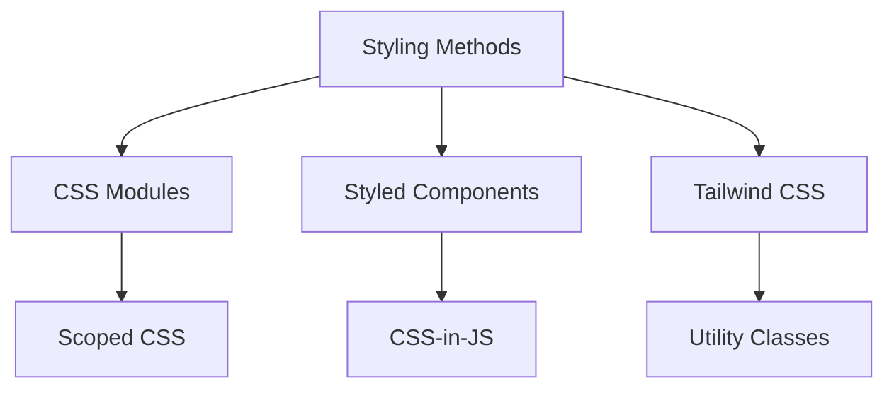
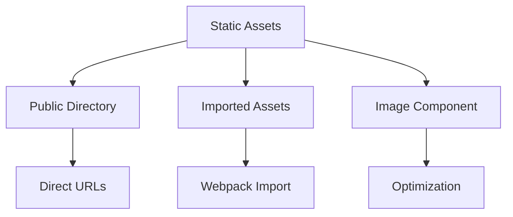

# Styling and Assets

## What are the different ways to style Next.js applications?

Next.js supports multiple styling approaches for flexibility.



```jsx
// CSS Modules
import styles from './Button.module.css';

function Button({ children }) {
    return <button className={styles.button}>{children}</button>;
}

// Styled Components
import styled from 'styled-components';

const StyledButton = styled.button`
    background: ${props => (props.primary ? 'blue' : 'white')};
    color: ${props => (props.primary ? 'white' : 'blue')};
    padding: 0.5rem 1rem;
    border-radius: 4px;

    &:hover {
        opacity: 0.8;
    }
`;

// Tailwind CSS
function TailwindButton({ children }) {
    return (
        <button className="bg-blue-500 hover:bg-blue-700 text-white font-bold py-2 px-4 rounded">
            {children}
        </button>
    );
}
```

## How to use CSS Modules?

CSS Modules provide local scoping and composition features.

```jsx
// Button.module.css
.button {
    padding: 0.5rem 1rem;
    border-radius: 4px;
    font-weight: bold;
}

.primary {
    background: var(--primary-color);
    color: white;
}

.secondary {
    background: white;
    color: var(--primary-color);
    border: 1px solid currentColor;
}

// Button.js
import styles from './Button.module.css';
import clsx from 'clsx';

function Button({ variant = 'primary', className, ...props }) {
    return (
        <button
            className={clsx(
                styles.button,
                styles[variant],
                className
            )}
            {...props}
        />
    );
}

// Usage with dynamic styles
function DynamicButton({ isActive }) {
    return (
        <button
            className={clsx(
                styles.button,
                isActive && styles.active,
                'custom-class'
            )}
        >
            Dynamic Button
        </button>
    );
}
```

## How to implement Styled JSX?

Styled JSX provides component-level CSS with full CSS support.

```jsx
function Card({ children, highlighted }) {
    return (
        <div className={`card ${highlighted ? 'highlighted' : ''}`}>
            {children}
            <style jsx>{`
                .card {
                    padding: 1.5rem;
                    border-radius: 8px;
                    box-shadow: 0 2px 4px rgba(0, 0, 0, 0.1);
                    transition: transform 0.2s;
                }

                .card.highlighted {
                    transform: scale(1.02);
                    box-shadow: 0 4px 8px rgba(0, 0, 0, 0.2);
                }

                /* Media queries */
                @media (max-width: 768px) {
                    .card {
                        padding: 1rem;
                    }
                }
            `}</style>
        </div>
    );
}
```

## How to handle static assets?

Next.js provides built-in support for static asset handling.



```jsx
// Using the public directory
function Logo() {
    return ;
}

// Using imported assets
import logoSvg from '@/assets/logo.svg';

function LogoWithImport() {
    return (
        
    );
}

// Using next/image
import Image from 'next/image';

function OptimizedImage() {
    return (
        <div className="relative aspect-video">
            <Image
                src="/hero.jpg"
                alt="Hero image"
                fill
                sizes="(max-width: 768px) 100vw,
                       (max-width: 1200px) 50vw,
                       33vw"
                priority
                className="object-cover"
            />
        </div>
    );
}
```

## How to optimize images?

Next.js Image component provides automatic image optimization.

```jsx
// Responsive image component
function ResponsiveImage({ src, alt }) {
    return (
        <div className="relative w-full">
            <Image
                src={src}
                alt={alt}
                width={1200}
                height={630}
                priority={true}
                placeholder="blur"
                blurDataURL="data:image/jpeg;base64,..."
                sizes="(max-width: 768px) 100vw,
                       (max-width: 1200px) 50vw,
                       33vw"
                className="rounded-lg"
            />
        </div>
    );
}

// Image gallery with optimization
function Gallery({ images }) {
    return (
        <div className="grid grid-cols-1 md:grid-cols-2 lg:grid-cols-3 gap-4">
            {images.map(image => (
                <div key={image.id} className="relative aspect-square">
                    <Image
                        src={image.url}
                        alt={image.alt}
                        fill
                        className="object-cover"
                        sizes="(max-width: 768px) 100vw,
                               (max-width: 1200px) 50vw,
                               33vw"
                    />
                </div>
            ))}
        </div>
    );
}
```

## How to use Tailwind CSS with Next.js?

Tailwind CSS provides utility-first styling approach.

```jsx
// tailwind.config.js
module.exports = {
    content: [
        './pages/**/*.{js,ts,jsx,tsx}',
        './components/**/*.{js,ts,jsx,tsx}',
    ],
    theme: {
        extend: {
            colors: {
                primary: {
                    50: '#f0f9ff',
                    500: '#0ea5e9',
                    900: '#0c4a6e',
                },
            },
            spacing: {
                128: '32rem',
            },
        },
    },
    plugins: [
        require('@tailwindcss/forms'),
        require('@tailwindcss/typography'),
    ],
};

// Component with Tailwind
function Card({ title, content }) {
    return (
        <div className="rounded-lg bg-white shadow-md p-6 hover:shadow-lg transition-shadow">
            <h2 className="text-xl font-bold text-gray-900 mb-4">{title}</h2>
            <p className="text-gray-600">{content}</p>
        </div>
    );
}
```

## How to implement dark mode?

```jsx
// Dark mode implementation
function ThemeProvider({ children }) {
    const [theme, setTheme] = useState('light');

    useEffect(() => {
        // Check system preference
        if (window.matchMedia('(prefers-color-scheme: dark)').matches) {
            setTheme('dark');
        }
    }, []);

    useEffect(() => {
        document.documentElement.classList.toggle('dark', theme === 'dark');
    }, [theme]);

    return (
        <div className={theme}>
            <button
                onClick={() =>
                    setTheme(t => (t === 'light' ? 'dark' : 'light'))
                }
                className="fixed bottom-4 right-4 p-2 rounded-full bg-gray-200 dark:bg-gray-800"
            >
                {theme === 'light' ? '🌙' : '☀️'}
            </button>
            {children}
        </div>
    );
}
```

## How to handle global styles?

```jsx
// pages/_app.js
import '@/styles/globals.css';

function MyApp({ Component, pageProps }) {
    return (
        <>
            <Component {...pageProps} />
            <style jsx global>{`
                :root {
                    --primary-color: #0070f3;
                    --secondary-color: #ff0080;
                }

                html {
                    font-family: system-ui, sans-serif;
                }

                body {
                    margin: 0;
                    padding: 0;
                    background: var(--bg-color);
                    color: var(--text-color);
                }

                @media (prefers-color-scheme: dark) {
                    :root {
                        --bg-color: #1a1a1a;
                        --text-color: #ffffff;
                    }
                }
            `}</style>
        </>
    );
}
```
