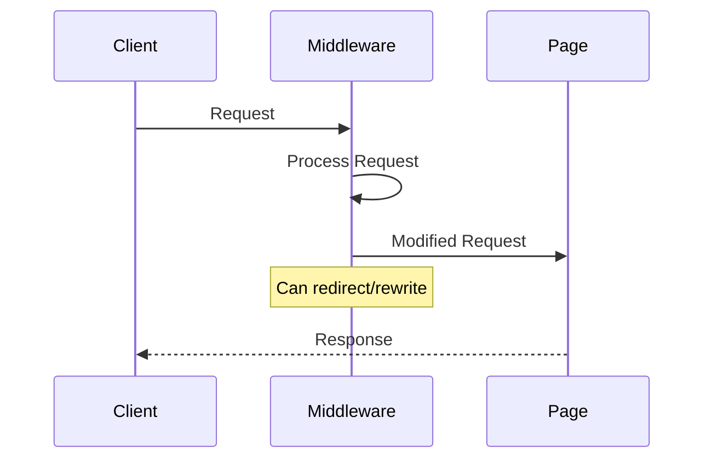
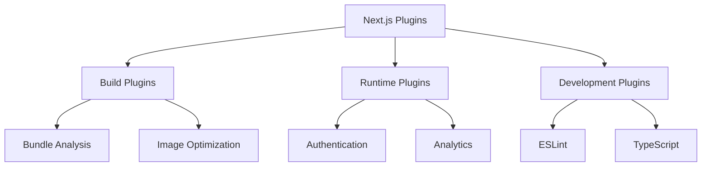

# Middleware and Plugins

## What is middleware in Next.js?

Middleware allows you to run code before a request is completed.



```jsx
// middleware.ts
import { NextResponse } from 'next/server';
import type { NextRequest } from 'next/server';

export function middleware(request: NextRequest) {
    // Get the pathname
    const path = request.nextUrl.pathname;

    // Check authentication
    const isAuthenticated = request.cookies.has('auth-token');
    const isAuthPage = path.startsWith('/auth');

    // Redirect logic
    if (!isAuthenticated && !isAuthPage) {
        return NextResponse.redirect(new URL('/auth/login', request.url));
    }

    // Add custom headers
    const response = NextResponse.next();
    response.headers.set('x-middleware-cache', 'no-cache');

    return response;
}

// Configure middleware matching
export const config = {
    matcher: [
        /*
         * Match all request paths except:
         * - _next/static (static files)
         * - _next/image (image optimization files)
         * - favicon.ico (favicon file)
         */
        '/((?!_next/static|_next/image|favicon.ico).*)',
    ],
};
```

## How to create and use middleware?

Middleware can be used for various purposes like authentication, logging, and redirects.

```jsx
// middleware/withLogging.ts
import { NextResponse } from 'next/server';
import type { NextRequest } from 'next/server';

export function withLogging(middleware: any) {
    return async function (request: NextRequest) {
        const start = Date.now();
        console.log(`[${request.method}] ${request.url}`);

        try {
            const response = await middleware(request);
            const duration = Date.now() - start;
            console.log(
                `[${request.method}] ${request.url} - ${duration}ms`,
            );
            return response;
        } catch (error) {
            console.error(
                `[${request.method}] ${request.url} - Error:`,
                error,
            );
            throw error;
        }
    };
}

// Usage
import { withLogging } from './middleware/withLogging';

export default withLogging(function middleware(request: NextRequest) {
    // Middleware logic
    return NextResponse.next();
});
```

## What are common Next.js plugins?

Next.js supports various plugins for extending functionality.



```jsx
// next.config.js
const withBundleAnalyzer = require('@next/bundle-analyzer')({
    enabled: process.env.ANALYZE === 'true',
});

const withPWA = require('next-pwa')({
    dest: 'public',
    register: true,
    skipWaiting: true,
});

module.exports = withBundleAnalyzer(
    withPWA({
        // Next.js config
        images: {
            domains: ['example.com'],
        },
        experimental: {
            serverActions: true,
        },
    }),
);
```

## How to develop custom plugins?

Custom plugins can extend Next.js functionality.

```jsx
// plugins/withCustomPlugin.js
module.exports = (nextConfig = {}) => {
    return {
        ...nextConfig,
        webpack(config, options) {
            // Modify webpack config
            config.module.rules.push({
                test: /\.custom$/,
                use: ['custom-loader'],
            });

            if (typeof nextConfig.webpack === 'function') {
                return nextConfig.webpack(config, options);
            }

            return config;
        },
    };
};

// Usage in next.config.js
const withCustomPlugin = require('./plugins/withCustomPlugin');

module.exports = withCustomPlugin({
    // Next.js config
});
```

## How to use third-party middleware?

Third-party middleware can be integrated with Next.js.

```jsx
// lib/cors.ts
import Cors from 'cors';
import type { NextApiRequest, NextApiResponse } from 'next';

const cors = Cors({
    methods: ['GET', 'POST', 'PUT', 'DELETE', 'OPTIONS'],
});

export function runMiddleware(
    req: NextApiRequest,
    res: NextApiResponse,
    fn: Function,
) {
    return new Promise((resolve, reject) => {
        fn(req, res, (result: any) => {
            if (result instanceof Error) {
                return reject(result);
            }
            return resolve(result);
        });
    });
}

// Usage in API route
export default async function handler(req, res) {
    await runMiddleware(req, res, cors);
    // API route logic
}
```

## How to implement authentication middleware?

Authentication middleware protects routes and API endpoints.

```jsx
// middleware/auth.ts
import { getToken } from 'next-auth/jwt';
import { NextResponse } from 'next/server';
import type { NextRequest } from 'next/server';

export async function authMiddleware(request: NextRequest) {
    const token = await getToken({
        req: request,
        secret: process.env.NEXTAUTH_SECRET,
    });

    if (!token) {
        const url = new URL('/api/auth/signin', request.url);
        url.searchParams.set('callbackUrl', request.url);
        return NextResponse.redirect(url);
    }

    // Add user info to headers
    const requestHeaders = new Headers(request.headers);
    requestHeaders.set('x-user-id', token.sub as string);

    return NextResponse.next({
        request: {
            headers: requestHeaders,
        },
    });
}

// Protect specific paths
export const config = {
    matcher: ['/dashboard/:path*', '/api/protected/:path*'],
};
```

## How to handle CORS in middleware?

CORS middleware manages cross-origin requests.

```jsx
// middleware/cors.ts
import { NextResponse } from 'next/server';
import type { NextRequest } from 'next/server';

const allowedOrigins = ['https://example.com', 'https://api.example.com'];

export function corsMiddleware(request: NextRequest) {
    const origin = request.headers.get('origin') || '';
    const isAllowedOrigin = allowedOrigins.includes(origin);

    // Handle preflight requests
    if (request.method === 'OPTIONS') {
        return new NextResponse(null, {
            status: 204,
            headers: {
                'Access-Control-Allow-Origin': isAllowedOrigin ? origin : '',
                'Access-Control-Allow-Methods':
                    'GET, POST, PUT, DELETE, OPTIONS',
                'Access-Control-Allow-Headers':
                    'Content-Type, Authorization',
                'Access-Control-Max-Age': '86400',
            },
        });
    }

    // Handle actual requests
    const response = NextResponse.next();

    if (isAllowedOrigin) {
        response.headers.set('Access-Control-Allow-Origin', origin);
    }

    return response;
}
```

## How to implement request logging?

Request logging middleware helps with monitoring and debugging.

```jsx
// middleware/logging.ts
import { NextResponse } from 'next/server';
import type { NextRequest } from 'next/server';

export function loggingMiddleware(request: NextRequest) {
    const startTime = Date.now();
    const requestId = crypto.randomUUID();

    // Log request
    console.log({
        timestamp: new Date().toISOString(),
        requestId,
        method: request.method,
        url: request.url,
        userAgent: request.headers.get('user-agent'),
    });

    const response = NextResponse.next();

    // Add timing headers
    response.headers.set('X-Request-ID', requestId);
    response.headers.set('X-Response-Time', `${Date.now() - startTime}ms`);

    return response;
}

// Combine multiple middleware
import { compose } from '@/lib/middleware';

export const middleware = compose([
    corsMiddleware,
    loggingMiddleware,
    authMiddleware,
]);
```
