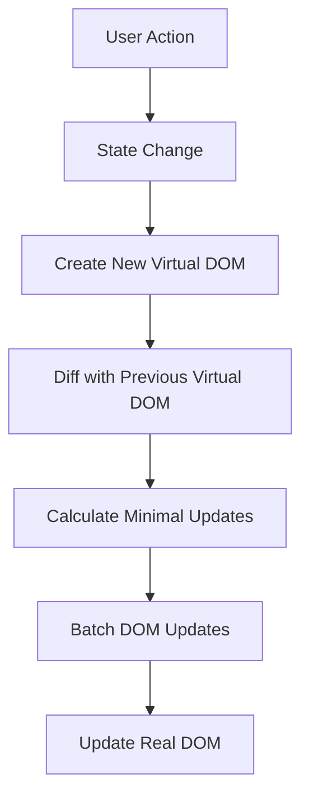
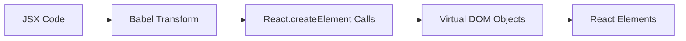
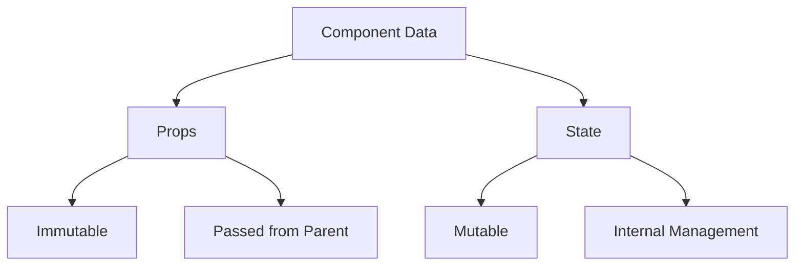
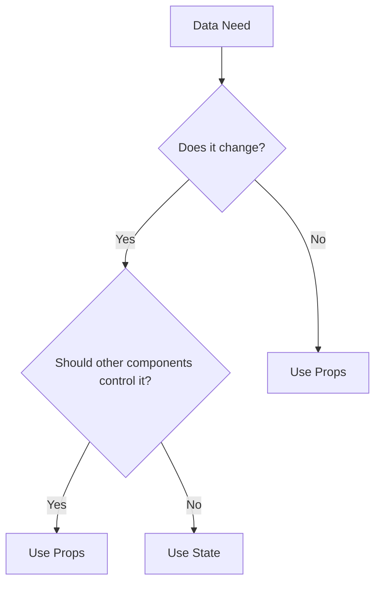

# Core Concepts

## Understanding React's Core Principles

React's design philosophy centers around several key principles that make it powerful and flexible. Understanding these principles is crucial for interviews and practical development.

### Virtual DOM and Reconciliation

The Virtual DOM is one of React's most innovative features. It's a lightweight copy of the actual DOM that enables React's efficient rendering strategy.



**How Virtual DOM Works:**

1. **Creation Phase**:

    - React creates a virtual representation of UI
    - Virtual DOM is a plain JavaScript object
    - Much lighter than the actual DOM

2. **Diffing Process**:

    - React compares new Virtual DOM with previous version
    - Uses efficient diffing algorithm
    - Identifies minimal set of changes needed

3. **Update Phase**:
    - Batches necessary DOM updates
    - Applies changes efficiently
    - Minimizes browser reflows

Example of Virtual DOM representation:

```jsx
// JSX Component
function UserProfile({ name, role }) {
    return (
        <div className="profile">
            <h2>{name}</h2>
            <p>{role}</p>
        </div>
    );
}

// Virtual DOM Representation
{
    type: 'div',
    props: {
        className: 'profile',
        children: [
            {
                type: 'h2',
                props: {
                    children: 'John Doe'
                }
            },
            {
                type: 'p',
                props: {
                    children: 'Developer'
                }
            }
        ]
    }
}
```

### JSX Deep Dive

JSX is more than just "HTML in JavaScript". Understanding its transformation process is essential.



**JSX Transformation Process:**

1. **Writing JSX**:

```jsx
// Original JSX
function Welcome() {
    return (
        <div className="welcome">
            <h1>Hello, World!</h1>
            <p>Welcome to React</p>
        </div>
    );
}
```

2. **Babel Transformation**:

```jsx
// Transformed by Babel
function Welcome() {
    return React.createElement(
        'div',
        { className: 'welcome' },
        React.createElement('h1', null, 'Hello, World!'),
        React.createElement('p', null, 'Welcome to React'),
    );
}
```

3. **Runtime Behavior**:

```jsx
// How JSX handles expressions
function Greeting({ user, isAdmin }) {
    return (
        <div>
            {/* Conditional Rendering */}
            {isAdmin && <AdminBadge />}

            {/* Expression Evaluation */}
            <h1>{`Hello, ${user.name}`}</h1>

            {/* Array Mapping */}
            <ul>
                {user.roles.map(role => (
                    <li key={role.id}>{role.name}</li>
                ))}
            </ul>
        </div>
    );
}
```

### State and Props Deep Dive

Understanding the nuances of state and props is crucial for effective React development.



**State Management Patterns:**

1. **State Updates**:

```jsx
function Counter() {
    const [count, setCount] = useState(0);

    // ❌ Incorrect state update
    const incorrectIncrement = () => {
        setCount(count + 1);
        setCount(count + 1); // Will not work as expected
    };

    // ✅ Correct state update
    const correctIncrement = () => {
        setCount(prev => prev + 1);
        setCount(prev => prev + 1); // Works correctly
    };

    return <button onClick={correctIncrement}>Count: {count}</button>;
}
```

2. **Props Best Practices**:

```jsx
// ✅ Good Props Design
function UserCard({ user, onUpdate, renderHeader, className, children }) {
    return (
        <div className={className}>
            {renderHeader?.(user)}
            <div className="content">
                <h2>{user.name}</h2>
                <p>{user.bio}</p>
                {children}
            </div>
            <button onClick={() => onUpdate(user.id)}>Update</button>
        </div>
    );
}

// Usage
<UserCard
    user={currentUser}
    onUpdate={handleUpdate}
    renderHeader={user => <CustomHeader user={user} />}
    className="user-card-premium"
>
    <UserStats user={currentUser} />
</UserCard>;
```

3. **State vs Props Decision Tree**:



### React's One-Way Data Flow

Understanding React's unidirectional data flow is crucial for managing application state.

```jsx
function ParentComponent() {
    const [parentData, setParentData] = useState('initial');

    // Data flows down through props
    return (
        <div>
            <ChildComponent data={parentData} onUpdate={setParentData} />
        </div>
    );
}

function ChildComponent({ data, onUpdate }) {
    // Child can't modify props directly
    // Must use callback provided by parent
    return <button onClick={() => onUpdate('updated')}>Current: {data}</button>;
}
```
