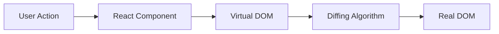
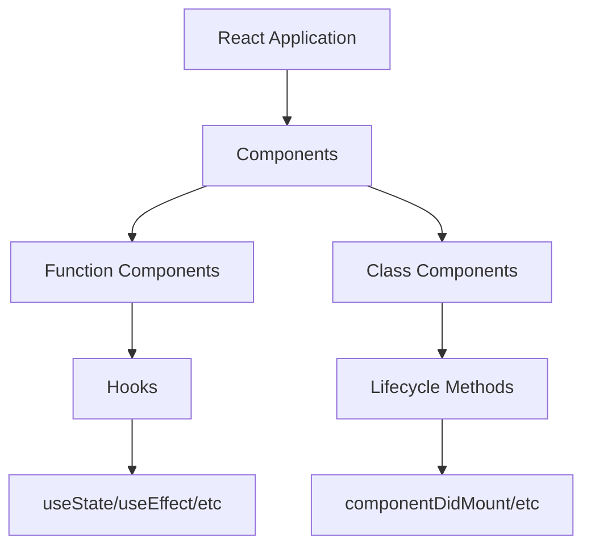
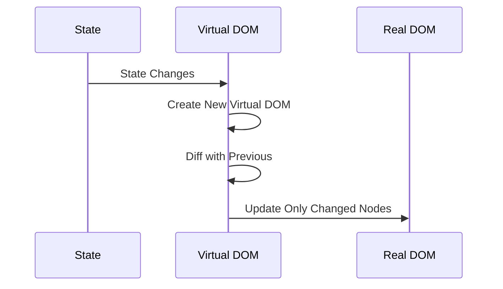
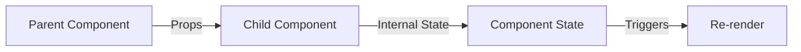
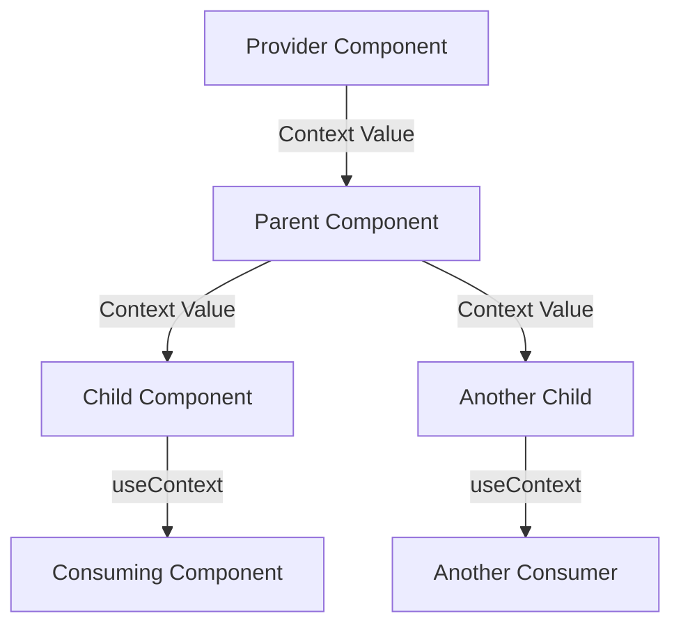
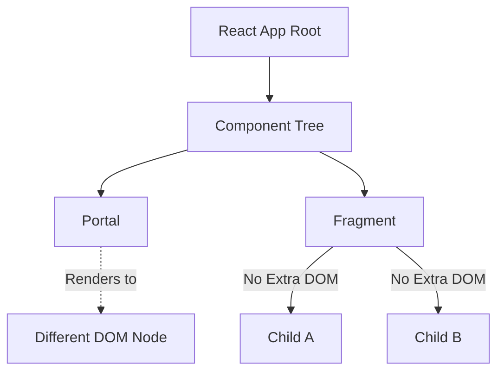

# 1. Core Concepts

## 1.1 React Basics

### What is React and how does it work?

React is a JavaScript library for building user interfaces, particularly single-page applications where data changes over time. It works by maintaining a virtual DOM to efficiently update and render components when the underlying data changes.



Key concepts from the official documentation:

-   **Declarative UI Programming**: React lets you describe what you want to show rather than directly manipulating the UI.
-   **Component-Based Architecture**: Build encapsulated components that manage their own state.
-   **Learn Once, Write Anywhere**: React can be used for web, mobile (React Native), and other platforms.



### What are the major features and advantages of React?

-   **Declarative**: React makes it painless to create interactive UIs by updating and rendering the right components when data changes.
-   **Component-Based**: Build encapsulated components that manage their own state, then compose them to make complex UIs.
-   **Learn Once, Write Anywhere**: You can develop new features in React without rewriting existing code.
-   **Rich Ecosystem**: Extensive collection of tools, libraries, and frameworks built around React.
-   **Virtual DOM**: Efficient rendering through a lightweight copy of the actual DOM.
-   **Unidirectional Data Flow**: Data flows in one direction, making the application more predictable and easier to debug.

### What are the limitations of React?

-   **Complexity in Large Applications**: Managing state and props can become complex in large applications.
-   **JSX as a Barrier**: Some developers find JSX syntax a bit difficult to grasp initially.
-   **Library, Not a Framework**: React is just a library, so additional libraries are often needed for routing, state management, etc.

### What is JSX and why is it used?

JSX is a syntax extension for JavaScript that looks similar to XML or HTML. It is used in React to describe what the UI should look like. JSX makes it easier to write and add HTML in React.

```jsx
// JSX Example with expressions
function Greeting({ user }) {
    return (
        <div className="greeting">
            {/* JSX allows embedding expressions */}
            <h1>{user.name}'s Profile</h1>
            {/* JSX supports attributes using camelCase */}
            
        </div>
    );
}
```

### What is Virtual DOM and how does it work?

The Virtual DOM is a lightweight copy of the actual DOM. React uses it to optimize updates by comparing the new virtual DOM with the previous one and applying only the necessary changes to the real DOM.



```jsx
// Example of how Virtual DOM works
function TodoList({ todos }) {
    return (
        <ul>
            {todos.map(todo => (
                // React efficiently updates only changed items
                <li key={todo.id}>{todo.text}</li>
            ))}
        </ul>
    );
}
```

### What is the difference between Element and Component?

-   **Element**: A plain object describing what you want to appear on the screen in terms of the DOM nodes or other components.
-   **Component**: A function or class that optionally accepts input and returns a React element.

### What are state and props in React?

-   **State**: A built-in object that stores property values that belong to a component. When the state object changes, the component re-renders.
-   **Props**: Short for properties, props are read-only components that must be kept pure, i.e., they do not modify the props.



```jsx
// Modern example using both props and state
function TodoItem({ todo, onToggle }) {
    const [isEditing, setIsEditing] = useState(false);

    return (
        <li>
            <input
                type="checkbox"
                checked={todo.completed}
                onChange={() => onToggle(todo.id)}
            />
            {isEditing ? (
                <input value={todo.text} onBlur={() => setIsEditing(false)} />
            ) : (
                <span onClick={() => setIsEditing(true)}>{todo.text}</span>
            )}
        </li>
    );
}
```

### What is Context API in React?

The Context API is a way to pass data through the component tree without having to pass props down manually at every level. It is used to share values like themes or user settings between components.



```jsx
// Modern Context API usage with hooks
const ThemeContext = React.createContext('light');

function ThemeProvider({ children }) {
    const [theme, setTheme] = useState('light');
    return (
        <ThemeContext.Provider value={{ theme, setTheme }}>
            {children}
        </ThemeContext.Provider>
    );
}

// Multiple components can consume the theme context
function ThemedApp() {
    return (
        <ThemeProvider>
            <ThemedButton />
            <ThemedHeader />
            <ThemedSidebar />
        </ThemeProvider>
    );
}
```

### What are refs and forward refs?

-   **Refs**: A way to access DOM nodes or React elements created in the render method.
-   **Forward Refs**: A technique for automatically passing a ref through a component to one of its children.

```jsx
class MyComponent extends React.Component {
    constructor(props) {
        super(props);
        this.myRef = React.createRef();
    }

    componentDidMount() {
        this.myRef.current.focus();
    }

    render() {
        return <input ref={this.myRef} />;
    }
}
```

### What are synthetic events in React?

Synthetic events are a cross-browser wrapper around the browser's native event. They combine the behavior of different browsers into one API, ensuring that events have consistent properties across different browsers.

### What are portals and fragments?

-   **Portals**: Allow you to render children into a DOM node that exists outside the DOM hierarchy of the parent component.
-   **Fragments**: A way to group a list of children without adding extra nodes to the DOM.



```jsx
// Complete Portal Example
const Modal = ({ children }) => {
    const modalRoot = document.getElementById('modal-root');
    const el = document.createElement('div');

    useEffect(() => {
        modalRoot.appendChild(el);
        return () => modalRoot.removeChild(el);
    }, []);

    return ReactDOM.createPortal(children, el);
};

// Usage
function App() {
    const [showModal, setShowModal] = useState(false);

    return (
        <>
            <button onClick={() => setShowModal(true)}>Show Modal</button>

            {showModal && (
                <Modal>
                    <div className="modal">
                        <h2>Modal Title</h2>
                        <button onClick={() => setShowModal(false)}>
                            Close
                        </button>
                    </div>
                </Modal>
            )}
        </>
    );
}
```
