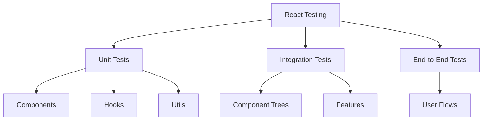

# Testing React Applications

## Testing Philosophy

Testing is a crucial part of React application development. A well-thought-out testing strategy helps ensure application reliability and maintainability. When discussing testing in interviews, it's important to understand not just the how, but also the why of testing.

### Testing Principles

1. **Test Behavior, Not Implementation**:

    - Focus on what your application does, not how it does it
    - Write tests that remain valid even when implementation details change
    - Think from the user's perspective when writing tests

2. **Testing Pyramid**:

    - Unit Tests: Quick, isolated tests for individual components and functions
    - Integration Tests: Testing how components work together
    - End-to-End Tests: Testing complete user flows

3. **Effective Test Selection**:
    - Not everything needs to be tested
    - Focus on business-critical paths
    - Test edge cases and error scenarios
    - Prioritize tests that give the most confidence

### Common Testing Mistakes

1. **Over-reliance on Snapshot Testing**:

    - Snapshots should be used sparingly
    - They're most useful for small, stable components
    - Large snapshots become maintenance burdens

2. **Testing Implementation Details**:

    - Avoid testing component state directly
    - Don't test private methods
    - Focus on component outputs and behaviors

3. **Brittle Tests**:
    - Avoid coupling tests to specific implementations
    - Use semantic queries instead of implementation details
    - Write tests that are resilient to refactoring



## Testing Setup

### Basic Setup with Jest and React Testing Library

```jsx
// package.json
{
  "dependencies": {
    "react": "^18.0.0",
    "react-dom": "^18.0.0"
  },
  "devDependencies": {
    "@testing-library/react": "^14.0.0",
    "@testing-library/jest-dom": "^6.0.0",
    "@testing-library/user-event": "^14.0.0",
    "jest": "^29.0.0"
  }
}

// setupTests.js
import '@testing-library/jest-dom';
```

### Writing Your First Test

```jsx
// Button.test.jsx
import { render, screen } from '@testing-library/react';
import userEvent from '@testing-library/user-event';
import Button from './Button';

test('calls onClick prop when clicked', async () => {
    // ARRANGE
    const handleClick = jest.fn();
    render(<Button onClick={handleClick}>Click Me</Button>);
    const user = userEvent.setup();

    // ACT
    await user.click(screen.getByRole('button', { name: /click me/i }));

    // ASSERT
    expect(handleClick).toHaveBeenCalledTimes(1);
});
```

## Testing Components

Component testing forms the foundation of React testing strategy. When approaching component testing, consider these key aspects:

1. **Component Testing Strategy**:

    - Isolate components when testing specific functionality
    - Test components in integration when testing complex interactions
    - Consider the component's role in the application

2. **What to Test**:

    - Props handling and validation
    - User interactions and events
    - State changes and side effects
    - Error states and edge cases
    - Accessibility requirements

3. **Testing Approaches**:
    - Black box testing: Test component behavior without knowledge of internals
    - Integration testing: Test component interactions
    - Visual regression testing: Test component appearance

### Testing User Interactions

```jsx
// Form.test.jsx
test('submits form with user input', async () => {
    const handleSubmit = jest.fn();
    render(<Form onSubmit={handleSubmit} />);
    const user = userEvent.setup();

    // Fill out form
    await user.type(
        screen.getByRole('textbox', { name: /username/i }),
        'testuser',
    );
    await user.type(
        screen.getByRole('textbox', { name: /email/i }),
        'test@example.com',
    );

    // Submit form
    await user.click(screen.getByRole('button', { name: /submit/i }));

    expect(handleSubmit).toHaveBeenCalledWith({
        username: 'testuser',
        email: 'test@example.com',
    });
});
```

### Testing Async Operations

```jsx
// UserProfile.test.jsx
test('loads and displays user data', async () => {
    // Mock API response
    const mockUser = { id: 1, name: 'John Doe' };
    jest.spyOn(global, 'fetch').mockImplementation(() =>
        Promise.resolve({
            ok: true,
            json: () => Promise.resolve(mockUser),
        }),
    );

    render(<UserProfile userId="1" />);

    // Wait for loading to complete
    expect(screen.getByText(/loading/i)).toBeInTheDocument();
    await screen.findByText(/john doe/i);

    // Verify API was called correctly
    expect(fetch).toHaveBeenCalledWith('/api/users/1');
});
```

## Testing Hooks

Custom hooks require special consideration in testing. Here's what to focus on:

1. **Hook Testing Challenges**:

    - Hooks can only be called inside React components
    - Some hooks have complex dependencies
    - Side effects need careful handling

2. **Testing Strategies**:

    - Use `renderHook` for isolated hook testing
    - Test hook behavior in different scenarios
    - Verify cleanup functions are called
    - Test error cases and edge conditions

3. **Common Patterns**:
    - Test initial state
    - Test state updates
    - Test side effects
    - Test cleanup behavior

### Testing Custom Hooks

```jsx
// useCounter.test.js
import { renderHook, act } from '@testing-library/react';
import useCounter from './useCounter';

test('increments counter', () => {
    const { result } = renderHook(() => useCounter());

    act(() => {
        result.current.increment();
    });

    expect(result.current.count).toBe(1);
});

test('accepts initial state', () => {
    const { result } = renderHook(() => useCounter(10));
    expect(result.current.count).toBe(10);
});
```

### Testing Hooks with Context

```jsx
// useAuth.test.js
test('provides authentication state', () => {
    const wrapper = ({ children }) => <AuthProvider>{children}</AuthProvider>;

    const { result } = renderHook(() => useAuth(), { wrapper });

    expect(result.current.isAuthenticated).toBe(false);

    act(() => {
        result.current.login('user', 'pass');
    });

    expect(result.current.isAuthenticated).toBe(true);
});
```

## Testing Patterns

Understanding common testing patterns helps write better tests:

1. **Pattern Selection**:

    - Choose patterns based on component complexity
    - Consider maintenance overhead
    - Balance coverage and testing effort

2. **Common Patterns**:

    - Arrange-Act-Assert (AAA)
    - Given-When-Then
    - Setup-Exercise-Verify
    - Mockist vs Classical

3. **Anti-patterns to Avoid**:
    - Testing implementation details
    - Overcomplicated test setups
    - Brittle assertions
    - Unnecessary mocking

### Integration Tests

```jsx
test('full app rendering/navigation', async () => {
    render(
        <BrowserRouter>
            <App />
        </BrowserRouter>,
    );
    const user = userEvent.setup();

    // Verify home page
    expect(screen.getByRole('heading')).toHaveTextContent(/welcome/i);

    // Navigate to about page
    await user.click(screen.getByText(/about/i));
    expect(screen.getByRole('heading')).toHaveTextContent(/about/i);
});
```

### Error Handling

```jsx
test('handles API error states', async () => {
    // Mock failed API call
    jest.spyOn(global, 'fetch').mockImplementation(() =>
        Promise.reject(new Error('API Error')),
    );

    render(<UserProfile userId="1" />);

    // Verify error state
    await screen.findByRole('alert');
    expect(screen.getByRole('alert')).toHaveTextContent(/error/i);
});
```

## Best Practices

Following these practices ensures maintainable and effective tests:

1. **Code Organization**:

    - Keep tests close to components
    - Use consistent naming conventions
    - Share test utilities and fixtures
    - Maintain test isolation

2. **Test Quality**:

    - Write clear test descriptions
    - Use meaningful assertions
    - Avoid test interdependence
    - Keep tests focused and simple

3. **Maintenance**:
    - Regular test review and updates
    - Remove obsolete tests
    - Update test dependencies
    - Monitor test performance

### Do's:

1. Use semantic queries (`getByRole`, `getByLabelText`, `getByText`)
2. Test from user's perspective
3. Use `userEvent` over `fireEvent` for user interactions
4. Write maintainable assertions
5. Test error states and loading states

### Don'ts:

1. Don't test implementation details
2. Don't use `container.querySelector`
3. Don't test library code
4. Don't test non-interactive snapshot
5. Don't use `shallow` rendering

## Common Testing Scenarios

### Form Testing

```jsx
test('validates form input', async () => {
    render(<RegistrationForm />);
    const user = userEvent.setup();

    // Submit without filling required fields
    await user.click(screen.getByRole('button', { name: /submit/i }));
    expect(screen.getByText(/email is required/i)).toBeInTheDocument();

    // Fill required field
    await user.type(screen.getByRole('textbox', { name: /email/i }), 'invalid');
    expect(screen.getByText(/invalid email/i)).toBeInTheDocument();

    // Fix validation error
    await user.clear(screen.getByRole('textbox', { name: /email/i }));
    await user.type(
        screen.getByRole('textbox', { name: /email/i }),
        'test@example.com',
    );
    expect(screen.queryByText(/invalid email/i)).not.toBeInTheDocument();
});
```

### Modal Testing

```jsx
test('modal shows and hides correctly', async () => {
    render(<App />);
    const user = userEvent.setup();

    // Modal should not be visible initially
    expect(screen.queryByRole('dialog')).not.toBeInTheDocument();

    // Open modal
    await user.click(screen.getByRole('button', { name: /open modal/i }));
    expect(screen.getByRole('dialog')).toBeInTheDocument();

    // Close modal
    await user.click(screen.getByRole('button', { name: /close/i }));
    expect(screen.queryByRole('dialog')).not.toBeInTheDocument();
});
```

### Testing with Mock Service Worker

```jsx
// setupTests.js
import { setupServer } from 'msw/node';
import { http, HttpResponse } from 'msw';

const server = setupServer(
    http.get('/api/users', () => {
        return HttpResponse.json([
            { id: 1, name: 'John' },
            { id: 2, name: 'Jane' },
        ]);
    }),
);

beforeAll(() => server.listen());
afterEach(() => server.resetHandlers());
afterAll(() => server.close());

// UserList.test.jsx
test('renders users from API', async () => {
    render(<UserList />);

    // Wait for users to load
    await screen.findByText('John');
    expect(screen.getByText('Jane')).toBeInTheDocument();
});
```

## Testing Library Queries Priority

When selecting elements, follow this priority order:

1. **Queries Accessible to Everyone**:

    - `getByRole`
    - `getByLabelText`
    - `getByPlaceholderText`
    - `getByText`

2. **Semantic Queries**:

    - `getByAltText`
    - `getByTitle`

3. **Test IDs**:
    - `getByTestId` (last resort)

```jsx
// Example of query priority
test('demonstrates query priority', async () => {
    render(
        <div>
            <label htmlFor="username">Username:</label>
            <input
                id="username"
                placeholder="Enter username"
                data-testid="username-input"
            />
            <button>Submit</button>
        </div>,
    );

    // Best: getByRole with name option
    screen.getByRole('textbox', { name: /username/i });

    // Good: getByLabelText
    screen.getByLabelText(/username/i);

    // Less Good: getByPlaceholderText
    screen.getByPlaceholderText(/enter username/i);

    // Last Resort: getByTestId
    screen.getByTestId('username-input');
});
```

## Advanced Testing Scenarios

Complex applications require sophisticated testing approaches:

1. **Complex Interactions**:

    - Multi-step user flows
    - Async operations
    - State management
    - Performance monitoring

2. **Testing Challenges**:

    - Race conditions
    - Timing issues
    - Network requests
    - Third-party integrations

3. **Advanced Techniques**:
    - Custom test utilities
    - Test data generators
    - Performance profiling
    - Visual regression testing

### Testing Custom Events

```jsx
test('handles custom events', async () => {
    const onDragEnd = jest.fn();
    render(<DraggableItem onDragEnd={onDragEnd} />);

    const item = screen.getByRole('button');
    fireEvent.dragStart(item);
    fireEvent.dragEnd(item);

    expect(onDragEnd).toHaveBeenCalledWith(
        expect.objectContaining({
            type: 'dragend',
        }),
    );
});
```

### Testing Animations

```jsx
test('handles animation states', async () => {
    jest.useFakeTimers();
    render(<AnimatedComponent />);

    // Trigger animation
    await userEvent.click(screen.getByRole('button', { name: /animate/i }));

    // Fast-forward animations
    jest.advanceTimersByTime(1000);

    expect(screen.getByTestId('animated-element')).toHaveStyle({
        opacity: '1',
        transform: 'translateY(0)',
    });

    jest.useRealTimers();
});
```

### Testing WebSocket Connections

```jsx
test('handles websocket messages', async () => {
    // Mock WebSocket
    const mockWebSocket = {
        send: jest.fn(),
        addEventListener: jest.fn(),
        removeEventListener: jest.fn(),
    };
    global.WebSocket = jest.fn(() => mockWebSocket);

    render(<ChatComponent />);

    // Simulate receiving message
    const messageEvent = new MessageEvent('message', {
        data: JSON.stringify({ text: 'Hello' }),
    });
    mockWebSocket.onmessage?.(messageEvent);

    expect(await screen.findByText('Hello')).toBeInTheDocument();
});
```

### Testing File Uploads

```jsx
test('handles file uploads', async () => {
    const file = new File(['hello'], 'hello.png', { type: 'image/png' });
    render(<FileUploader onUpload={jest.fn()} />);
    const user = userEvent.setup();

    const input = screen.getByLabelText(/upload file/i);
    await user.upload(input, file);

    expect(input.files[0]).toBe(file);
    expect(input.files).toHaveLength(1);
});
```

### Testing Infinite Scroll

```jsx
test('loads more items on scroll', async () => {
    const items = Array.from({ length: 50 }, (_, i) => ({
        id: i,
        name: `Item ${i}`,
    }));

    render(<InfiniteList items={items} />);

    // Simulate scroll to bottom
    fireEvent.scroll(window, {
        target: {
            scrollY: 2000,
        },
    });

    // Wait for new items
    await screen.findByText('Item 49');
    expect(screen.getAllByRole('listitem')).toHaveLength(50);
});
```

### Testing with Intersection Observer

```jsx
test('handles intersection observer', async () => {
    const mockIntersectionObserver = jest.fn();
    mockIntersectionObserver.mockReturnValue({
        observe: () => null,
        unobserve: () => null,
        disconnect: () => null,
    });
    window.IntersectionObserver = mockIntersectionObserver;

    render(<LazyLoadedImage src="test.jpg" />);

    // Simulate intersection
    const [observerCallback] = mockIntersectionObserver.mock.calls[0];
    observerCallback([{ isIntersecting: true }]);

    expect(await screen.findByRole('img')).toHaveAttribute('src', 'test.jpg');
});
```

### Testing Redux Integration

```jsx
test('integrates with Redux store', () => {
    const store = configureStore({
        reducer: {
            todos: todosReducer,
        },
        preloadedState: {
            todos: [{ id: 1, text: 'Test', completed: false }],
        },
    });

    render(
        <Provider store={store}>
            <TodoList />
        </Provider>,
    );

    expect(screen.getByText('Test')).toBeInTheDocument();
});
```

### Testing Error Boundaries with React 18

```jsx
test('recovers from errors', async () => {
    const spy = jest.spyOn(console, 'error').mockImplementation(() => {});

    render(
        <ErrorBoundary fallback={<div>Error occurred</div>}>
            <ComponentThatThrows />
        </ErrorBoundary>,
    );

    // Error should be caught and fallback rendered
    expect(await screen.findByText('Error occurred')).toBeInTheDocument();

    spy.mockRestore();
});
```

### Testing Suspense and Concurrent Features

```jsx
test('handles suspense boundaries', async () => {
    render(
        <Suspense fallback={<div>Loading...</div>}>
            <AsyncComponent />
        </Suspense>,
    );

    // Check loading state
    expect(screen.getByText('Loading...')).toBeInTheDocument();

    // Wait for content
    expect(await screen.findByText('Content')).toBeInTheDocument();
});
```

### Testing Accessibility

```jsx
test('meets accessibility requirements', async () => {
    const { container } = render(<Form />);

    // Check for ARIA attributes
    expect(screen.getByRole('button')).toHaveAttribute('aria-pressed', 'false');

    // Check focus management
    const input = screen.getByRole('textbox');
    input.focus();
    expect(input).toHaveFocus();

    // Check color contrast (requires jest-axe)
    const results = await axe(container);
    expect(results).toHaveNoViolations();
});
```

### Testing Performance

```jsx
test('renders without excessive updates', async () => {
    const renderSpy = jest.spyOn(console, 'log');

    render(<PerformanceComponent />);
    const user = userEvent.setup();

    await user.click(screen.getByRole('button'));

    // Check render count
    expect(renderSpy).toHaveBeenCalledTimes(2); // Initial + one update
});
```

These examples cover additional scenarios you might encounter in real-world applications. Remember to:

1. Mock external dependencies appropriately
2. Test edge cases and error states
3. Consider accessibility in your tests
4. Test performance-critical code
5. Use the right tools for specific scenarios

## Testing Best Practices

Following these practices ensures maintainable and effective tests:

1. **Code Organization**:

    - Keep tests close to components
    - Use consistent naming conventions
    - Share test utilities and fixtures
    - Maintain test isolation

2. **Test Quality**:

    - Write clear test descriptions
    - Use meaningful assertions
    - Avoid test interdependence
    - Keep tests focused and simple

3. **Maintenance**:
    - Regular test review and updates
    - Remove obsolete tests
    - Update test dependencies
    - Monitor test performance

### Do's:

1. Use semantic queries (`getByRole`, `getByLabelText`, `getByText`)
2. Test from user's perspective
3. Use `userEvent` over `fireEvent` for user interactions
4. Write maintainable assertions
5. Test error states and loading states

### Don'ts:

1. Don't test implementation details
2. Don't use `container.querySelector`
3. Don't test library code
4. Don't test non-interactive snapshot
5. Don't use `shallow` rendering

## Testing Tools and Ecosystem

Understanding the testing ecosystem helps choose the right tools:

1. **Core Testing Tools**:

    - Jest: Test runner and assertion library
    - React Testing Library: Component testing
    - MSW: API mocking
    - Cypress: End-to-end testing

2. **Supporting Tools**:

    - ESLint plugins for testing
    - Test coverage tools
    - Visual regression tools
    - Performance testing tools

3. **Tool Selection Criteria**:
    - Project requirements
    - Team expertise
    - Maintenance overhead
    - Community support
