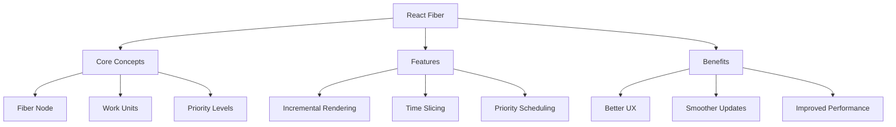

# Fiber Architecture

## Understanding React Fiber

### What is React Fiber?

React Fiber is a complete rewrite of React's core reconciliation algorithm introduced in React 16. It's designed to enable incremental rendering of the virtual DOM, breaking the rendering work into chunks that can be spread across multiple frames.

The key objectives of Fiber architecture:

1. **Incremental Rendering**: Ability to split rendering work into chunks and spread it over multiple frames
2. **Pause and Resume**: Capability to pause work and come back to it later
3. **Priority Management**: Ability to prioritize different types of updates
4. **Concurrency**: Support for React Concurrent Mode



### The Mental Model of Fiber

Fiber architecture can be understood through the lens of algebraic effects, a functional programming concept that separates the description of effects from their implementation.

```jsx
// Example of how Fiber conceptually works
function FiberWorkLoop() {
    // Work can be paused here
    const elementA = performUnitOfWork(workInProgress);
    if (shouldYield()) {
        // Return control to the main thread
        return;
    }

    // Continue with more work
    const elementB = performUnitOfWork(workInProgress);
    if (shouldYield()) {
        // Return control again if needed
        return;
    }

    // Complete the work
    completeUnitOfWork(elementA);
    completeUnitOfWork(elementB);
}

// Priority handling example
function updateComponent(fiber, priority) {
    if (priority === HIGH_PRIORITY) {
        // Interrupt current work and process immediately
        performSyncWork(fiber);
    } else {
        // Schedule work for later
        scheduleWork(fiber, priority);
    }
}
```

### How does Fiber Work?

The Fiber reconciliation process is split into two main phases:

1. **Render/Reconciliation Phase** (can be interrupted):

    - Building the Fiber tree
    - Comparing the new tree with the current tree
    - Calculating changes
    - Marking nodes with side effects

2. **Commit Phase** (cannot be interrupted):
    - Applying the changes to the DOM
    - Calling lifecycle methods
    - Handling refs

```jsx
// Example showing the two phases
function FiberReconciliation() {
    const [data, setData] = useState(initialData);

    useEffect(() => {
        // This runs during commit phase
        console.log('DOM updated');
    });

    // This part happens during render phase
    const processedData = useMemo(() => {
        // Can be interrupted if needed
        return expensiveCalculation(data);
    }, [data]);

    return (
        <div>
            {/* Render phase creates/updates this tree */}
            <ChildComponent data={processedData} />
        </div>
    );
}
```

### What is a Fiber Node?

A Fiber node is the core data structure in React Fiber. It represents a unit of work and contains information about a component, its input, and its output.

```typescript
interface FiberNode {
    // Instance
    tag: WorkTag;
    key: null | string;
    elementType: any;
    type: any;
    stateNode: any;

    // Fiber relationships
    return: Fiber | null;
    child: Fiber | null;
    sibling: Fiber | null;
    index: number;

    // Pending work
    pendingProps: any;
    memoizedProps: any;
    updateQueue: UpdateQueue<any> | null;
    memoizedState: any;

    // Side effects
    flags: Flags;
    subtreeFlags: Flags;
    deletions: Array<Fiber> | null;

    // Scheduling
    lanes: Lanes;
    childLanes: Lanes;

    // Alternate (used for double buffering)
    alternate: Fiber | null;
}

// Example of how Fiber nodes form a tree
function FiberTreeExample() {
    return (
        <div>           {/* Fiber(div) */}
            <header>    {/* Fiber(header) */}
                <h1>    {/* Fiber(h1) */}
                    Title
                </h1>
            </header>
            <main>      {/* Fiber(main) */}
                <p>     {/* Fiber(p) */}
                    Content
                </p>
            </main>
        </div>
    );
}
```

### Double Buffering in Fiber

React Fiber uses a double buffering technique to build and switch between trees:

```jsx
function ExampleWithDoubleBuffering() {
    const [count, setCount] = useState(0);

    const handleClick = () => {
        // This creates a new work-in-progress tree
        setCount(c => c + 1);
    };

    return (
        <div>
            {/* Current tree being displayed */}
            <p>Count: {count}</p>
            <button onClick={handleClick}>Increment</button>
            {/*
                When updating, React:
                1. Creates a new WIP tree
                2. Performs reconciliation
                3. Commits and swaps the trees
            */}
        </div>
    );
}
```

### Priority Scheduling with Lanes

React Fiber uses a lanes model for priority scheduling:

```jsx
function PriorityExample() {
    const [urgent, setUrgent] = useState(false);
    const [nonUrgent, setNonUrgent] = useState(false);
    const [isPending, startTransition] = useTransition();

    // High priority update (Sync Lane)
    const handleUrgentUpdate = () => {
        setUrgent(true);
    };

    // Low priority update (Default Lane)
    const handleNonUrgentUpdate = () => {
        startTransition(() => {
            setNonUrgent(true);
            // Heavy computation that can be interrupted
            performExpensiveOperation();
        });
    };

    return (
        <div>
            <button onClick={handleUrgentUpdate}>Urgent Update</button>
            <button onClick={handleNonUrgentUpdate}>
                {isPending ? 'Processing...' : 'Non-urgent Update'}
            </button>
            <Results urgent={urgent} nonUrgent={nonUrgent} />
        </div>
    );
}
```

### Fiber Reconciliation Process

The reconciliation process in Fiber works through several phases:

```jsx
function ReconciliationExample() {
    const [items, setItems] = useState([]);
    const [isPending, startTransition] = useTransition();

    const handleUpdate = () => {
        // Begin phase - schedule update
        startTransition(() => {
            setItems(prev => {
                // Render phase - create new Fiber nodes
                const newItems = [...prev, { id: Date.now() }];

                // Reconciliation phase - compare and mark updates
                return newItems;
            });
        });
    };

    // Complete phase - commit changes
    useEffect(() => {
        if (items.length > 0) {
            console.log('Changes committed to DOM');
        }
    }, [items]);

    return (
        <div>
            <button onClick={handleUpdate} disabled={isPending}>
                Add Item
            </button>
            <ItemList items={items} />
        </div>
    );
}
```

### Work Loop and Time Slicing

The work loop is the heart of Fiber's time slicing mechanism:

```jsx
// Simplified version of React's work loop
function workLoop(deadline) {
    let shouldYield = false;

    while (nextUnitOfWork && !shouldYield) {
        nextUnitOfWork = performUnitOfWork(nextUnitOfWork);
        shouldYield = deadline.timeRemaining() < 1;
    }

    // Schedule next piece of work
    requestIdleCallback(workLoop);
}

// Example of time slicing in action
function TimeSlicedList({ items }) {
    const [displayItems, setDisplayItems] = useState([]);
    const [isPending, startTransition] = useTransition();

    const processItems = useCallback(() => {
        startTransition(() => {
            // Process items in chunks
            setDisplayItems(
                items.map(item => ({
                    ...item,
                    processed: heavyComputation(item),
                })),
            );
        });
    }, [items]);

    return (
        <div>
            <button onClick={processItems} disabled={isPending}>
                {isPending ? 'Processing...' : 'Process Items'}
            </button>
            <div>
                {displayItems.map(item => (
                    <ListItem key={item.id} data={item} />
                ))}
            </div>
        </div>
    );
}
```

### Side Effects Management

Fiber introduces a sophisticated system for managing side effects:

```jsx
function SideEffectExample() {
    const [data, setData] = useState(null);
    const [layout, setLayout] = useState(null);

    // Passive effects (useEffect)
    useEffect(() => {
        let mounted = true;

        async function fetchData() {
            const result = await api.getData();
            if (mounted) {
                // Schedule a passive effect
                setData(result);
            }
        }

        fetchData();
        return () => {
            mounted = false;
        };
    }, []);

    // Layout effects (useLayoutEffect)
    useLayoutEffect(() => {
        // Synchronous effect that runs before paint
        const element = measureElement();
        setLayout(element.dimensions);
    }, [data]);

    // Ref effects
    const ref = useCallback(node => {
        if (node) {
            // Handle ref attachment
            setupDOMNode(node);
        }
    }, []);

    return (
        <div ref={ref}>
            {data && <DataDisplay data={data} layout={layout} />}
        </div>
    );
}
```

### Error Handling in Fiber

Fiber's error handling mechanism allows for better error boundaries and recovery:

```jsx
class FiberErrorBoundary extends React.Component {
    state = { error: null, errorInfo: null };

    static getDerivedStateFromError(error) {
        // Update state to render fallback UI
        return { error };
    }

    componentDidCatch(error, errorInfo) {
        // Log error to error reporting service
        logErrorToService(error, errorInfo);

        // Store error info for debugging display
        this.setState({ errorInfo });
    }

    resetError = () => {
        this.setState({ error: null, errorInfo: null });

        // Optionally trigger a retry
        if (this.props.onReset) {
            this.props.onReset();
        }
    };

    render() {
        if (this.state.error) {
            return (
                <div className="error-boundary">
                    <h2>Something went wrong</h2>
                    <button onClick={this.resetError}>Try Again</button>
                    {process.env.NODE_ENV === 'development' && (
                        <details>
                            <summary>Error Details</summary>
                            <pre>
                                {this.state.error.toString()}
                                {this.state.errorInfo?.componentStack}
                            </pre>
                        </details>
                    )}
                </div>
            );
        }

        return this.props.children;
    }
}

// Usage with error recovery
function AppWithErrorHandling() {
    const [key, setKey] = useState(0);

    return (
        <FiberErrorBoundary key={key} onReset={() => setKey(k => k + 1)}>
            <RiskyComponent />
        </FiberErrorBoundary>
    );
}
```

### Fiber Debug Tools

Tools and utilities for debugging Fiber-based applications:

```jsx
function FiberDebugger({ fiber }) {
    // Helper to visualize Fiber tree
    const renderFiberNode = node => {
        if (!node) return null;

        return (
            <div className="fiber-node">
                <div className="fiber-info">
                    <span>Type: {node.type?.name || node.type}</span>
                    <span>Tag: {node.tag}</span>
                    <span>Lanes: {node.lanes.toString(2)}</span>
                </div>
                {node.child && (
                    <div className="fiber-children">
                        {renderFiberNode(node.child)}
                    </div>
                )}
                {node.sibling && renderFiberNode(node.sibling)}
            </div>
        );
    };

    return (
        <div className="fiber-debugger">
            <h3>Fiber Tree Visualization</h3>
            {renderFiberNode(fiber)}
        </div>
    );
}

// Performance monitoring hook
function useFiberPerformance() {
    const [metrics, setMetrics] = useState({
        renderTime: 0,
        commitTime: 0,
    });

    useEffect(() => {
        const observer = new PerformanceObserver(list => {
            const entries = list.getEntries();
            entries.forEach(entry => {
                if (entry.name.includes('render')) {
                    setMetrics(m => ({
                        ...m,
                        renderTime: entry.duration,
                    }));
                }
                if (entry.name.includes('commit')) {
                    setMetrics(m => ({
                        ...m,
                        commitTime: entry.duration,
                    }));
                }
            });
        });

        observer.observe({ entryTypes: ['measure'] });
        return () => observer.disconnect();
    }, []);

    return metrics;
}
```

### Advanced Scheduling Patterns

Complex scheduling patterns using Fiber's priority system:

```jsx
function AdvancedSchedulingExample() {
    const [data, setData] = useState(null);
    const [isPending, startTransition] = useTransition();
    const deferredValue = useDeferredValue(data);

    // Different priority updates
    const handleHighPriorityUpdate = () => {
        // Synchronous update
        setData({ type: 'urgent', value: Date.now() });
    };

    const handleLowPriorityUpdate = () => {
        // Transition update
        startTransition(() => {
            setData({ type: 'background', value: Date.now() });
        });
    };

    const handleBatchedUpdates = () => {
        // Batch multiple updates
        ReactDOM.unstable_batchedUpdates(() => {
            setData(d => ({ ...d, batch: 1 }));
            setData(d => ({ ...d, batch: 2 }));
            setData(d => ({ ...d, batch: 3 }));
        });
    };

    return (
        <div>
            <button onClick={handleHighPriorityUpdate}>High Priority</button>
            <button onClick={handleLowPriorityUpdate} disabled={isPending}>
                Low Priority
            </button>
            <button onClick={handleBatchedUpdates}>Batch Updates</button>

            {/* Use deferred value for non-urgent updates */}
            <SlowComponent data={deferredValue} />
        </div>
    );
}
```

### Core Implementation of Fiber

Let's build a simplified version of Fiber to understand its core principles:

```jsx
// 1. Basic Fiber Node Structure
class FiberNode {
    constructor(type, props) {
        // Element type and props
        this.type = type;
        this.props = props;
        this.dom = null;

        // Fiber relationships
        this.parent = null;
        this.child = null;
        this.sibling = null;

        // Work related
        this.alternate = null;
        this.effectTag = null;
        this.hooks = [];
    }
}

// 2. Work-In-Progress Root
let wipRoot = null;
let currentRoot = null;
let nextUnitOfWork = null;
let deletions = [];

// 3. Create Fiber Tree from Elements
function createFiber(element, parent) {
    const fiber = new FiberNode(element.type, element.props);
    fiber.parent = parent;
    return fiber;
}

// 4. Reconciliation Process
function reconcileChildren(wipFiber, elements) {
    let oldFiber = wipFiber.alternate?.child;
    let prevSibling = null;
    let index = 0;

    while (index < elements.length || oldFiber) {
        const element = elements[index];
        let newFiber = null;

        // Compare oldFiber with element
        const sameType = oldFiber && element && element.type === oldFiber.type;

        if (sameType) {
            // Update: reuse the DOM node
            newFiber = createFiber(element, wipFiber);
            newFiber.dom = oldFiber.dom;
            newFiber.alternate = oldFiber;
            newFiber.effectTag = 'UPDATE';
        }

        if (element && !sameType) {
            // Create: new DOM node needed
            newFiber = createFiber(element, wipFiber);
            newFiber.effectTag = 'PLACEMENT';
        }

        if (oldFiber && !sameType) {
            // Delete: remove old node
            oldFiber.effectTag = 'DELETION';
            deletions.push(oldFiber);
        }

        if (oldFiber) {
            oldFiber = oldFiber.sibling;
        }

        if (index === 0) {
            wipFiber.child = newFiber;
        } else if (prevSibling && element) {
            prevSibling.sibling = newFiber;
        }

        prevSibling = newFiber;
        index++;
    }
}

// 5. Work Loop Implementation
function workLoop(deadline) {
    let shouldYield = false;

    while (nextUnitOfWork && !shouldYield) {
        nextUnitOfWork = performUnitOfWork(nextUnitOfWork);
        shouldYield = deadline.timeRemaining() < 1;
    }

    if (!nextUnitOfWork && wipRoot) {
        commitRoot();
    }

    requestIdleCallback(workLoop);
}

// 6. Perform Unit of Work
function performUnitOfWork(fiber) {
    // Create DOM node if needed
    if (!fiber.dom) {
        fiber.dom = createDom(fiber);
    }

    // Reconcile children
    const elements = fiber.props.children || [];
    reconcileChildren(fiber, elements);

    // Return next unit of work
    if (fiber.child) {
        return fiber.child;
    }
    let nextFiber = fiber;
    while (nextFiber) {
        if (nextFiber.sibling) {
            return nextFiber.sibling;
        }
        nextFiber = nextFiber.parent;
    }
}

// 7. Commit Phase
function commitRoot() {
    deletions.forEach(commitWork);
    commitWork(wipRoot.child);
    currentRoot = wipRoot;
    wipRoot = null;
}

function commitWork(fiber) {
    if (!fiber) return;

    let parentFiber = fiber.parent;
    while (!parentFiber.dom) {
        parentFiber = parentFiber.parent;
    }

    if (fiber.effectTag === 'PLACEMENT' && fiber.dom) {
        parentFiber.dom.appendChild(fiber.dom);
    } else if (fiber.effectTag === 'DELETION') {
        commitDeletion(fiber, parentFiber.dom);
    } else if (fiber.effectTag === 'UPDATE' && fiber.dom) {
        updateDom(fiber.dom, fiber.alternate.props, fiber.props);
    }

    commitWork(fiber.child);
    commitWork(fiber.sibling);
}

// 8. Simple Hook Implementation
let currentFiber = null;
let hookIndex = 0;

function useState(initial) {
    const oldHook = currentFiber.alternate?.hooks[hookIndex];
    const hook = {
        state: oldHook ? oldHook.state : initial,
        queue: [],
    };

    const actions = oldHook ? oldHook.queue : [];
    actions.forEach(action => {
        hook.state = typeof action === 'function' ? action(hook.state) : action;
    });

    const setState = action => {
        hook.queue.push(action);
        wipRoot = {
            dom: currentRoot.dom,
            props: currentRoot.props,
            alternate: currentRoot,
        };
        nextUnitOfWork = wipRoot;
        deletions = [];
    };

    currentFiber.hooks[hookIndex] = hook;
    hookIndex++;
    return [hook.state, setState];
}

// 9. Usage Example
function Counter() {
    const [count, setCount] = useState(0);

    return {
        type: 'div',
        props: {
            children: [
                {
                    type: 'h1',
                    props: { children: [`Count: ${count}`] },
                },
                {
                    type: 'button',
                    props: {
                        onClick: () => setCount(c => c + 1),
                        children: ['Increment'],
                    },
                },
            ],
        },
    };
}

// 10. Start the Fiber Engine
requestIdleCallback(workLoop);
render(<Counter />, document.getElementById('root'));
```

This simplified implementation demonstrates the core concepts of Fiber:

1. **Fiber Nodes**: Basic building blocks that represent units of work
2. **Work Loop**: The main engine that processes work in chunks
3. **Reconciliation**: The process of comparing old and new trees
4. **Commit Phase**: The process of applying changes to the DOM
5. **Hooks**: Basic state management integrated with Fiber

Key differences from the actual React implementation:

1. No priority scheduling
2. Simplified diffing algorithm
3. Basic hook implementation
4. No batching or concurrent features
5. No error boundaries
6. No context or portals

The actual React implementation includes many more features and optimizations, but this simplified version helps understand the core principles of how Fiber works.
