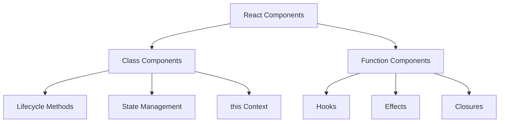
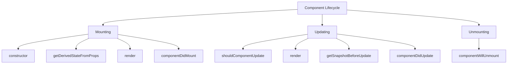
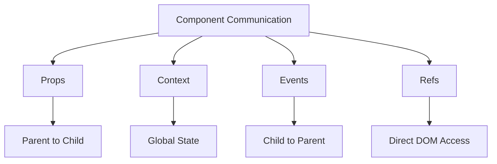

# Components and Lifecycle

## Understanding React Components

React components are the building blocks of React applications. In interviews, it's essential to demonstrate a deep understanding of both class and function components.

### Component Architecture



### Component Types Comparison

1. **Class Components vs Function Components**:

```jsx
// Class Component
class UserProfile extends React.Component {
    constructor(props) {
        super(props);
        this.state = { data: null };
    }

    componentDidMount() {
        fetchUserData(this.props.id).then(data => this.setState({ data }));
    }

    render() {
        const { data } = this.state;
        return data ? <div>{data.name}</div> : <Loading />;
    }
}

// Function Component
function UserProfile({ id }) {
    const [data, setData] = useState(null);

    useEffect(() => {
        fetchUserData(id).then(setData);
    }, [id]);

    return data ? <div>{data.name}</div> : <Loading />;
}
```

### Component Lifecycle Deep Dive



1. **Mounting Phase**:

```jsx
class MountingExample extends React.Component {
    constructor(props) {
        super(props);
        // ✅ Do: Initialize state
        this.state = { count: 0 };
        // ❌ Don't: Cause side effects
        // document.title = props.title;
    }

    static getDerivedStateFromProps(props, state) {
        // ✅ Do: Sync state to props
        if (props.count !== state.prevCount) {
            return {
                count: props.count,
                prevCount: props.count,
            };
        }
        return null;
    }

    componentDidMount() {
        // ✅ Do: Side effects (subscriptions, API calls)
        this.interval = setInterval(this.tick, 1000);
        document.title = this.props.title;
    }

    render() {
        // ✅ Do: Pure rendering logic
        return <div>{this.state.count}</div>;
    }
}
```

2. **Updating Phase**:

```jsx
class UpdatingExample extends React.Component {
    shouldComponentUpdate(nextProps, nextState) {
        // ✅ Do: Performance optimization
        return this.props.value !== nextProps.value;
    }

    getSnapshotBeforeUpdate(prevProps, prevState) {
        // ✅ Do: Capture DOM info before update
        if (prevProps.list.length < this.props.list.length) {
            return this.listRef.scrollHeight;
        }
        return null;
    }

    componentDidUpdate(prevProps, prevState, snapshot) {
        // ✅ Do: Side effects after update
        if (this.props.userId !== prevProps.userId) {
            this.fetchData(this.props.userId);
        }
        if (snapshot !== null) {
            this.listRef.scrollTop += this.listRef.scrollHeight - snapshot;
        }
    }
}
```

3. **Unmounting Phase**:

```jsx
class UnmountingExample extends React.Component {
    componentWillUnmount() {
        // ✅ Do: Cleanup
        clearInterval(this.interval);
        this.subscription.unsubscribe();
        document.removeEventListener('click', this.handler);
    }
}
```

### Function Component Lifecycle Equivalents

Modern React uses hooks to handle lifecycle events in function components:

```jsx
function ModernComponent({ userId }) {
    // 1. Setup (Constructor equivalent)
    const [data, setData] = useState(null);
    const [error, setError] = useState(null);

    // 2. Mounting (componentDidMount equivalent)
    useEffect(() => {
        let mounted = true;

        async function fetchData() {
            try {
                const result = await fetchUserData(userId);
                if (mounted) {
                    setData(result);
                }
            } catch (err) {
                if (mounted) {
                    setError(err);
                }
            }
        }

        fetchData();

        // 3. Unmounting (componentWillUnmount equivalent)
        return () => {
            mounted = false;
        };
    }, [userId]); // 4. Updating (componentDidUpdate equivalent)

    // 5. Error Handling
    if (error) {
        return <ErrorDisplay error={error} />;
    }

    // 6. Rendering
    return data ? <UserDisplay data={data} /> : <Loading />;
}
```

### Component Communication Patterns

Understanding how components communicate is crucial:



Example implementation:

```jsx
// 1. Props (Parent to Child)
function Parent() {
    const [data, setData] = useState('parent data');
    return <Child data={data} onUpdate={setData} />;
}

// 2. Context (Global State)
const ThemeContext = React.createContext('light');

function ThemedButton() {
    const theme = useContext(ThemeContext);
    return <button className={theme}>Themed Button</button>;
}

// 3. Events (Child to Parent)
function Child({ onUpdate }) {
    return <button onClick={() => onUpdate('new data')}>Update Parent</button>;
}

// 4. Refs (Direct DOM Access)
function Form() {
    const inputRef = useRef(null);

    const focusInput = () => {
        inputRef.current?.focus();
    };

    return (
        <>
            <input ref={inputRef} />
            <button onClick={focusInput}>Focus Input</button>
        </>
    );
}
```
