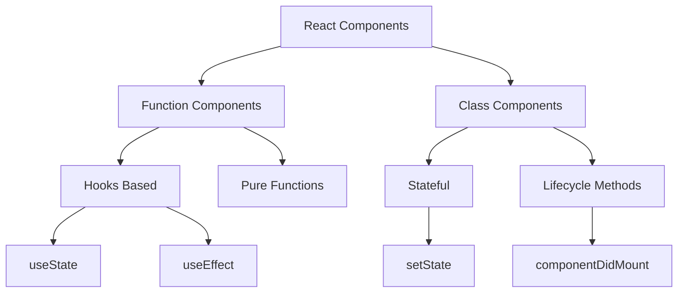
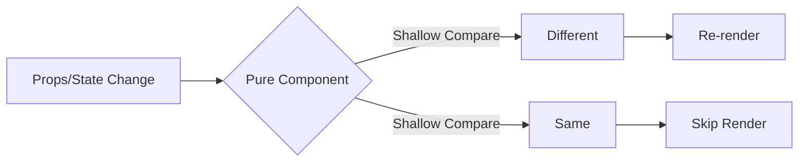
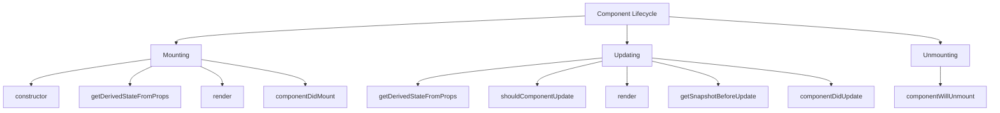
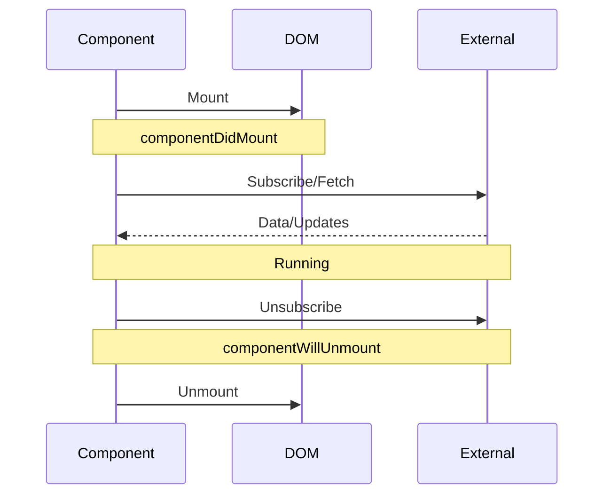

# 2. Components and Lifecycle

## 2.1 Components

### What are components in React?

Components are the building blocks of React applications. They are independent, reusable pieces of code that return React elements to be rendered to the page.



### What is the difference between functional and class components?

1. **Syntax and Declaration**:

```jsx
// Function Component
function Welcome({ name }) {
    const [count, setCount] = useState(0);

    return (
        <div>
            <h1>Hello, {name}</h1>
            <button onClick={() => setCount(count 1)}>
                Clicked {count} times
            </button>
        </div>
    );
}

// Class Component
class Welcome extends React.Component {
    state = { count: 0 };

    handleClick = () => {
        this.setState(prev => ({
            count: prev.count 1
        }));
    };

    render() {
        return (
            <div>
                <h1>Hello, {this.props.name}</h1>
                <button onClick={this.handleClick}>
                    Clicked {this.state.count} times
                </button>
            </div>
        );
    }
}
```

### What are Pure Components?

Pure Components implement `shouldComponentUpdate` with a shallow prop and state comparison, which can improve performance by reducing unnecessary renders.



```jsx
class OptimizedList extends React.PureComponent {
    render() {
        return (
            <ul>
                {this.props.items.map(item => (
                    <li key={item.id}>{item.text}</li>
                ))}
            </ul>
        );
    }
}
```

### What are Compound Components in React?

Compound components are a pattern where components work together to form a cohesive unit of functionality.

```jsx
const Select = {
    Root: ({ children, onValueChange }) => {
        const [isOpen, setIsOpen] = useState(false);
        const [value, setValue] = useState(null);

        return Children.map(children, child =>
            cloneElement(child, {
                isOpen,
                setIsOpen,
                value,
                setValue: newValue => {
                    setValue(newValue);
                    onValueChange?.(newValue);
                },
            }),
        );
    },

    Trigger: ({ isOpen, setIsOpen, value }) => (
        <button onClick={() => setIsOpen(!isOpen)}>
            {value || 'Select...'}
        </button>
    ),

    Options: ({ isOpen, children }) =>
        isOpen ? <div className="options">{children}</div> : null,

    Option: ({ value, setValue, children }) => (
        <div onClick={() => setValue(value)}>{children}</div>
    ),
};

// Usage
function App() {
    return (
        <Select.Root onValueChange={console.log}>
            <Select.Trigger />
            <Select.Options>
                <Select.Option value="1">Option 1</Select.Option>
                <Select.Option value="2">Option 2</Select.Option>
            </Select.Options>
        </Select.Root>
    );
}
```

## 2.2 Lifecycle

### What are lifecycle methods in React?



### What are the different phases of the component lifecycle?

```jsx
class LifecycleExample extends React.Component {
    constructor(props) {
        super(props);
        this.state = { count: 0 };
        console.log('1. Constructor');
    }

    static getDerivedStateFromProps(props, state) {
        console.log('2. getDerivedStateFromProps');
        return null;
    }

    componentDidMount() {
        console.log('4. componentDidMount');
        // Start timers, fetch data, DOM manipulation
    }

    shouldComponentUpdate(nextProps, nextState) {
        console.log('5. shouldComponentUpdate');
        return true;
    }

    getSnapshotBeforeUpdate(prevProps, prevState) {
        console.log('6. getSnapshotBeforeUpdate');
        return null;
    }

    componentDidUpdate(prevProps, prevState, snapshot) {
        console.log('7. componentDidUpdate');
        // Update DOM, make network requests
    }

    componentWillUnmount() {
        console.log('8. componentWillUnmount');
        // Cleanup timers, cancel requests
    }

    render() {
        console.log('3. render');
        return <div>Lifecycle Example</div>;
    }
}
```

### Why do we use componentDidMount and componentWillUnmount?



```jsx
class DataFetchingComponent extends React.Component {
    state = { data: null, intervalId: null };

    componentDidMount() {
        // API call
        fetch('https://api.example.com/data')
            .then(res => res.json())
            .then(data => this.setState({ data }));

        // Set up interval
        const intervalId = setInterval(this.fetchUpdates, 1000);
        this.setState({ intervalId });
    }

    componentWillUnmount() {
        // Clean up interval
        clearInterval(this.state.intervalId);
        // Cancel any pending requests
        this.abortController?.abort();
    }

    render() {
        const { data } = this.state;
        return (
            <div>
                {data ? (
                    <div>Data: {JSON.stringify(data)}</div>
                ) : (
                    <div>Loading...</div>
                )}
            </div>
        );
    }
}
```
