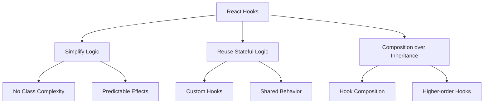

# React Hooks

## Understanding React Hooks

React Hooks revolutionized how we write React components. Understanding their design principles and implementation details is crucial for interviews.

### Hook Design Philosophy



### Hook Rules and Their Reasoning

1. **Only Call Hooks at the Top Level**:
    - Ensures consistent hook order
    - Maintains state correspondence
    - Enables hook optimization

```jsx
function BadComponent() {
    const [count, setCount] = useState(0);

    // ❌ Don't: Conditional hook
    if (count > 0) {
        const [data, setData] = useState(null); // This breaks rules
    }

    // ❌ Don't: Hook in loop
    for (let i = 0; i < count; i++) {
        const [item, setItem] = useState(null); // This breaks rules
    }
}

function GoodComponent() {
    // ✅ Do: All hooks at top level
    const [count, setCount] = useState(0);
    const [data, setData] = useState(null);
    const [items, setItems] = useState([]);

    // Conditional logic inside effects or event handlers
    useEffect(() => {
        if (count > 0) {
            // Safe to have conditions here
            fetchData().then(setData);
        }
    }, [count]);
}
```

### State Hook Deep Dive

Understanding useState's behavior and patterns:

```jsx
function StateExample() {
    // 1. Basic State
    const [count, setCount] = useState(0);

    // 2. Lazy Initial State
    const [user, setUser] = useState(() => {
        const saved = localStorage.getItem('user');
        return saved ? JSON.parse(saved) : defaultUser;
    });

    // 3. Object State
    const [form, setForm] = useState({
        name: '',
        email: '',
    });

    // 4. State Updates
    const handleIncrement = () => {
        // ❌ Don't: Multiple state updates might be batched
        setCount(count + 1);
        setCount(count + 1);

        // ✅ Do: Use functional updates
        setCount(c => c + 1);
        setCount(c => c + 1);
    };

    // 5. Object State Updates
    const handleFormChange = e => {
        const { name, value } = e.target;

        // ✅ Do: Proper object state update
        setForm(prev => ({
            ...prev,
            [name]: value,
        }));
    };

    return (
        <form>
            <input
                name="email"
                value={form.email}
                onChange={handleFormChange}
            />
            <button type="button" onClick={handleIncrement}>
                Count: {count}
            </button>
        </form>
    );
}
```

### Effect Hook Patterns

Understanding useEffect's lifecycle and cleanup:

```jsx
function EffectExample({ id }) {
    // 1. Data Fetching
    useEffect(() => {
        let mounted = true;

        async function fetchData() {
            try {
                const data = await fetchUser(id);
                if (mounted) {
                    setUser(data);
                }
            } catch (error) {
                if (mounted) {
                    setError(error);
                }
            }
        }

        fetchData();

        return () => {
            mounted = false;
        };
    }, [id]);

    // 2. Subscriptions
    useEffect(() => {
        const subscription = dataSource.subscribe(handleData);

        // Cleanup subscription
        return () => subscription.unsubscribe();
    }, []);

    // 3. DOM Events
    useEffect(() => {
        const handler = e => console.log(e);
        window.addEventListener('resize', handler);

        return () => window.removeEventListener('resize', handler);
    }, []);

    // 4. Timers
    useEffect(() => {
        const timer = setInterval(() => {
            setCount(c => c + 1);
        }, 1000);

        return () => clearInterval(timer);
    }, []);
}
```

### Custom Hooks Best Practices

Creating reusable hooks with proper abstractions:

```jsx
// 1. Generic Data Fetching Hook
function useAsync<T>(asyncFn: () => Promise<T>, deps: any[] = []) {
    const [state, setState] = useState<{
        data?: T;
        error?: Error;
        loading: boolean;
    }>({
        loading: true,
    });

    useEffect(() => {
        let mounted = true;

        setState({ loading: true });
        asyncFn()
            .then(data => {
                if (mounted) {
                    setState({ data, loading: false });
                }
            })
            .catch(error => {
                if (mounted) {
                    setState({ error, loading: false });
                }
            });

        return () => {
            mounted = false;
        };
    }, deps);

    return state;
}

// 2. Form Management Hook
function useForm<T>(initialValues: T) {
    const [values, setValues] = useState<T>(initialValues);
    const [errors, setErrors] = useState<Partial<Record<keyof T, string>>>({});
    const [touched, setTouched] = useState<Partial<Record<keyof T, boolean>>>({});

    const handleChange = useCallback((name: keyof T, value: any) => {
        setValues(prev => ({ ...prev, [name]: value }));
    }, []);

    const handleBlur = useCallback((name: keyof T) => {
        setTouched(prev => ({ ...prev, [name]: true }));
    }, []);

    const reset = useCallback(() => {
        setValues(initialValues);
        setErrors({});
        setTouched({});
    }, [initialValues]);

    return {
        values,
        errors,
        touched,
        handleChange,
        handleBlur,
        reset,
    };
}

// 3. Local Storage Hook
function useLocalStorage<T>(key: string, initialValue: T) {
    const [storedValue, setStoredValue] = useState<T>(() => {
        try {
            const item = window.localStorage.getItem(key);
            return item ? JSON.parse(item) : initialValue;
        } catch (error) {
            console.error(error);
            return initialValue;
        }
    });

    const setValue = useCallback(
        (value: T | ((prev: T) => T)) => {
            try {
                const valueToStore =
                    value instanceof Function ? value(storedValue) : value;
                setStoredValue(valueToStore);
                window.localStorage.setItem(key, JSON.stringify(valueToStore));
            } catch (error) {
                console.error(error);
            }
        },
        [key, storedValue],
    );

    return [storedValue, setValue] as const;
}

// Usage Examples
function UserProfile() {
    // Using async hook
    const { data: user, loading, error } = useAsync(
        () => fetchUser(userId),
        [userId],
    );

    // Using form hook
    const { values, handleChange, handleBlur } = useForm({
        name: '',
        email: '',
    });

    // Using localStorage hook
    const [theme, setTheme] = useLocalStorage('theme', 'light');

    if (loading) return <Loading />;
    if (error) return <Error error={error} />;

    return (
        <div data-theme={theme}>
            <form>
                <input
                    value={values.name}
                    onChange={e => handleChange('name', e.target.value)}
                    onBlur={() => handleBlur('name')}
                />
            </form>
            <button onClick={() => setTheme(t => (t === 'light' ? 'dark' : 'light'))}>
                Toggle Theme
            </button>
        </div>
    );
}
```

### Performance Optimization with Hooks

Understanding memoization and callback optimization:

```jsx
function OptimizedComponent({ items, onItemSelect }) {
    // 1. Memoize expensive calculations
    const sortedItems = useMemo(
        () => items.sort((a, b) => b.priority - a.priority),
        [items],
    );

    // 2. Memoize callbacks
    const handleSelect = useCallback(
        id => {
            const item = items.find(item => item.id === id);
            onItemSelect(item);
        },
        [items, onItemSelect],
    );

    // 3. Memoize child components
    const MemoizedChild = useMemo(
        () => <ExpensiveChild data={sortedItems} />,
        [sortedItems],
    );

    return (
        <div>
            {MemoizedChild}
            <ItemList items={sortedItems} onSelect={handleSelect} />
        </div>
    );
}
```

### Hook Testing Strategies

```jsx
// 1. Testing Custom Hooks
import { renderHook, act } from '@testing-library/react-hooks';

test('useCounter', () => {
    const { result } = renderHook(() => useCounter(0));

    expect(result.current.count).toBe(0);

    act(() => {
        result.current.increment();
    });

    expect(result.current.count).toBe(1);
});

// 2. Testing Hooks with Context
test('useTheme', () => {
    const wrapper = ({ children }) => <ThemeProvider>{children}</ThemeProvider>;

    const { result } = renderHook(() => useTheme(), { wrapper });

    expect(result.current.theme).toBe('light');
});
```
