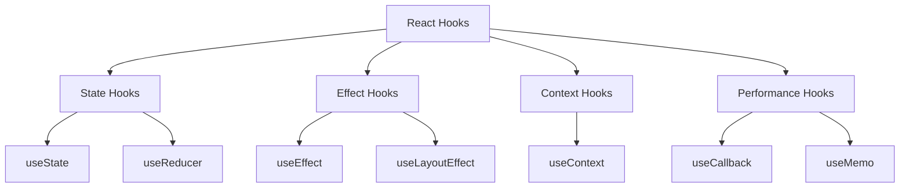
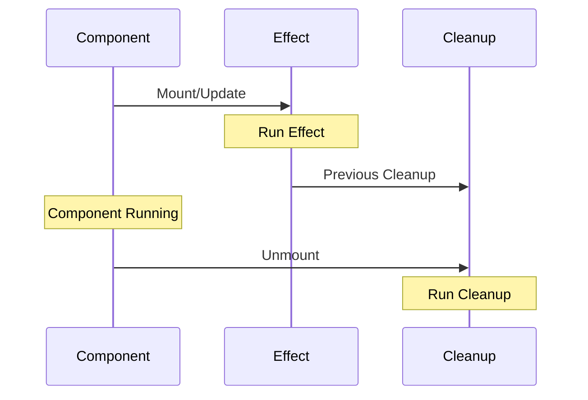

# Hooks

## React Hooks

### What are React Hooks and their rules?

React Hooks are functions that allow you to "hook into" React state and lifecycle features from function components.

Rules of Hooks:

1. Only call hooks at the top level (not inside loops, conditions, or nested functions)
2. Only call hooks from React function components or custom hooks



### What is useState Hook?

useState is a Hook that lets you add React state to function components.

```jsx
function Counter() {
    const [count, setCount] = useState(0);
    const [user, setUser] = useState({ name: '', age: 0 });

    return (
        <div>
            <p>Count: {count}</p>
            <button onClick={() => setCount(c => c + 1)}>Increment</button>

            <input
                value={user.name}
                onChange={e =>
                    setUser(prev => ({
                        ...prev,
                        name: e.target.value,
                    }))
                }
            />
        </div>
    );
}
```

### What is useEffect Hook?

useEffect lets you perform side effects in function components. It serves the same purpose as componentDidMount, componentDidUpdate, and componentWillUnmount in React classes.



```jsx
function UserProfile({ userId }) {
    const [user, setUser] = useState(null);
    const [isLoading, setIsLoading] = useState(true);

    useEffect(() => {
        const abortController = new AbortController();

        async function fetchUser() {
            try {
                const response = await fetch(
                    `https://api.example.com/users/${userId}`,
                    { signal: abortController.signal },
                );
                const data = await response.json();
                setUser(data);
            } catch (error) {
                if (!abortController.signal.aborted) {
                    console.error('Failed to fetch user:', error);
                }
            } finally {
                setIsLoading(false);
            }
        }

        fetchUser();

        // Cleanup function
        return () => abortController.abort();
    }, [userId]); // Only re-run when userId changes

    if (isLoading) return <div>Loading...</div>;
    if (!user) return <div>User not found</div>;

    return (
        <div>
            <h1>{user.name}</h1>
            <p>Email: {user.email}</p>
        </div>
    );
}
```

### What is useContext Hook?

useContext subscribes to React context without introducing nesting.

```jsx
const ThemeContext = React.createContext('light');

function ThemeProvider({ children }) {
    const [theme, setTheme] = useState('light');

    return (
        <ThemeContext.Provider value={{ theme, setTheme }}>
            {children}
        </ThemeContext.Provider>
    );
}

function ThemedButton() {
    const { theme, setTheme } = useContext(ThemeContext);

    return (
        <button
            className={theme}
            onClick={() => setTheme(t => (t === 'light' ? 'dark' : 'light'))}
        >
            Current theme: {theme}
        </button>
    );
}
```

### What is useReducer Hook?

useReducer is usually preferable to useState when you have complex state logic.

```jsx
const initialState = { count: 0 };

function reducer(state, action) {
    switch (action.type) {
        case 'increment':
            return { count: state.count + 1 };
        case 'decrement':
            return { count: state.count - 1 };
        default:
            throw new Error();
    }
}

function Counter() {
    const [state, dispatch] = useReducer(reducer, initialState);

    return (
        <div>
            Count: {state.count}
            <button onClick={() => dispatch({ type: 'increment' })}>+</button>
            <button onClick={() => dispatch({ type: 'decrement' })}>-</button>
        </div>
    );
}
```

### What is useCallback Hook?

useCallback returns a memoized version of the callback that only changes if one of the dependencies has changed.

```jsx
function SearchResults() {
    const [query, setQuery] = useState('');
    const [results, setResults] = useState([]);

    const searchAPI = useCallback(async searchQuery => {
        const response = await fetch(`/api/search?q=${searchQuery}`);
        const data = await response.json();
        setResults(data);
    }, []); // Empty deps array since function doesn't depend on props/state

    return (
        <div>
            <input
                value={query}
                onChange={e => {
                    setQuery(e.target.value);
                    searchAPI(e.target.value);
                }}
            />
            <ResultsList results={results} onItemClick={searchAPI} />
        </div>
    );
}
```

### What is useMemo Hook?

useMemo returns a memoized value that only changes when one of the dependencies has changed.

```jsx
function ExpensiveComponent({ items, query }) {
    const filteredItems = useMemo(
        () =>
            items.filter(item =>
                item.name.toLowerCase().includes(query.toLowerCase()),
            ),
        [items, query], // Only re-compute if items or query changes
    );

    return (
        <ul>
            {filteredItems.map(item => (
                <li key={item.id}>{item.name}</li>
            ))}
        </ul>
    );
}
```

### What is useRef Hook?

useRef returns a mutable ref object that persists for the full lifetime of the component.

```jsx
function TextInputWithFocusButton() {
    const inputRef = useRef(null);
    const intervalRef = useRef(null);
    const [count, setCount] = useState(0);

    useEffect(() => {
        intervalRef.current = setInterval(() => {
            setCount(c => c + 1);
        }, 1000);

        return () => clearInterval(intervalRef.current);
    }, []);

    return (
        <div>
            <input ref={inputRef} type="text" />
            <button onClick={() => inputRef.current.focus()}>
                Focus the input
            </button>
            <p>Counter: {count}</p>
        </div>
    );
}
```

### What is useLayoutEffect Hook?

useLayoutEffect is identical to useEffect, but it fires synchronously after all DOM mutations.

```jsx
function Tooltip({ text, position }) {
    const tooltipRef = useRef();

    useLayoutEffect(() => {
        const element = tooltipRef.current;
        const { x, y } = position;

        // This runs synchronously after DOM mutations
        element.style.left = `${x}px`;
        element.style.top = `${y}px`;
    }, [position]);

    return <div ref={tooltipRef}>{text}</div>;
}
```

### How to create custom Hooks?

Custom Hooks let you extract component logic into reusable functions.

```jsx
// Custom hook for handling form fields
function useFormField(initialValue = '') {
    const [value, setValue] = useState(initialValue);
    const [error, setError] = useState(null);

    const handleChange = useCallback(e => {
        const newValue = e.target.value;
        setValue(newValue);

        // Validate
        if (!newValue) {
            setError('Field is required');
        } else {
            setError(null);
        }
    }, []);

    return {
        value,
        error,
        onChange: handleChange,
    };
}

// Usage in a component
function SignupForm() {
    const email = useFormField('');
    const password = useFormField('');

    return (
        <form>
            <div>
                <input type="email" {...email} placeholder="Email" />
                {email.error && <span>{email.error}</span>}
            </div>
            <div>
                <input type="password" {...password} placeholder="Password" />
                {password.error && <span>{password.error}</span>}
            </div>
        </form>
    );
}
```
