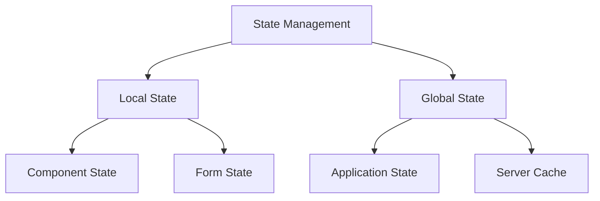
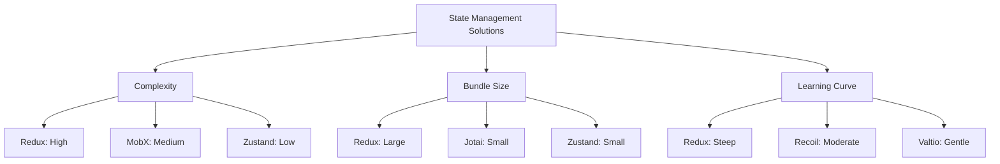
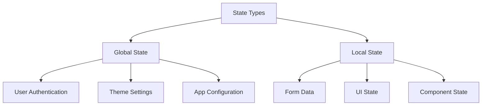

# State Management

## Overview of State Management in React

### Introduction to State Management

State management is the process of handling application data that can change over time. In React applications, state can exist at different levels:



### Why State Management is Important

-   **Predictability**: Centralized state management makes data flow more predictable
-   **Maintainability**: Easier to debug and maintain as application grows
-   **Performance**: Efficient updates and re-renders
-   **Developer Experience**: Better tooling and debugging capabilities

## Popular State Management Libraries

### Redux: The Classic Choice

Redux follows a centralized state management pattern with a single source of truth.

```jsx
// Store setup
const initialState = { count: 0 };

const counterReducer = (state = initialState, action) => {
    switch (action.type) {
        case 'INCREMENT':
            return { count: state.count + 1 };
        case 'DECREMENT':
            return { count: state.count - 1 };
        default:
            return state;
    }
};

// Component usage
function Counter() {
    const count = useSelector(state => state.count);
    const dispatch = useDispatch();

    return (
        <div>
            <p>Count: {count}</p>
            <button onClick={() => dispatch({ type: 'INCREMENT' })}>
                Increment
            </button>
        </div>
    );
}
```

### MobX: Reactive State Management

MobX uses observables and reactions for automatic state tracking.

```jsx
import { makeAutoObservable } from 'mobx';
import { observer } from 'mobx-react-lite';

class TodoStore {
    todos = [];

    constructor() {
        makeAutoObservable(this);
    }

    addTodo(text) {
        this.todos.push({ text, completed: false });
    }

    toggleTodo(index) {
        this.todos[index].completed = !this.todos[index].completed;
    }
}

const TodoList = observer(({ store }) => (
    <div>
        {store.todos.map((todo, index) => (
            <div
                key={index}
                onClick={() => store.toggleTodo(index)}
                style={{
                    textDecoration: todo.completed ? 'line-through' : 'none',
                }}
            >
                {todo.text}
            </div>
        ))}
    </div>
));
```

### Recoil: State Management with Atoms

Recoil introduces atoms and selectors for flexible state management.

```jsx
import { atom, selector, useRecoilState, useRecoilValue } from 'recoil';

const todoListState = atom({
    key: 'todoListState',
    default: [],
});

const todoListStatsState = selector({
    key: 'todoListStats',
    get: ({ get }) => {
        const todoList = get(todoListState);
        return {
            total: todoList.length,
            completed: todoList.filter(item => item.completed).length,
        };
    },
});

function TodoStats() {
    const { total, completed } = useRecoilValue(todoListStatsState);
    return (
        <div>
            <span>Total: {total}</span>
            <span>Completed: {completed}</span>
        </div>
    );
}
```

### Zustand: Bear Necessities of State Management

Zustand provides a minimalistic approach to state management.

```jsx
import create from 'zustand';

const useStore = create(set => ({
    bears: 0,
    increasePopulation: () => set(state => ({ bears: state.bears + 1 })),
    removeAllBears: () => set({ bears: 0 }),
}));

function BearCounter() {
    const bears = useStore(state => state.bears);
    const increase = useStore(state => state.increasePopulation);

    return (
        <div>
            <span>Bears: {bears}</span>
            <button onClick={increase}>Add Bear</button>
        </div>
    );
}
```

### Jotai: Primitive and Flexible State Management

Jotai uses atomic model with minimal API.

```jsx
import { atom, useAtom } from 'jotai';

const countAtom = atom(0);
const doubleCountAtom = atom(get => get(countAtom) * 2);

function Counter() {
    const [count, setCount] = useAtom(countAtom);
    const [doubleCount] = useAtom(doubleCountAtom);

    return (
        <div>
            <p>Count: {count}</p>
            <p>Double: {doubleCount}</p>
            <button onClick={() => setCount(c => c + 1)}>Increment</button>
        </div>
    );
}
```

### Valtio: Proxy-based State Management

Valtio uses JavaScript Proxy for simple state management.

```jsx
import { proxy, useSnapshot } from 'valtio';

const state = proxy({ count: 0, text: 'hello' });

function Counter() {
    const snap = useSnapshot(state);

    return (
        <div>
            <p>Count: {snap.count}</p>
            <button onClick={() => state.count++}>Increment</button>
        </div>
    );
}
```

### XState: State Machines and Statecharts

XState brings state machines to React applications.

```jsx
import { createMachine, assign } from 'xstate';
import { useMachine } from '@xstate/react';

const toggleMachine = createMachine({
    id: 'toggle',
    initial: 'inactive',
    states: {
        inactive: {
            on: { TOGGLE: 'active' },
        },
        active: {
            on: { TOGGLE: 'inactive' },
        },
    },
});

function Toggle() {
    const [state, send] = useMachine(toggleMachine);

    return (
        <button onClick={() => send('TOGGLE')}>
            {state.value === 'inactive' ? 'Off' : 'On'}
        </button>
    );
}
```

## Comparing State Management Libraries



### Comparing Redux and MobX

| Feature        | Redux        | MobX            |
| -------------- | ------------ | --------------- |
| State Model    | Single store | Multiple stores |
| Mutability     | Immutable    | Mutable         |
| Boilerplate    | More         | Less            |
| Learning Curve | Steep        | Moderate        |
| Debugging      | Excellent    | Good            |

### Recoil vs. Context API

| Feature        | Recoil    | Context API         |
| -------------- | --------- | ------------------- |
| Performance    | Better    | Context limitations |
| Code Splitting | Supported | Limited             |
| Dependencies   | External  | Built-in            |
| Learning Curve | Moderate  | Low                 |

## Best Practices in State Management

### Choosing the Right State Management Library

Consider these factors:

-   Application size and complexity
-   Team experience
-   Performance requirements
-   Bundle size constraints
-   Development timeline

### Optimizing State Updates and Re-renders

```jsx
// Bad: Unnecessary re-renders
const Component = () => {
    const [state, setState] = useState({ count: 0, name: 'John' });
    return (
        <button onClick={() => setState({ ...state, count: state.count + 1 })}>
            {state.count}
        </button>
    );
};

// Good: Optimized state updates
const Component = () => {
    const [count, setCount] = useState(0);
    const [name, setName] = useState('John');
    return <button onClick={() => setCount(c => c + 1)}>{count}</button>;
};
```

### Managing Global vs. Local State



### Handling Asynchronous State Changes

```jsx
// Example using Redux Toolkit
import { createAsyncThunk, createSlice } from '@reduxjs/toolkit';

const fetchUserById = createAsyncThunk(
    'users/fetchById',
    async (userId, thunkAPI) => {
        const response = await fetch(`/api/users/${userId}`);
        return response.json();
    },
);

const userSlice = createSlice({
    name: 'users',
    initialState: { entities: {}, loading: 'idle' },
    reducers: {},
    extraReducers: builder => {
        builder
            .addCase(fetchUserById.pending, (state, action) => {
                state.loading = 'pending';
            })
            .addCase(fetchUserById.fulfilled, (state, action) => {
                state.entities[action.payload.id] = action.payload;
                state.loading = 'idle';
            });
    },
});
```

## Advanced Topics in State Management

### State Management in Concurrent Mode

-   Consider using transitions for non-urgent updates
-   Use concurrent features wisely
-   Handle suspense boundaries appropriately

### Memory Optimization in Large Applications

```jsx
// Using cleanup functions
useEffect(() => {
    const subscription = heavyDataSource.subscribe();
    return () => subscription.unsubscribe();
}, []);

// Proper garbage collection
const store = useMemo(() => new HeavyStore(), []);
```

### State Serialization and Persistence

```jsx
// Example using Redux Persist
import { persistStore, persistReducer } from 'redux-persist';
import storage from 'redux-persist/lib/storage';

const persistConfig = {
    key: 'root',
    storage,
    whitelist: ['auth', 'settings'],
};

const persistedReducer = persistReducer(persistConfig, rootReducer);
const store = createStore(persistedReducer);
const persistor = persistStore(store);
```

### Avoiding Common Pitfalls in State Management

1. Over-centralizing state
2. Prop drilling
3. Unnecessary global state
4. Poor performance optimization
5. Inconsistent state updates
