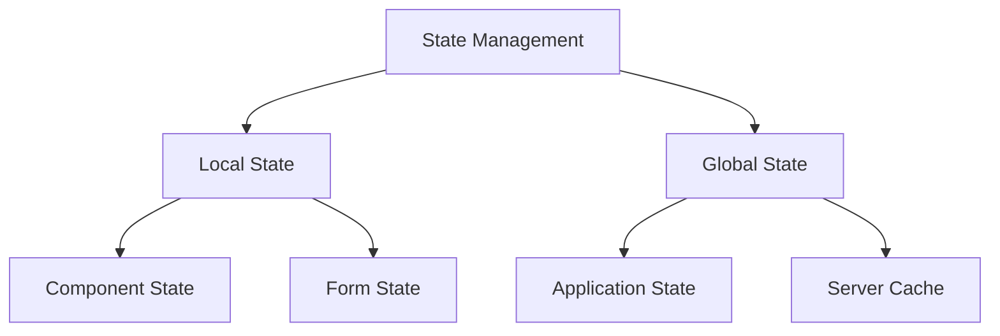
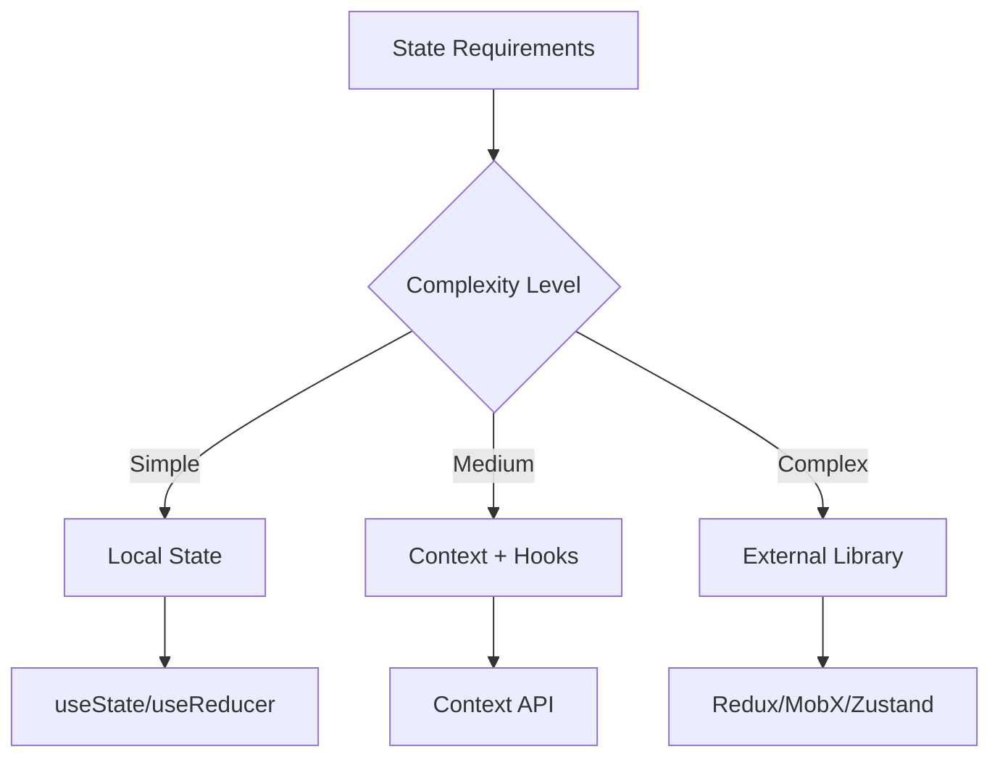

# State Management

## Overview of State Management in React

### Introduction to State Management

When discussing state management in React interviews, it's essential to demonstrate understanding of different state management approaches and when to use each one.



Key concepts to discuss in interviews:

1. **Types of State**:

    - UI State (loading, error, modal visibility)
    - Form State (input values, validation)
    - Server Cache (API responses, data)
    - URL State (routing parameters, query strings)
    - Authentication State (user info, permissions)

2. **State Management Solutions**:
    - Built-in: useState, useReducer, Context
    - External: Redux, MobX, Zustand
    - Server State: React Query, SWR
    - Form State: Formik, React Hook Form

### Why State Management is Important

In React interviews, you should be able to explain the benefits of proper state management:

1. **Predictability**:

    - Centralized state management
    - Clear data flow
    - Easier debugging
    - Better testing

2. **Maintainability**:

    - Separation of concerns
    - Reusable state logic
    - Scalable architecture
    - Better team collaboration

3. **Performance**:
    - Optimized renders
    - Efficient updates
    - Better caching
    - Reduced network requests

## Popular State Management Libraries

### Redux: The Classic Choice

Redux remains a popular choice for large applications. Understanding Redux is crucial for many React interviews.

```jsx
// Action Types
const TODO_ACTIONS = {
    ADD: 'ADD_TODO',
    TOGGLE: 'TOGGLE_TODO',
    DELETE: 'DELETE_TODO',
};

// Action Creators
const addTodo = text => ({
    type: TODO_ACTIONS.ADD,
    payload: { text, id: Date.now() },
});

const toggleTodo = id => ({
    type: TODO_ACTIONS.TOGGLE,
    payload: { id },
});

// Reducer
const todoReducer = (state = [], action) => {
    switch (action.type) {
        case TODO_ACTIONS.ADD:
            return [
                ...state,
                {
                    id: action.payload.id,
                    text: action.payload.text,
                    completed: false,
                },
            ];

        case TODO_ACTIONS.TOGGLE:
            return state.map(todo =>
                todo.id === action.payload.id
                    ? { ...todo, completed: !todo.completed }
                    : todo,
            );

        default:
            return state;
    }
};

// Modern Redux with Redux Toolkit
import { createSlice, configureStore } from '@reduxjs/toolkit';

const todosSlice = createSlice({
    name: 'todos',
    initialState: [],
    reducers: {
        addTodo: {
            reducer: (state, action) => {
                state.push(action.payload); // Immer allows "mutating" code
            },
            prepare: text => ({
                payload: {
                    id: Date.now(),
                    text,
                    completed: false,
                },
            }),
        },
        toggleTodo: (state, action) => {
            const todo = state.find(todo => todo.id === action.payload);
            if (todo) {
                todo.completed = !todo.completed;
            }
        },
    },
});

const store = configureStore({
    reducer: {
        todos: todosSlice.reducer,
    },
});

// React Component using Redux
function TodoList() {
    const todos = useSelector(state => state.todos);
    const dispatch = useDispatch();

    return (
        <div>
            <AddTodoForm
                onAdd={text => dispatch(todosSlice.actions.addTodo(text))}
            />
            {todos.map(todo => (
                <TodoItem
                    key={todo.id}
                    todo={todo}
                    onToggle={() =>
                        dispatch(todosSlice.actions.toggleTodo(todo.id))
                    }
                />
            ))}
        </div>
    );
}
```

### MobX: Reactive State Management

MobX offers a simpler, reactive approach to state management. Understanding its differences from Redux is important.

```jsx
import { makeAutoObservable } from 'mobx';
import { observer } from 'mobx-react-lite';

// Store definition
class TodoStore {
    todos = [];

    constructor() {
        makeAutoObservable(this);
    }

    addTodo(text) {
        this.todos.push({
            id: Date.now(),
            text,
            completed: false,
        });
    }

    toggleTodo(id) {
        const todo = this.todos.find(todo => todo.id === id);
        if (todo) {
            todo.completed = !todo.completed;
        }
    }

    get completedCount() {
        return this.todos.filter(todo => todo.completed).length;
    }
}

// React components using MobX
const TodoList = observer(({ store }) => (
    <div>
        <AddTodoForm onAdd={text => store.addTodo(text)} />
        {store.todos.map(todo => (
            <TodoItem
                key={todo.id}
                todo={todo}
                onToggle={() => store.toggleTodo(todo.id)}
            />
        ))}
        <div>Completed: {store.completedCount}</div>
    </div>
));
```

### Zustand: Modern Minimalist State Management

Zustand represents a modern approach to state management, offering a simpler API while maintaining Redux-like patterns.

```jsx
import create from 'zustand';

// Create store with TypeScript support
interface TodoState {
    todos: Todo[];
    addTodo: (text: string) => void;
    toggleTodo: (id: number) => void;
    completedCount: number;
}

const useTodoStore = create<TodoState>((set, get) => ({
    todos: [],
    addTodo: text =>
        set(state => ({
            todos: [
                ...state.todos,
                { id: Date.now(), text, completed: false },
            ],
        })),
    toggleTodo: id =>
        set(state => ({
            todos: state.todos.map(todo =>
                todo.id === id
                    ? { ...todo, completed: !todo.completed }
                    : todo,
            ),
        })),
    get completedCount() {
        return get().todos.filter(todo => todo.completed).length;
    },
}));

// React component using Zustand
function TodoList() {
    const { todos, addTodo, toggleTodo, completedCount } = useTodoStore();

    return (
        <div>
            <AddTodoForm onAdd={addTodo} />
            {todos.map(todo => (
                <TodoItem
                    key={todo.id}
                    todo={todo}
                    onToggle={() => toggleTodo(todo.id)}
                />
            ))}
            <div>Completed: {completedCount}</div>
        </div>
    );
}
```

### React Query: Server State Management

React Query has revolutionized how we handle server state in React applications. Understanding its patterns is crucial for modern React development.

```jsx
import { useQuery, useMutation, useQueryClient } from 'react-query';

function TodoApp() {
    const queryClient = useQueryClient();

    // Fetch todos
    const {
        data: todos,
        isLoading,
        error,
    } = useQuery('todos', async () => {
        const response = await fetch('/api/todos');
        return response.json();
    });

    // Add todo mutation
    const addTodoMutation = useMutation(
        async newTodo => {
            const response = await fetch('/api/todos', {
                method: 'POST',
                body: JSON.stringify(newTodo),
            });
            return response.json();
        },
        {
            // Optimistic update
            onMutate: async newTodo => {
                await queryClient.cancelQueries('todos');
                const previousTodos = queryClient.getQueryData('todos');
                queryClient.setQueryData('todos', old => [
                    ...old,
                    { id: 'temp', ...newTodo },
                ]);
                return { previousTodos };
            },
            // Handle error and success
            onError: (err, newTodo, context) => {
                queryClient.setQueryData('todos', context.previousTodos);
            },
            onSettled: () => {
                queryClient.invalidateQueries('todos');
            },
        },
    );

    if (isLoading) return <div>Loading...</div>;
    if (error) return <div>Error: {error.message}</div>;

    return (
        <div>
            <AddTodoForm
                onAdd={text => addTodoMutation.mutate({ text })}
                isAdding={addTodoMutation.isLoading}
            />
            <TodoList todos={todos} />
        </div>
    );
}
```

### Jotai: Atomic State Management

Jotai provides atomic state management with a focus on composition and TypeScript support.

```jsx
import { atom, useAtom } from 'jotai';

// Define atoms
const todosAtom = atom([]);
const filterAtom = atom('all');

// Derived atom for filtered todos
const filteredTodosAtom = atom(get => {
    const todos = get(todosAtom);
    const filter = get(filterAtom);

    switch (filter) {
        case 'completed':
            return todos.filter(todo => todo.completed);
        case 'active':
            return todos.filter(todo => !todo.completed);
        default:
            return todos;
    }
});

function TodoApp() {
    const [todos, setTodos] = useAtom(todosAtom);
    const [filter, setFilter] = useAtom(filterAtom);
    const [filteredTodos] = useAtom(filteredTodosAtom);

    const addTodo = text => {
        setTodos(prev => [...prev, { id: Date.now(), text, completed: false }]);
    };

    const toggleTodo = id => {
        setTodos(prev =>
            prev.map(todo =>
                todo.id === id ? { ...todo, completed: !todo.completed } : todo,
            ),
        );
    };

    return (
        <div>
            <AddTodoForm onAdd={addTodo} />
            <FilterButtons currentFilter={filter} onChange={setFilter} />
            <TodoList todos={filteredTodos} onToggle={toggleTodo} />
        </div>
    );
}
```

## Best Practices in State Management

### Choosing the Right Solution

When discussing state management in interviews, explain how to choose the right solution:



1. **Local State**:

    - Component-level state
    - Form handling
    - UI interactions
    - Temporary data

2. **Context + Hooks**:

    - Theme management
    - User preferences
    - Authentication state
    - Localization

3. **External Libraries**:
    - Complex data flows
    - Large applications
    - Team collaboration
    - Performance optimization

### Performance Optimization Strategies

```jsx
// Example of optimized state updates
function OptimizedTodoList() {
    // Split state by concern
    const [todos, setTodos] = useState([]);
    const [filter, setFilter] = useState('all');
    const [search, setSearch] = useState('');

    // Memoize filtered and searched todos
    const filteredTodos = useMemo(() => {
        console.log('Filtering todos...'); // Expensive operation
        return todos
            .filter(todo => {
                if (filter === 'completed') return todo.completed;
                if (filter === 'active') return !todo.completed;
                return true;
            })
            .filter(todo =>
                todo.text.toLowerCase().includes(search.toLowerCase()),
            );
    }, [todos, filter, search]);

    return (
        <div>
            <SearchInput value={search} onChange={setSearch} />
            <FilterButtons value={filter} onChange={setFilter} />
            <TodoItems todos={filteredTodos} />
        </div>
    );
}
```

### State Management Architecture

Best practices for structuring state management:

1. **State Organization**:

    - Separate by domain
    - Keep state minimal
    - Use normalized data
    - Maintain single source of truth

2. **State Updates**:

    - Immutable updates
    - Batch related changes
    - Handle async operations
    - Implement optimistic updates

3. **Error Handling**:

    - Centralized error handling
    - Graceful degradation
    - User feedback
    - Recovery strategies

4. **Testing Strategies**:
    - Unit test state logic
    - Integration test state flow
    - Mock external dependencies
    - Test error scenarios
