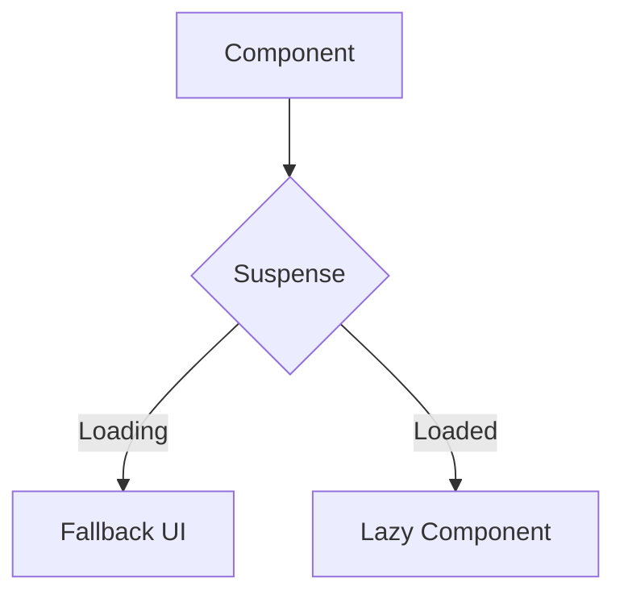
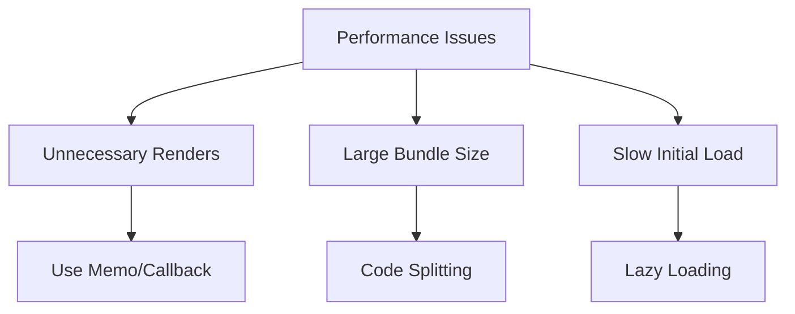

# 5. Performance Optimization

## 5.1 Performance Optimization

### How to prevent components from re-rendering?

There are several ways to prevent unnecessary re-renders:

1. Use React.memo for function components
2. Implement shouldComponentUpdate for class components
3. Use useMemo and useCallback hooks
4. Proper state management

```jsx
// Using React.memo
const MovieCard = React.memo(({ title, description }) => (
    <div className="card">
        <h3>{title}</h3>
        <p>{description}</p>
    </div>
));

// Using shouldComponentUpdate
class MovieList extends React.Component {
    shouldComponentUpdate(nextProps) {
        return this.props.movies !== nextProps.movies;
    }

    render() {
        return (
            <div>
                {this.props.movies.map(movie => (
                    <MovieCard key={movie.id} {...movie} />
                ))}
            </div>
        );
    }
}
```

### What is React.memo()?

React.memo is a higher-order component that can wrap function components to prevent re-renders if props haven't changed.

```jsx
const ExpensiveComponent = React.memo(
    ({ data }) => {
        // Only re-renders if data changes
        return <div>{/* Complex rendering logic */}</div>;
    },
    (prevProps, nextProps) => {
        // Custom comparison function (optional)
        return prevProps.data.id === nextProps.data.id;
    },
);
```

### What is React.lazy()?

React.lazy enables code-splitting through dynamic imports.

```jsx
// Instead of importing directly
// import ExpensiveComponent from './ExpensiveComponent';

// Use lazy loading
const ExpensiveComponent = React.lazy(() => import('./ExpensiveComponent'));

function App() {
    return (
        <Suspense fallback={<Loading />}>
            <ExpensiveComponent />
        </Suspense>
    );
}
```

### What is Suspense in React?

Suspense lets components "wait" for something before rendering, commonly used with React.lazy for code-splitting.



```jsx
function App() {
    return (
        <Suspense fallback={<LoadingSpinner />}>
            <Routes>
                <Route path="/dashboard" element={<DashboardPage />} />
                <Route path="/settings" element={<SettingsPage />} />
            </Routes>
        </Suspense>
    );
}
```

### What is code splitting?

Code splitting is a technique to split your code into small chunks and load them on demand.

```jsx
// Route-based code splitting
import { Routes, Route } from 'react-router-dom';

const Dashboard = React.lazy(() => import('./pages/Dashboard'));
const Settings = React.lazy(() => import('./pages/Settings'));
const Profile = React.lazy(() => import('./pages/Profile'));

function App() {
    return (
        <Suspense fallback={<Loading />}>
            <Routes>
                <Route path="/dashboard" element={<Dashboard />} />
                <Route path="/settings" element={<Settings />} />
                <Route path="/profile" element={<Profile />} />
            </Routes>
        </Suspense>
    );
}
```

### What are Error Boundaries?

Error Boundaries are React components that catch JavaScript errors in their child component tree.

```jsx
class ErrorBoundary extends React.Component {
    state = { hasError: false, error: null };

    static getDerivedStateFromError(error) {
        return { hasError: true, error };
    }

    componentDidCatch(error, errorInfo) {
        console.error('Error caught:', error, errorInfo);
        // Log to error reporting service
    }

    render() {
        if (this.state.hasError) {
            return (
                <div className="error-ui">
                    <h2>Something went wrong!</h2>
                    <button onClick={() => window.location.reload()}>
                        Retry
                    </button>
                </div>
            );
        }

        return this.props.children;
    }
}
```

### What is memoization in React?

Memoization is an optimization technique that stores the results of expensive computations and reuses them when the same inputs occur again.

```jsx
function ProductList({ products, filter }) {
    // Memoize expensive filtering operation
    const filteredProducts = useMemo(
        () => products.filter(p => p.category === filter),
        [products, filter],
    );

    // Memoize callback function
    const handleSort = useCallback(
        sortKey => {
            // Sorting logic
        },
        [], // Empty deps array if sorting logic doesn't depend on props/state
    );

    return (
        <div>
            {filteredProducts.map(product => (
                <ProductCard
                    key={product.id}
                    product={product}
                    onSort={handleSort}
                />
            ))}
        </div>
    );
}
```

### How do you optimize performance in a React application?

1. **Virtual DOM Optimization**:

```jsx
// Use keys properly
function List({ items }) {
    return (
        <ul>
            {items.map(item => (
                <li key={item.id}>{item.name}</li>
            ))}
        </ul>
    );
}
```

2. **State Management Optimization**:

```jsx
// Split state logically
function UserProfile() {
    const [userInfo, setUserInfo] = useState({ name: '', email: '' });
    const [preferences, setPreferences] = useState({ theme: 'light' });

    // Updates won't affect unrelated state
    const updateTheme = theme => {
        setPreferences(prev => ({ ...prev, theme }));
    };
}
```

### Common Performance Issues and Solutions



### Performance Monitoring Tools

1. **React Developer Tools**
2. **Lighthouse**
3. **Web Vitals**

```jsx
// Measuring component render time
function PerformanceMonitor({ children }) {
    useEffect(() => {
        const start = performance.now();

        return () => {
            const end = performance.now();
            console.log(`Render time: ${end - start}ms`);
        };
    });

    return children;
}
```
