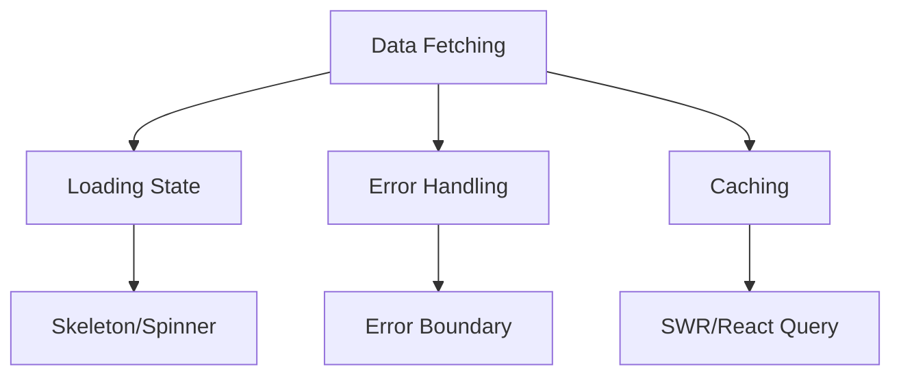
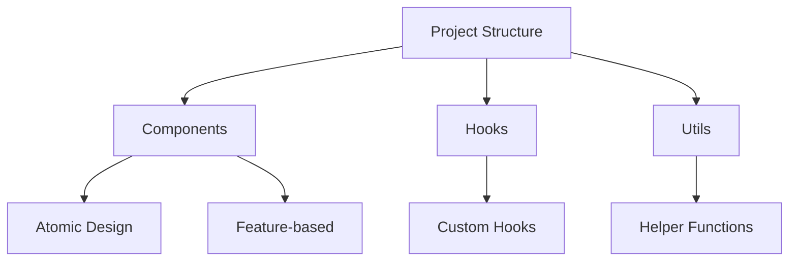

# 6. Engineering Practices

## 6.1 Engineering Practices

### What is the Provider Pattern?

The Provider Pattern is a way to share values across the React component tree without explicitly passing props.

```jsx
// Theme Provider Example
const ThemeContext = React.createContext(null);

const ThemeProvider = ({ children }) => {
    const [theme, setTheme] = useState('light');

    const toggleTheme = useCallback(() => {
        setTheme(t => (t === 'light' ? 'dark' : 'light'));
    }, []);

    return (
        <ThemeContext.Provider value={{ theme, toggleTheme }}>
            {children}
        </ThemeContext.Provider>
    );
};

// Custom hook for using theme
const useTheme = () => {
    const context = useContext(ThemeContext);
    if (!context) {
        throw new Error('useTheme must be used within ThemeProvider');
    }
    return context;
};
```

### What are the best practices for data fetching in React?



```jsx
// Custom hook for data fetching
function useData(url) {
    const [state, setState] = useState({
        data: null,
        error: null,
        loading: true,
    });

    useEffect(() => {
        const abortController = new AbortController();

        async function fetchData() {
            try {
                setState(prev => ({ ...prev, loading: true }));
                const response = await fetch(url, {
                    signal: abortController.signal,
                });
                const data = await response.json();
                setState({ data, error: null, loading: false });
            } catch (error) {
                if (!abortController.signal.aborted) {
                    setState({ data: null, error, loading: false });
                }
            }
        }

        fetchData();
        return () => abortController.abort();
    }, [url]);

    return state;
}
```

### How to handle API calls with React Query?

React Query provides powerful tools for fetching, caching, and updating data.

```jsx
import { useQuery, useMutation, useQueryClient } from 'react-query';

function TodoList() {
    const queryClient = useQueryClient();

    // Fetch todos
    const { data: todos, isLoading } = useQuery('todos', async () => {
        const response = await fetch('/api/todos');
        return response.json();
    });

    // Add todo mutation
    const { mutate: addTodo } = useMutation(
        async newTodo => {
            const response = await fetch('/api/todos', {
                method: 'POST',
                body: JSON.stringify(newTodo),
            });
            return response.json();
        },
        {
            onSuccess: () => {
                queryClient.invalidateQueries('todos');
            },
        },
    );

    if (isLoading) return <div>Loading...</div>;

    return (
        <div>
            {todos.map(todo => (
                <TodoItem key={todo.id} todo={todo} />
            ))}
            <button onClick={() => addTodo({ title: 'New Todo' })}>
                Add Todo
            </button>
        </div>
    );
}
```

### What are Higher-Order Components (HOC)?

HOCs are functions that take a component and return a new component with additional props or behavior.

```jsx
// withAuth HOC example
const withAuth = WrappedComponent => {
    return function WithAuthComponent(props) {
        const { isAuthenticated, loading } = useAuth();

        if (loading) {
            return <div>Loading auth state...</div>;
        }

        if (!isAuthenticated) {
            return <Navigate to="/login" />;
        }

        return <WrappedComponent {...props} />;
    };
};

// Usage
const ProtectedComponent = withAuth(UserDashboard);
```

### What are React Design Patterns?

Common React design patterns include:

1. **Compound Components**

```jsx
const Select = {
    Root: ({ children, value, onChange }) => {
        const [isOpen, setIsOpen] = useState(false);
        return Children.map(children, child =>
            cloneElement(child, { value, onChange, isOpen, setIsOpen }),
        );
    },
    Trigger: ({ value, isOpen, setIsOpen }) => (
        <button onClick={() => setIsOpen(!isOpen)}>
            {value || 'Select...'}
        </button>
    ),
    Options: ({ isOpen, children }) =>
        isOpen && <div className="options">{children}</div>,
    Option: ({ value, children, onChange, setIsOpen }) => (
        <div
            onClick={() => {
                onChange(value);
                setIsOpen(false);
            }}
        >
            {children}
        </div>
    ),
};
```

2. **Render Props**

```jsx
const MouseTracker = ({ render }) => {
    const [position, setPosition] = useState({ x: 0, y: 0 });

    useEffect(() => {
        const handleMouseMove = event => {
            setPosition({ x: event.clientX, y: event.clientY });
        };

        window.addEventListener('mousemove', handleMouseMove);
        return () => window.removeEventListener('mousemove', handleMouseMove);
    }, []);

    return render(position);
};
```

### Best Practices for Component Organization



### Error Handling Best Practices

1. **Use Error Boundaries**
2. **Handle Async Errors**
3. **Provide Fallback UI**

```jsx
function DataComponent({ fallback }) {
    const [error, setError] = useState(null);

    if (error) {
        return fallback || <div>Something went wrong: {error.message}</div>;
    }

    return (
        <ErrorBoundary fallback={<div>Component Error</div>}>
            {/* Component content */}
        </ErrorBoundary>
    );
}
```

### Code Quality and Maintenance

1. **Type Safety with TypeScript**

```tsx
interface UserProps {
    name: string;
    age: number;
    email?: string;
}

const UserProfile: React.FC<UserProps> = ({ name, age, email }) => {
    return (
        <div>
            <h2>{name}</h2>
            <p>Age: {age}</p>
            {email && <p>Email: {email}</p>}
        </div>
    );
};
```

2. **Testing Best Practices**

```jsx
import { render, screen, fireEvent } from '@testing-library/react';

test('counter increments when clicked', () => {
    render(<Counter />);
    const button = screen.getByRole('button');
    fireEvent.click(button);
    expect(screen.getByText('Count: 1')).toBeInTheDocument();
});
```

### Performance Best Practices

1. **Code Splitting**
2. **Memoization**
3. **Virtual List for Large Data**

### Security Best Practices

1. **XSS Prevention**

```jsx
// Sanitize user input
import DOMPurify from 'dompurify';

function Comment({ content }) {
    const sanitizedContent = DOMPurify.sanitize(content);
    return <div dangerouslySetInnerHTML={{ __html: sanitizedContent }} />;
}
```

2. **CSRF Protection**
3. **Secure Authentication Handling**
