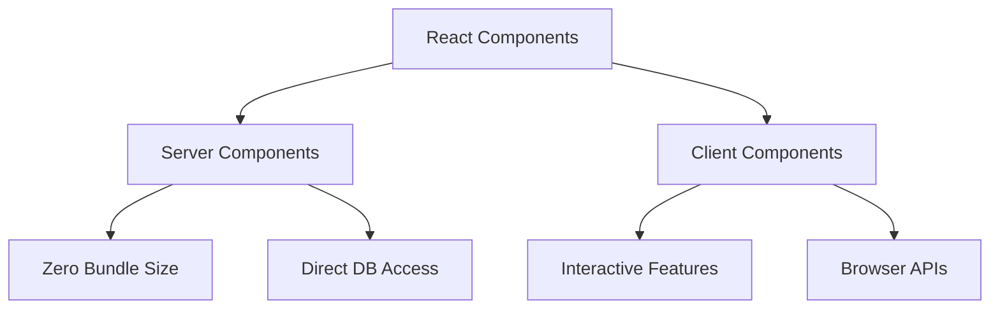
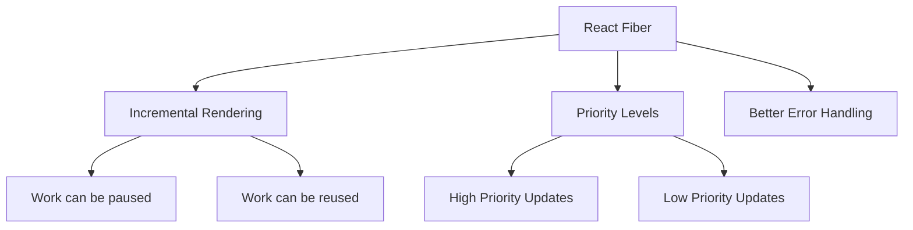

# Advanced Features

## Advanced Features

### What are React Server Components?

React Server Components (RSC) allow components to be rendered on the server with zero client-side JavaScript.



```jsx
// Server Component
async function BlogPost({ id }) {
    const post = await db.post.findUnique({ where: { id } });

    return (
        <article>
            <h1>{post.title}</h1>
            <Content>{post.content}</Content>
            {/* Client components can be used within server components */}
            <ClientCommentForm />
        </article>
    );
}

// Client Component
('use client');
function ClientCommentForm() {
    const [comment, setComment] = useState('');

    return (
        <form>
            <textarea
                value={comment}
                onChange={e => setComment(e.target.value)}
            />
            <button type="submit">Submit</button>
        </form>
    );
}
```

### What is React Concurrent Mode?

Concurrent Mode enables React to prepare multiple versions of the UI at the same time.

```jsx
// Using startTransition for non-urgent updates
function SearchResults() {
    const [query, setQuery] = useState('');
    const [isPending, startTransition] = useTransition();

    const updateQuery = newQuery => {
        startTransition(() => {
            // Non-urgent state update
            setQuery(newQuery);
        });
    };

    return (
        <div>
            <input onChange={e => updateQuery(e.target.value)} />
            {isPending ? <div>Loading...</div> : <ResultsList query={query} />}
        </div>
    );
}
```

### What is React Fiber?

React Fiber is the internal reconciliation algorithm used by React since version 16.



### What is React Suspense?

Suspense lets components "wait" for something before rendering.

```jsx
// Data fetching with Suspense
const Resource = createResource(fetchData);

function AsyncComponent() {
    const data = Resource.read();
    return <div>{data.message}</div>;
}

function App() {
    return (
        <Suspense
            fallback={<div>Loading...</div>}
            fallbackMs={500} // Optional delay before showing fallback
        >
            <AsyncComponent />
        </Suspense>
    );
}
```

### What are the major features introduced in React 17?

1. **New JSX Transform**

```jsx
// No need to import React in React 17+
function App() {
    return <h1>Hello World</h1>;
}
```

2. **Event Delegation Changes**

```jsx
// Event handlers are now attached to the root DOM container
const root = document.getElementById('root');
ReactDOM.createRoot(root).render(<App />);
```

### Advanced Component Patterns

1. **Controlled Components with State Machines**

```jsx
import { useMachine } from '@xstate/react';
import { createMachine } from 'xstate';

const formMachine = createMachine({
    initial: 'idle',
    states: {
        idle: {
            on: { SUBMIT: 'submitting' },
        },
        submitting: {
            invoke: {
                src: 'submitForm',
                onDone: 'success',
                onError: 'error',
            },
        },
        success: {},
        error: {
            on: { RETRY: 'idle' },
        },
    },
});

function Form() {
    const [state, send] = useMachine(formMachine);

    return (
        <form onSubmit={() => send('SUBMIT')}>
            {state.matches('submitting') && <Spinner />}
            {state.matches('error') && <ErrorMessage />}
        </form>
    );
}
```

### Advanced Performance Optimizations

1. **Virtualization for Large Lists**

```jsx
import { VirtualizedList } from 'react-window';

function VirtualList({ items }) {
    const Row = ({ index, style }) => (
        <div style={style}>{items[index].name}</div>
    );

    return (
        <VirtualizedList
            height={400}
            itemCount={items.length}
            itemSize={35}
            width={300}
        >
            {Row}
        </VirtualizedList>
    );
}
```

### Advanced State Management

1. **Actor Model with XState**

```jsx
const todoMachine = createMachine({
    initial: 'loading',
    states: {
        loading: {
            invoke: {
                src: 'loadTodos',
                onDone: { target: 'idle', actions: 'setTodos' },
            },
        },
        idle: {
            on: {
                ADD: { actions: 'addTodo' },
                TOGGLE: { actions: 'toggleTodo' },
            },
        },
    },
});
```

### Advanced Routing Techniques

1. **Dynamic Route Matching**

```jsx
import { Routes, Route, useMatches, useNavigate } from 'react-router-dom';

function App() {
    return (
        <Routes>
            <Route path="users">
                <Route path=":id" element={<UserProfile />} />
                <Route path=":id/posts" element={<UserPosts />} />
                <Route path=":id/settings" element={<UserSettings />} />
            </Route>
        </Routes>
    );
}
```

### Server-Side Features

1. **Streaming SSR**

```jsx
import { renderToPipeableStream } from 'react-dom/server';

function handleRequest(req, res) {
    const { pipe } = renderToPipeableStream(<App />, {
        bootstrapScripts: ['/client.js'],
        onShellReady() {
            res.setHeader('content-type', 'text/html');
            pipe(res);
        },
    });
}
```

2. **Selective Hydration**

```jsx
function App() {
    return (
        <Layout>
            <Suspense fallback={<HeaderSkeleton />}>
                <Header />
            </Suspense>
            <Suspense fallback={<MainSkeleton />}>
                <MainContent />
            </Suspense>
        </Layout>
    );
}
```
