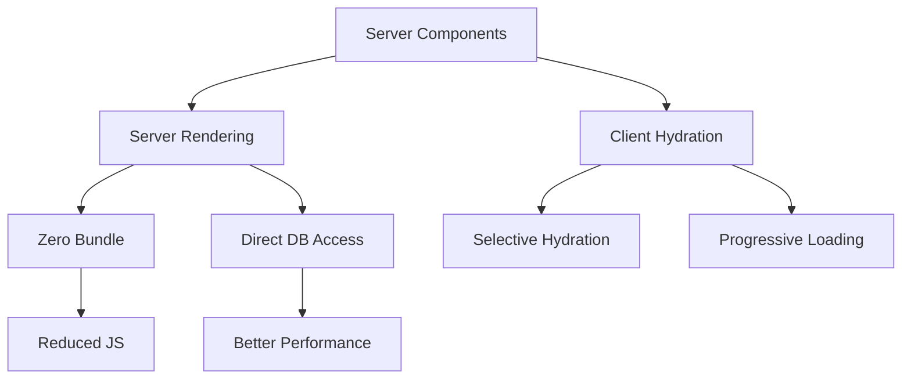
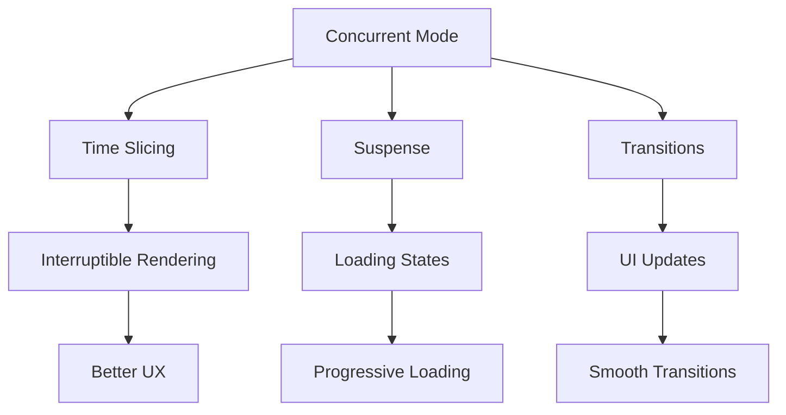

# Advanced Features

## Modern React Features Deep Dive

### Server Components Architecture

Server Components represent a fundamental shift in React's architecture. Understanding their working mechanism is crucial for modern React development.



**Key Concepts:**

1. **Zero Bundle Size**:

    - Server components don't ship to client
    - Reduced JavaScript payload
    - Automatic code splitting

2. **Direct Backend Access**:
    - Safe access to databases
    - File system operations
    - Sensitive data handling

Example Implementation:

```jsx
// Server Component
async function ProductDetails({ id }) {
    // Direct database access - only runs on server
    const product = await db.products.findUnique({
        where: { id },
        include: {
            reviews: true,
            specifications: true,
        },
    });

    // Access sensitive data safely
    const margin = await getProductMargin(id);
    const analytics = await getProductAnalytics(id);

    return (
        <div className="product-details">
            {/* Static content rendered on server */}
            <h1>{product.name}</h1>
            <ProductImage src={product.image} alt={product.name} />
            <ProductSpecs specs={product.specifications} />

            {/* Interactive parts are Client Components */}
            <ClientPriceDisplay
                price={product.price}
                discount={product.discount}
            />
            <ClientReviewForm productId={id} />
        </div>
    );
}

// Client Component
('use client');
function ClientPriceDisplay({ price, discount }) {
    const [showDiscount, setShowDiscount] = useState(false);

    return (
        <div className="price-display">
            <span className={discount ? 'strikethrough' : ''}>${price}</span>
            {discount && <span className="discount">${price - discount}</span>}
            <button onClick={() => setShowDiscount(!showDiscount)}>
                {showDiscount ? 'Hide' : 'Show'} Discount Details
            </button>
        </div>
    );
}
```

### Concurrent Features Deep Dive

Concurrent Mode enables React to prepare multiple versions of the UI at the same time. Here's how it works:



Implementation Example:

```jsx
function SearchResults() {
    const [query, setQuery] = useState('');
    const [isPending, startTransition] = useTransition();
    const [results, setResults] = useState([]);

    const handleSearch = useCallback(event => {
        const searchQuery = event.target.value;

        // Immediate update for input
        setQuery(searchQuery);

        // Transition for expensive computation
        startTransition(() => {
            const searchResults = performExpensiveSearch(searchQuery);
            setResults(searchResults);
        });
    }, []);

    return (
        <div className="search">
            <input
                value={query}
                onChange={handleSearch}
                placeholder="Search..."
            />

            {/* Show transitioning state */}
            {isPending ? (
                <div className="loading">Searching...</div>
            ) : (
                <ResultsList results={results} />
            )}
        </div>
    );
}

// Using Suspense for code splitting
const ExpensiveChart = lazy(() => import('./ExpensiveChart'));
const DataGrid = lazy(() => import('./DataGrid'));

function Dashboard() {
    return (
        <div className="dashboard">
            <Suspense fallback={<SimpleLoader />}>
                <ExpensiveChart />
            </Suspense>

            <Suspense fallback={<TableLoader />}>
                <DataGrid />
            </Suspense>
        </div>
    );
}
```

### Advanced Suspense Patterns

Understanding Suspense's advanced usage patterns:

```jsx
// 1. Data Fetching with Suspense
function createResource(promise) {
    let status = 'pending';
    let result;
    let suspender = promise.then(
        data => {
            status = 'success';
            result = data;
        },
        error => {
            status = 'error';
            result = error;
        },
    );

    return {
        read() {
            if (status === 'pending') {
                throw suspender;
            } else if (status === 'error') {
                throw result;
            } else if (status === 'success') {
                return result;
            }
        },
    };
}

// 2. Suspense with Error Boundaries
function ProductPage({ productId }) {
    return (
        <ErrorBoundary fallback={<ErrorDisplay />}>
            <Suspense fallback={<Loading />}>
                <ProductDetails id={productId} />

                <Suspense fallback={<ReviewsLoading />}>
                    <ProductReviews id={productId} />
                </Suspense>

                <Suspense fallback={<SimilarLoading />}>
                    <SimilarProducts id={productId} />
                </Suspense>
            </Suspense>
        </ErrorBoundary>
    );
}

// 3. Coordinating Suspense Boundaries
function ProfilePage() {
    return (
        <SuspenseList revealOrder="forwards" tail="collapsed">
            <Suspense fallback={<ProfileLoading />}>
                <ProfileDetails />
            </Suspense>

            <Suspense fallback={<PostsLoading />}>
                <ProfilePosts />
            </Suspense>

            <Suspense fallback={<FollowersLoading />}>
                <ProfileFollowers />
            </Suspense>
        </SuspenseList>
    );
}
```

### Advanced Error Handling

Sophisticated error handling patterns:

```jsx
class ErrorBoundary extends React.Component {
    state = { error: null, errorInfo: null };

    static getDerivedStateFromError(error) {
        return { error };
    }

    componentDidCatch(error, errorInfo) {
        // Log to error reporting service
        logErrorToService(error, errorInfo);

        // Store error info for debugging display
        this.setState({ errorInfo });
    }

    render() {
        if (this.state.error) {
            return (
                <div className="error-boundary">
                    <h2>Something went wrong</h2>
                    <details>
                        <summary>Error Details</summary>
                        <pre>
                            {this.state.error.toString()}
                            {this.state.errorInfo?.componentStack}
                        </pre>
                    </details>
                    <button
                        onClick={() => {
                            this.setState({ error: null, errorInfo: null });
                            this.props.onReset?.();
                        }}
                    >
                        Try Again
                    </button>
                </div>
            );
        }

        return this.props.children;
    }
}

// Usage with recovery patterns
function App() {
    const [key, setKey] = useState(0);

    return (
        <ErrorBoundary key={key} onReset={() => setKey(k => k + 1)}>
            <AppContent />
        </ErrorBoundary>
    );
}
```

### Advanced Portal Usage

Complex portal patterns for modern applications:

```jsx
function ModalPortal({ children, onClose }) {
    const [mounted, setMounted] = useState(false);
    const modalRoot = useRef(null);

    useEffect(() => {
        modalRoot.current = document.getElementById('modal-root');
        setMounted(true);

        // Lock body scroll
        document.body.style.overflow = 'hidden';

        return () => {
            document.body.style.overflow = 'unset';
        };
    }, []);

    const handleKeyDown = useCallback(
        e => {
            if (e.key === 'Escape') {
                onClose();
            }
        },
        [onClose],
    );

    useEffect(() => {
        document.addEventListener('keydown', handleKeyDown);
        return () => document.removeEventListener('keydown', handleKeyDown);
    }, [handleKeyDown]);

    if (!mounted) return null;

    return createPortal(
        <div className="modal-overlay" onClick={onClose}>
            <div className="modal-content" onClick={e => e.stopPropagation()}>
                <button
                    className="modal-close"
                    onClick={onClose}
                    aria-label="Close modal"
                >
                    ×
                </button>
                {children}
            </div>
        </div>,
        modalRoot.current,
    );
}
```

These advanced features demonstrate React's power in building modern, performant applications. Understanding their proper usage and implementation patterns is crucial for senior React developers.
