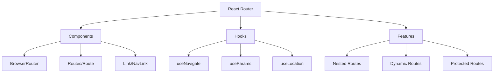

# Routing

## React Router

### What is React Router and how does it work?

React Router is the standard routing solution for React applications. In interviews, it's important to understand both the concepts and implementation details.



Basic implementation:

```jsx
import {
    BrowserRouter,
    Routes,
    Route,
    Link,
    useNavigate,
    useParams,
} from 'react-router-dom';

function App() {
    return (
        <BrowserRouter>
            <nav>
                <Link to="/">Home</Link>
                <Link to="/about">About</Link>
                <Link to="/users">Users</Link>
            </nav>

            <Routes>
                <Route path="/" element={<Home />} />
                <Route path="/about" element={<About />} />
                <Route path="/users" element={<Users />}>
                    <Route path=":id" element={<UserProfile />} />
                </Route>
                <Route path="*" element={<NotFound />} />
            </Routes>
        </BrowserRouter>
    );
}
```

### How to implement protected routes?

Protected routes are crucial for securing parts of your application:

```jsx
// Auth context setup
const AuthContext = createContext(null);

function AuthProvider({ children }) {
    const [user, setUser] = useState(null);
    const navigate = useNavigate();

    const login = async credentials => {
        const user = await loginUser(credentials);
        setUser(user);
        navigate('/dashboard');
    };

    const logout = () => {
        setUser(null);
        navigate('/login');
    };

    return (
        <AuthContext.Provider value={{ user, login, logout }}>
            {children}
        </AuthContext.Provider>
    );
}

// Protected route component
function ProtectedRoute({ children }) {
    const { user } = useContext(AuthContext);
    const location = useLocation();

    if (!user) {
        // Redirect to login but save the attempted URL
        return <Navigate to="/login" state={{ from: location }} replace />;
    }

    return children;
}

// Usage in router setup
function AppRouter() {
    return (
        <Routes>
            <Route path="/login" element={<LoginPage />} />
            <Route path="/public" element={<PublicPage />} />
            <Route
                path="/dashboard"
                element={
                    <ProtectedRoute>
                        <DashboardPage />
                    </ProtectedRoute>
                }
            />
            <Route
                path="/admin"
                element={
                    <ProtectedRoute>
                        <AdminPage />
                    </ProtectedRoute>
                }
            />
        </Routes>
    );
}
```

### How to handle route parameters and queries?

Route parameters and query strings are common in web applications:

```jsx
function UserProfile() {
    // Get route parameters
    const { id } = useParams();
    // Get query parameters
    const [searchParams, setSearchParams] = useSearchParams();
    const tab = searchParams.get('tab') || 'profile';

    const navigate = useNavigate();
    const location = useLocation();

    useEffect(() => {
        // Track page view
        analytics.pageView({
            userId: id,
            tab,
            path: location.pathname,
        });
    }, [id, tab, location]);

    return (
        <div>
            <h1>User Profile: {id}</h1>
            <nav>
                <button
                    onClick={() => setSearchParams({ tab: 'profile' })}
                    className={tab === 'profile' ? 'active' : ''}
                >
                    Profile
                </button>
                <button
                    onClick={() => setSearchParams({ tab: 'settings' })}
                    className={tab === 'settings' ? 'active' : ''}
                >
                    Settings
                </button>
            </nav>

            {tab === 'profile' ? (
                <UserProfileTab userId={id} />
            ) : (
                <UserSettingsTab userId={id} />
            )}
        </div>
    );
}
```

### How to implement nested routes?

Nested routes are powerful for complex UIs:

```jsx
function DashboardLayout() {
    return (
        <div className="dashboard">
            <aside>
                <nav>
                    <NavLink to="/dashboard/overview">Overview</NavLink>
                    <NavLink to="/dashboard/analytics">Analytics</NavLink>
                    <NavLink to="/dashboard/settings">Settings</NavLink>
                </nav>
            </aside>

            <main>
                <Outlet /> {/* Nested routes render here */}
            </main>
        </div>
    );
}

function AppRoutes() {
    return (
        <Routes>
            <Route path="/dashboard" element={<DashboardLayout />}>
                <Route index element={<DashboardOverview />} />
                <Route path="analytics" element={<Analytics />} />
                <Route path="settings" element={<Settings />} />
            </Route>
        </Routes>
    );
}
```

### How to handle route transitions?

Route transitions can enhance user experience:

```jsx
function PageTransition({ children }) {
    const location = useLocation();

    return (
        <AnimatePresence mode="wait">
            <motion.div
                key={location.pathname}
                initial={{ opacity: 0, x: 20 }}
                animate={{ opacity: 1, x: 0 }}
                exit={{ opacity: 0, x: -20 }}
                transition={{ duration: 0.3 }}
            >
                {children}
            </motion.div>
        </AnimatePresence>
    );
}

function App() {
    return (
        <BrowserRouter>
            <PageTransition>
                <Routes>
                    <Route path="/" element={<Home />} />
                    <Route path="/about" element={<About />} />
                    <Route path="/contact" element={<Contact />} />
                </Routes>
            </PageTransition>
        </BrowserRouter>
    );
}
```

### How to implement route-based code splitting?

Code splitting by route improves initial load performance:

```jsx
import { Suspense, lazy } from 'react';

// Lazy load route components
const Home = lazy(() => import('./pages/Home'));
const About = lazy(() => import('./pages/About'));
const Dashboard = lazy(() => import('./pages/Dashboard'));

function App() {
    return (
        <BrowserRouter>
            <Suspense
                fallback={
                    <div className="loading">
                        <Spinner size="large" />
                    </div>
                }
            >
                <Routes>
                    <Route path="/" element={<Home />} />
                    <Route path="/about" element={<About />} />
                    <Route
                        path="/dashboard/*"
                        element={
                            <ProtectedRoute>
                                <Dashboard />
                            </ProtectedRoute>
                        }
                    />
                </Routes>
            </Suspense>
        </BrowserRouter>
    );
}
```

### How to handle route-based data loading?

Data loading with routes requires careful consideration:

```jsx
function UserList() {
    const [searchParams] = useSearchParams();
    const page = parseInt(searchParams.get('page') || '1');
    const limit = parseInt(searchParams.get('limit') || '10');

    // Use React Query for data fetching
    const {
        data: users,
        isLoading,
        error,
    } = useQuery(['users', page, limit], () => fetchUsers({ page, limit }));

    if (isLoading) return <LoadingSpinner />;
    if (error) return <ErrorMessage error={error} />;

    return (
        <div>
            <UserTable users={users.data} />
            <Pagination
                current={page}
                total={users.total}
                onChange={newPage =>
                    setSearchParams({ page: newPage.toString(), limit })
                }
            />
        </div>
    );
}
```
