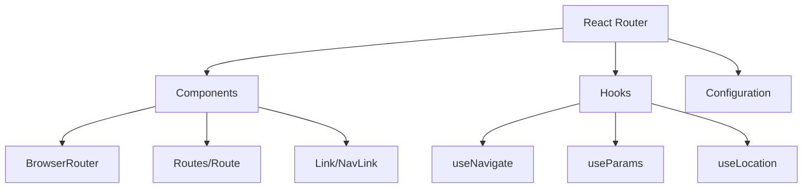
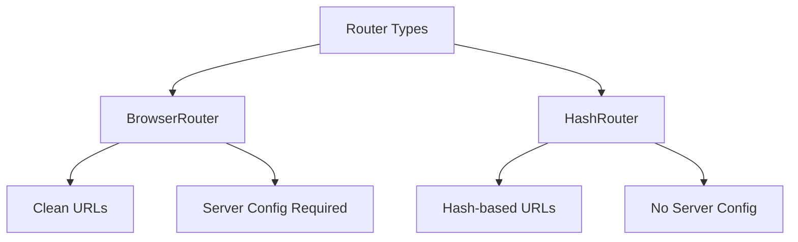

# 8. Routing

## 8.1 Routing

### What is React Router and how is it used?

React Router is a standard library for routing in React applications. It enables navigation between views, URL manipulation, and browser history management.



```jsx
import { BrowserRouter, Routes, Route, Link } from 'react-router-dom';

function App() {
    return (
        <BrowserRouter>
            <nav>
                <Link to="/">Home</Link>
                <Link to="/about">About</Link>
                <Link to="/users">Users</Link>
            </nav>

            <Routes>
                <Route path="/" element={<Home />} />
                <Route path="/about" element={<About />} />
                <Route path="/users" element={<Users />}>
                    <Route path=":id" element={<UserProfile />} />
                </Route>
                <Route path="*" element={<NotFound />} />
            </Routes>
        </BrowserRouter>
    );
}
```

### What are the components of React Router?

1. **Core Components**:

```jsx
// Basic routing setup
import {
    BrowserRouter,
    Routes,
    Route,
    Link,
    NavLink,
    Outlet,
} from 'react-router-dom';

function Layout() {
    return (
        <div>
            <nav>
                <NavLink
                    to="/"
                    className={({ isActive }) =>
                        isActive ? 'active' : undefined
                    }
                >
                    Home
                </NavLink>
            </nav>

            <main>
                <Outlet /> {/* Nested routes render here */}
            </main>
        </div>
    );
}
```

2. **Hooks**:

```jsx
function UserProfile() {
    const { id } = useParams();
    const navigate = useNavigate();
    const location = useLocation();
    const { state } = useLocation();

    return (
        <div>
            <h1>User Profile: {id}</h1>
            <button onClick={() => navigate(-1)}>Go Back</button>
            <button
                onClick={() =>
                    navigate('/dashboard', { state: { from: location } })
                }
            >
                Dashboard
            </button>
        </div>
    );
}
```

### What is the difference between BrowserRouter and HashRouter?



```jsx
// BrowserRouter - URLs look like: /users/123
<BrowserRouter>
    <Routes>
        <Route path="/users/:id" element={<UserProfile />} />
    </Routes>
</BrowserRouter>

// HashRouter - URLs look like: /#/users/123
<HashRouter>
    <Routes>
        <Route path="/users/:id" element={<UserProfile />} />
    </Routes>
</HashRouter>
```

### How to implement protected routes?

1. **Using Authentication Guard**:

```jsx
function PrivateRoute({ children }) {
    const { isAuthenticated } = useAuth();
    const location = useLocation();

    if (!isAuthenticated) {
        // Redirect to login page but save the attempted URL
        return <Navigate to="/login" state={{ from: location }} replace />;
    }

    return children;
}

function App() {
    return (
        <Routes>
            <Route path="/login" element={<Login />} />
            <Route
                path="/dashboard"
                element={
                    <PrivateRoute>
                        <Dashboard />
                    </PrivateRoute>
                }
            />
        </Routes>
    );
}
```

2. **Using Role-Based Access**:

```jsx
function RoleBasedRoute({ children, allowedRoles }) {
    const { user } = useAuth();
    const location = useLocation();

    if (!user || !allowedRoles.includes(user.role)) {
        return (
            <Navigate to="/unauthorized" state={{ from: location }} replace />
        );
    }

    return children;
}

function App() {
    return (
        <Routes>
            <Route
                path="/admin"
                element={
                    <RoleBasedRoute allowedRoles={['admin']}>
                        <AdminDashboard />
                    </RoleBasedRoute>
                }
            />
            <Route
                path="/moderator"
                element={
                    <RoleBasedRoute allowedRoles={['admin', 'moderator']}>
                        <ModeratorPanel />
                    </RoleBasedRoute>
                }
            />
        </Routes>
    );
}
```

3. **Handling Authentication Flow**:

```jsx
function Login() {
    const navigate = useNavigate();
    const location = useLocation();
    const { login } = useAuth();

    const handleLogin = async credentials => {
        await login(credentials);
        // Redirect to the page they tried to visit or default to dashboard
        const from = location.state?.from?.pathname || '/dashboard';
        navigate(from, { replace: true });
    };

    return (
        <form onSubmit={handleSubmit(handleLogin)}>
            {/* Login form fields */}
        </form>
    );
}
```
