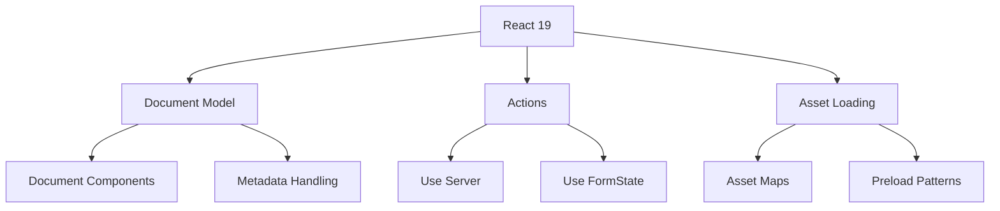

# React 19 Features

## Understanding React 19's Major Changes

React 19 introduces several groundbreaking features that reshape how we build React applications. Here's a comprehensive overview of the key changes and their implications.

### Core Architecture Changes



### Document Components

Document Components represent a new way to handle document structure and metadata:

```jsx
// Document Component Example
export default function RootLayout() {
    return (
        <html lang="en">
            <head>
                <title>My Application</title>
                <meta name="description" content="Modern React App" />
                <link rel="stylesheet" href="/styles.css" />
            </head>
            <body>
                <Header />
                <main>
                    <Outlet />
                </main>
                <Footer />
            </body>
        </html>
    );
}

// Nested Document Components
function ProductPage({ id }) {
    return (
        <>
            <DocumentHead>
                <title>Product: {id}</title>
                <meta name="og:type" content="product" />
            </DocumentHead>
            <ProductDetails id={id} />
        </>
    );
}
```

### Actions and Forms

New form handling and server actions:

```jsx
// Server Action Definition
async function submitForm(formData: FormData) {
    'use server';

    const email = formData.get('email');
    const password = formData.get('password');

    try {
        await createUser({ email, password });
        return { success: true };
    } catch (error) {
        return { error: error.message };
    }
}

// Client Component Using Server Action
function SignupForm() {
    const [state, formAction] = useFormState(submitForm, {});
    const [isPending, startTransition] = useTransition();

    return (
        <form action={formAction}>
            <div>
                <label htmlFor="email">Email:</label>
                <input
                    type="email"
                    id="email"
                    name="email"
                    required
                />
            </div>

            <div>
                <label htmlFor="password">Password:</label>
                <input
                    type="password"
                    id="password"
                    name="password"
                    required
                />
            </div>

            <button type="submit" disabled={isPending}>
                {isPending ? 'Signing up...' : 'Sign Up'}
            </button>

            {state.error && (
                <div className="error">{state.error}</div>
            )}
        </form>
    );
}
```

### Asset Loading Optimization

New patterns for optimizing asset loading:

```jsx
// Asset Loading with Preload
function ImageGallery() {
    return (
        <div>
            <link
                rel="preload"
                as="image"
                href="/hero.jpg"
                fetchpriority="high"
            />
            <Images />
        </div>
    );
}

// Optimized Image Component
function OptimizedImage({ src, alt, sizes }) {
    return (
        <picture>
            <source
                type="image/webp"
                srcSet={`${src}?format=webp&w=400 400w,
                         ${src}?format=webp&w=800 800w`}
                sizes={sizes}
            />
            
        </picture>
    );
}
```

### Improved Error Handling

Enhanced error boundary and error handling patterns:

```jsx
// Modern Error Boundary
function ErrorBoundary({ children, fallback }) {
    return (
        <Suspense fallback={<Loading />}>
            <ErrorBoundaryImpl fallback={fallback}>
                {children}
            </ErrorBoundaryImpl>
        </Suspense>
    );
}

// Usage with Recovery
function App() {
    return (
        <ErrorBoundary
            fallback={error => (
                <ErrorPage
                    error={error}
                    onRetry={() => window.location.reload()}
                />
            )}
        >
            <AppContent />
        </ErrorBoundary>
    );
}
```

### Migration Guide

Key considerations when upgrading to React 19:

1. **Document Components Migration**:

    - Replace existing document manipulation
    - Update metadata handling
    - Adapt to new asset loading patterns

2. **Server Actions Migration**:

    - Convert form submissions to server actions
    - Update client-side form handling
    - Implement optimistic updates

3. **Asset Loading Updates**:
    - Implement new preload patterns
    - Update image loading strategy
    - Optimize resource loading

Example Migration Path:

```jsx
// Before (React 18)
function OldForm() {
    const handleSubmit = async e => {
        e.preventDefault();
        const data = new FormData(e.target);
        await fetch('/api/submit', {
            method: 'POST',
            body: data,
        });
    };

    return (
        <form onSubmit={handleSubmit}>
            <input name="data" />
            <button type="submit">Submit</button>
        </form>
    );
}

// After (React 19)
async function submitAction(formData) {
    'use server';
    // Direct server action
    const data = formData.get('data');
    await processData(data);
}

function NewForm() {
    const [state, formAction] = useFormState(submitAction, {});

    return (
        <form action={formAction}>
            <input name="data" />
            <button type="submit">Submit</button>
            {state.error && <div>{state.error}</div>}
        </form>
    );
}
```

### Performance Improvements

React 19 introduces several performance optimizations:

```jsx
// Automatic Batching
function AutoBatchingExample() {
    const [count, setCount] = useState(0);
    const [flag, setFlag] = useState(false);

    // React 19 automatically batches these updates
    const handleClick = () => {
        setCount(c => c + 1);
        setFlag(f => !f);
        // Only one render will occur
    };

    return <button onClick={handleClick}>Update State</button>;
}

// Selective Hydration
function App() {
    return (
        <Suspense fallback={<Shell />}>
            <MainContent />
            <Suspense fallback={<SidebarSkeleton />}>
                <Sidebar />
            </Suspense>
        </Suspense>
    );
}
```

These new features in React 19 provide better performance, improved developer experience, and enhanced capabilities for building modern web applications.
